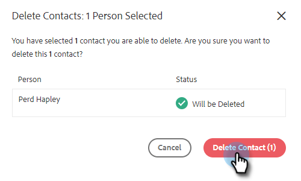

# Creazione ed eliminazione di contatti {#creating-and-deleting-contacts}

## Creazione dei contatti {#creating-contacts}

1. Nella pagina Persone, fai clic sul pulsante **Azioni** e seleziona **Crea contatto**.

   

1. Inserisci il nome/cognome e l’indirizzo e-mail, insieme a qualsiasi altra informazione desiderata. Fai clic su **Crea** al termine, oppure **Crea e aggiungi nuovo** per aggiungere altri contatti.

   

   >[!TIP]
   >
   >Vuoi aggiungere più contatti contemporaneamente? [Fai clic qui](/help/marketo/product-docs/marketo-sales-insight/actions/people/managing-contacts/import-contacts-via-csv.md) per scoprire come importare i contatti tramite CSV.

## Eliminazione dei contatti {#deleting-contacts}

1. Nella pagina Persone , seleziona la casella del contatto da eliminare. Fai clic sul punto (tre punti verticali) e seleziona **Elimina**.

   

   >[!NOTE]
   >
   >Per eliminare più contatti, selezionare semplicemente più persone. I passaggi rimanenti sarebbero gli stessi.

1. Fai clic su **Elimina contatto** per confermare.

   
