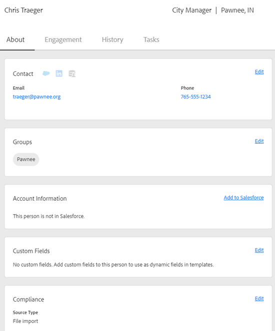

# Visualizzazione dettagli persona {#person-detail-view}

La visualizzazione dettagli persona fornisce un profilo dettagliato di ogni persona nel tuo account Marketo Sales.

## Accesso {#how-to-access}

1. Per accedere alla visualizzazione dettagli persona, fai clic sul pulsante **Persone** scheda .

   

1. Seleziona la persona desiderata.

   

   >[!TIP]
   >
   >Praticamente ovunque si veda il nome di una persona, è possibile cliccarlo e arrivare alla loro visualizzazione dettagli persona.

## Scheda Informazioni {#about-tab}

Include tutte le informazioni di contatto della persona.

**Scheda contatto**

* Contiene informazioni di contatto come: indirizzo e-mail, nome, società, titolo, numero di telefono e collegamenti ai social media

**Gruppi**

* Visualizza e gestisce i gruppi di cui fa parte questa persona

**Informazioni sull&#39;account**

* Può aggiungere una persona a Salesforce
* Estrarre il conto e le informazioni di lead/contatti da Salesforce

**Campi personalizzati**

* Aggiungi o rimuovi campi personalizzati che possono essere utilizzati come campi dinamici nei modelli e nelle campagne

**Conformità**

* Testo

**Note**

* Creare note personalizzate

## Scheda Coinvolgimento {#engagement-tab}

Scopri in che modo questa persona si impegna con il tuo outreach.

PICC

**Attività di vendita Marketo**

* Vedi le attività di coinvolgimento dalle e-mail e dalle campagne di vendita

**Attività di marketing**

* Scopri il coinvolgimento della tua persona nelle campagne di marketing

## Scheda Cronologia {#history-tab}

Mostra la cronologia del tuo outreach. Include e-mail, campagne e chiamate.

PICC

**Campagne di vendita**

* Visualizza tutte le campagne attive o completate a cui appartiene questa persona

**Campagne di marketing**

* Vedi tutte le campagne di marketing a cui questa persona è membro

**E-mail di vendita**

* Vedi tutte le e-mail che hai inviato a questa persona e le metriche di coinvolgimento

**Chiamate di vendita**

* Visualizza tutte le chiamate effettuate a questa persona

## Scheda Attività {#tasks-tab}

Gestisci le attività associate a questa persona.

PICC

Azioni eseguibili:

* Modificare o eliminare un’attività
* Vedi la data di scadenza
* Fai clic sul Tipo per avviare il telefono di vendita se Chiama, Componi e-mail se E-mail, Collegato se Inmail e Nota personalizzata se Personalizzato.
* Contrassegna attività come completata
