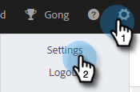

# Motivi della chiamata {#call-reasons}

Consenti ai team di vendita di selezionare i motivi della chiamata quando si effettuano le chiamate in modo che il team possa capire il motivo per cui vengono effettuate le chiamate.

>[!NOTE]
>
>**Autorizzazioni amministratore richieste**

## Abilita motivi di chiamata {#enable-call-reasons}

1. Fai clic sull’icona dell’ingranaggio e seleziona **Impostazioni**.

   

1. In Impostazioni amministratore seleziona **Connessione telefonica**.

   

1. Seleziona **Abilita motivi di chiamata**.

   

1. Scegli il requisito del motivo di chiamata desiderato.

   

## Crea motivo chiamata {#create-call}

>[!NOTE]
>
>Puoi creare un massimo di 15 motivi di chiamata.

1. Fai clic sull’icona dell’ingranaggio e seleziona **Impostazioni**.

   

1. In Impostazioni amministratore seleziona **Connessione telefonica**.

   

1. Clic **Gestire i motivi delle chiamate**.

   

1. Inserisci il nome del motivo di chiamata desiderato nel campo di testo e fai clic su **Aggiungi**.

   

## Seleziona un motivo di chiamata {#select-a-call-reason}

Una volta abilitati i motivi della chiamata. Gli utenti possono selezionarne uno durante una chiamata.

1. Fare clic sul pulsante di chiamata per avviare la composizione.

   

1. Inserisci le informazioni sulla chiamata nella finestra di dialogo e fai clic su **Chiamata**.

   

1. Seleziona il motivo della chiamata che meglio descrive la chiamata.

   

1. Termina la chiamata.

   

1. Registra la chiamata.

   

>[!MORELIKETHIS]
>
>* [Registra i motivi e gli esiti delle chiamate a Salesforce](/help/marketo/product-docs/marketo-sales-insight/actions/phone/log-call-reasons-and-call-outcomes-to-salesforce.md)
>* [Risultati della chiamata](/help/marketo/product-docs/marketo-sales-insight/actions/phone/call-outcomes.md)
