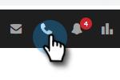

# Presenza locale {#local-presence}

La presenza locale consente di ottenere l&#39;aspetto che si sta chiamando dallo stesso codice di area del destinatario.

## Seleziona presenza locale {#select-local-presence}

1. Fare clic sull&#39;icona del telefono per aprire la finestra di dialogo Vendite.

   

1. Seleziona la **Usa presenza locale** casella di controllo.

   

## Domande frequenti {#faq}

**Il mio contatto può richiamarmi a questo nuovo numero?**

No, la presenza locale funziona solo per le chiamate in uscita. Il chiamante non può richiamarti a questo numero &quot;nuovo&quot;.

**Posso chiamare da qualche parte con Presenza Locale?**

Offriamo tutte le funzionalità per i telefoni di vendita solo per le chiamate negli Stati Uniti.

**Il numero di presenza locale è sempre lo stesso quando si chiama un codice di area?**

È probabile che il numero sia sempre lo stesso quando si chiama in un codice di area.

**L’intero numero cambia o si limita al codice dell’area quando si utilizza la presenza locale?**

L&#39;intero numero cambierà.
