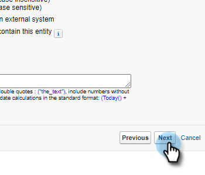

# Segnala i motivi delle chiamate e i risultati delle chiamate a Salesforce {#log-call-reasons-and-call-outcomes-to-salesforce}

Se desideri registrare i risultati delle chiamate e chiamare i motivi a Salesforce a scopo di reporting o visibilità, puoi creare un campo di attività personalizzato per ciascuno di essi. Ogni campo deve utilizzare un nome API specifico (noto come &quot;Nome campo&quot; in Salesforce).

* Nome campo risultati chiamata: mktosales_call_result
* Nome campo motivi chiamata: mktosales_call_reason

Per utilizzare questi campi, devi innanzitutto creare il campo come campo di attività personalizzato. Per renderlo visibile agli utenti, è necessario aggiungerlo al layout della pagina dell&#39;oggetto attività.

## Salesforce Classic {#salesforce-classic}

### Crea campo attività personalizzato in Salesforce Classic  {#create-custom-activity-field-in-salesforce-classic}

1. In Salesforce, fai clic su **Configurazione**.

   

1. Digitare &quot;Attività&quot; nella casella Ricerca rapida.

   

1. Fai clic su **Campi personalizzati dell’attività**.

   

1. Fai clic su **Nuovo**.

   

1. Seleziona il tipo di dati &quot;Testo&quot; e fai clic su **Successivo**.

   

1. Assegnare al campo personalizzato il nome del campo come definito in precedenza. La lunghezza del campo ha un limite di 255 caratteri. Etichetta campo sarà il campo visibile al team di vendita e può essere personalizzato per soddisfare le esigenze del team.

   

1. Il resto delle impostazioni è facoltativo. Una volta completata la configurazione, fai clic su **Successivo**.

   

1. Selezionare le impostazioni di protezione a livello di campo desiderate per questo campo e fare clic su **Successivo** (l’immagine seguente è solo un esempio).

   

   >[!NOTE]
   >
   >Assicurati che il campo personalizzato sia visibile al profilo utilizzato dagli utenti per le azioni Approfondimenti vendite, insieme a qualsiasi altro campo desiderato.

1. Selezionare i layout di pagina a cui si desidera aggiungere il campo e fare clic su **Salva** (facoltativamente, puoi fare clic su **Salva e nuovo** e ripetere il processo per il campo Motivo della chiamata).

   

### Aggiungi campo attività personalizzato al layout della pagina attività in Salesforce Classic {#add-custom-activity-field-to-task-page-layout-in-salesforce-classic}

>[!NOTE]
>
>Sarà necessario seguire questi passaggi solo se non hai selezionato il layout di pagina desiderato nel passaggio 9 precedente.

1. In Salesforce, fai clic su **Configurazione**.

   

1. Digitare &quot;Task&quot; nella casella Ricerca rapida.

   

1. Fai clic su **Layout delle pagine attività**.

   

1. Fai clic su **Modifica** accanto al layout della pagina attività a cui si desidera aggiungere questo campo.

   

1. Trascina il campo nella sezione desiderata del layout della pagina Attività.

   

1. Fai clic su **Salva**.

   

## Fulmine Salesforce {#salesforce-lightning}

### Crea campo attività personalizzato in fulmine di Salesforce {#create-custom-activity-field-in-salesforce-lightning}

1. In Salesforce, fai clic sull&#39;icona dell&#39;ingranaggio in alto a destra e seleziona **Configurazione**.

   

1. Fai clic su **Gestione oggetti**.

   

1. Digitare &quot;Attività&quot; nella casella Ricerca rapida.

   

1. Fai clic sul pulsante **Attività** etichetta.

   

1. Fai clic su **Campi e correlazioni**.

   

1. Fai clic su **Nuovo**.

   

### Aggiungi campo attività personalizzato al layout della pagina attività in Salesforce Lightning {#add-custom-activity-field-to-task-page-layout-in-salesforce-lightning}

1. In Salesforce, fai clic sull&#39;icona dell&#39;ingranaggio in alto a destra e seleziona **Configurazione**.

   

1. Fai clic su **Gestione oggetti**.

   

1. Digitare &quot;Task&quot; nella casella Ricerca rapida.

   

1. Fai clic sul pulsante **Attività** etichetta.

   

1. Fai clic su **Layout di pagina**.

   

1. Fare clic sul layout della pagina attività a cui si desidera aggiungere il campo.

   

1. Trascina il campo nella sezione desiderata del layout della pagina Attività.

   

1. Fai clic su **Salva**.

   

>[!MORELIKETHIS]
>
>* [Risultati chiamata](/help/marketo/product-docs/marketo-sales-insight/actions/phone/call-outcomes.md)
>* [Motivi della chiamata](/help/marketo/product-docs/marketo-sales-insight/actions/phone/call-reasons.md)

