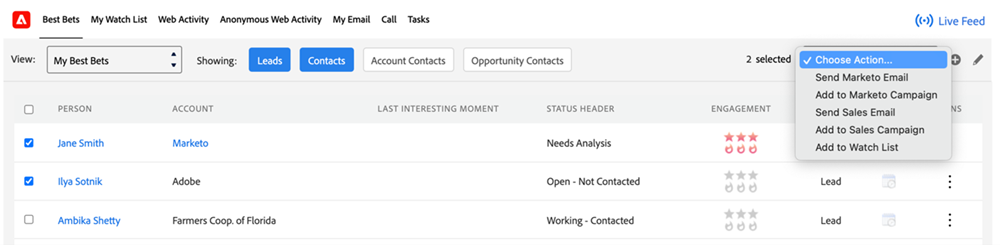

# Panoramica sulla funzione Azioni approfondimenti vendite {#msi-actions-feature-overview}

Accelera le attività di ricerca di potenziali clienti con strumenti di marketing e coinvolgimento riuniti in un unico flusso di lavoro utilizzando le azioni di approfondimento sulle vendite.

>[!NOTE]
>
>Marketo Sales Insight Actions è un&#39;applicazione basata su Web che si integra con l&#39;interfaccia utente di Salesforce tramite [Pacchetto Sales Insight di Marketo](/help/marketo/product-docs/marketo-sales-insight/msi-for-salesforce/installation/install-marketo-sales-insight-package-in-salesforce-appexchange.md){target="_blank"}. A volte viene chiamato &quot;Vendite Marketo&quot; o semplicemente &quot;Azioni&quot;.

>[!AVAILABILITY]
>
>Questa funzione è attualmente implementata per tutti gli utenti di Sales Insight. Se desideri avere la priorità nel rollout, invia un’e-mail a `sales-insights(at)adobe(dot)com`.

Per una panoramica video delle azioni di approfondimento sulle vendite: [fai clic qui](https://experienceleague.adobe.com/docs/marketo-learn/tutorials/sales-insight-actions/overview.html){target="_blank"}.

## Layout lead e layout contatto {#lead-layout-and-contact-layout}

Le seguenti azioni sono disponibili dal menu a discesa &quot;Scegli azioni&quot; nella navigazione superiore:

* Invia e-mail vendite
   * Le e-mail di vendita hanno un monitoraggio di visualizzazione, clic e risposta (quando il canale di consegna è configurato)
   * Include Personalizzazione e-mail, Firma personalizzata e allegati
   * Condivisione di modelli e rapporti
   * Condivisione team, e-mail di gruppo e capacità CC/CCN
   * L’attività e-mail di vendita verrà registrata nel record persona di Marketo
   * Filtri e trigger corrispondenti nelle campagne Marketo Smart (dettagli di seguito)

* Aggiungi a campagna di vendita
   * Aggiungi lead ai playbook di vendita, ovvero una sequenza di e-mail e attività
   * Include l’accesso e la condivisione del team, la generazione di attività, il salto dei fine settimana, l’eliminazione delle e-mail fuori sede come risposte e la fine automatica
   * L’attività della campagna verrà registrata nel record persona di Marketo
   * Filtri e trigger corrispondenti nelle campagne Marketo Smart (dettagli di seguito)

* Connessione di vendita
   * Effettuare chiamate di vendita utilizzando il selettore all&#39;interno del CRM
   * Include presenza locale, preregistrata
   * Registra il risultato della chiamata, la registrazione delle chiamate nel pannello e la cronologia delle attività
   * L’attività di chiamata verrà registrata nel record persona di Marketo
   * Filtri e attivatori nelle campagne Marketo Smart

* Aggiungi attività
   * Crea e-mail, chiamate, InMail e attività personalizzate per i lead
   * Automatizzare la creazione di attività con le campagne di vendita
   * Sincronizza attività con Salesforce
   * Registra le attività nella sezione Cronologia attività Salesforce

Per accedere ai feed live, fai clic sull’icona ((0)) nel menu di navigazione in alto. Include la possibilità di visualizzare aggiornamenti live sulle attività di vendita e funzionalità di ancoraggio dello schermo.

I seguenti dati sono disponibili nelle schede all’interno del pannello MSI:

* Dashboard approfondimenti
   * La griglia Velocity del coinvolgimento includerà attività da e-mail di vendita, azioni della campagna di vendita e comunicazione di vendita
   * Prossime campagne di vendita: quando un lead fa parte di una campagna in corso, queste informazioni saranno disponibili nella scheda Prossime campagne di vendita
   * Attività future: quando è prevista un’attività relativa a un lead, queste informazioni saranno disponibili nella scheda Attività successive

* Scheda E-mail
   * Tutte le e-mail di vendita inviate verranno registrate qui. Le attività verranno anche registrate nel record persona di Marketo
   * Le colonne includono Oggetto, Apri, Clic, Risposta (disponibile solo per e-mail di vendita con canale di consegna impostato), Mittente, Data
   * Include la scheda di presentazione con dettagli aggiuntivi come Mittente, Modello, Campagna di vendita e Anteprima e-mail

* Scheda Chiamata
   * Tutte le chiamate effettuate utilizzando la funzione di chiamata di vendita verranno registrate qui. Le attività verranno anche registrate nel record persona di Marketo
   * Le colonne includono Nome, Risultato, Note, Chiamata, Durata e collegamento alla registrazione
   * Include una scheda a tendina con dettagli aggiuntivi come Chiamata effettuata da, Chiamata con risposta da, Numero di telefono e Stato

## Layout account e opportunità {#account-and-opportunity-layout}

Nella barra di navigazione superiore sono disponibili le seguenti azioni:

* Invia e-mail di vendita: possibilità di inviare e-mail di gruppo personalizzate o con modelli con visualizzazione, tracciamento dei clic e delle risposte a tutti i contatti associati a un account/opportunità
   * Le e-mail di vendita hanno un monitoraggio di visualizzazione, clic e risposta (quando il canale di consegna è configurato)
   * Include Personalizzazione e-mail, Firma personalizzata e allegati
   * Condivisione di modelli e rapporti
   * Condivisione team, e-mail di gruppo e capacità CC/CCN
   * L’attività e-mail di vendita verrà registrata nel record persona di Marketo
   * Filtri e trigger corrispondenti nelle campagne Marketo Smart (dettagli di seguito)

* Aggiungi a campagna di vendita: consente di aggiungere ai playbook di vendita tutti i contatti associati a un account/opportunità, ovvero una sequenza di e-mail e attività.
   * Aggiungi lead ai playbook di vendita, ovvero una sequenza di e-mail e attività
   * Include l’accesso e la condivisione del team, la generazione di attività, il salto dei fine settimana, l’eliminazione delle e-mail fuori sede come risposte e la fine automatica
   * L’attività della campagna verrà registrata nel record persona di Marketo
   * Filtri e trigger corrispondenti nelle campagne Marketo Smart (dettagli di seguito)

Per accedere ai feed live, fai clic sull’icona ((0)) nel menu di navigazione in alto. Include la possibilità di visualizzare aggiornamenti live sulle attività di vendita e funzionalità di ancoraggio dello schermo.

Nelle schede sono disponibili i seguenti dati:

* Dashboard approfondimenti
   * La griglia Velocity del coinvolgimento includerà le attività da e-mail di vendita, azioni della campagna di vendita e la comunicazione di vendita
   * Prossime campagne di vendita: quando un contatto dell’account/opportunità fa parte di una campagna in corso, queste informazioni saranno disponibili nella scheda Prossime campagne di vendita
   * Attività future: quando un’attività futura riguarda un contatto dell’account/opportunità, queste informazioni saranno disponibili nella scheda Attività successive

* Scheda E-mail
   * Tutte le e-mail di vendita inviate ai contatti dall’account/opportunità verranno registrate qui. Le attività verranno anche registrate nel record persona di Marketo
   * Le colonne includono Oggetto, Apri, Clic, Risposta (disponibile solo per e-mail di vendita con canale di consegna impostato), Mittente e Data
   * Include la scheda di presentazione con dettagli aggiuntivi come Mittente, Modello, Campagna di vendita e Anteprima e-mail

* Scheda Chiamata
   * Tutte le chiamate effettuate ai contatti dall&#39;account/opportunità utilizzando la funzione di chiamata di vendita verranno registrate qui. Le attività verranno anche registrate nel record persona di Marketo
   * Le colonne includono Nome, Risultato, Note, Chiamata, Durata e collegamento alla registrazione
   * Include una scheda a tendina con dettagli aggiuntivi come Chiamata effettuata da, Chiamata con risposta da, Numero di telefono e Stato

## Visualizzazione elenco contatti e lead (azioni in blocco) {#lead-and-contact-list-view}

* Invia e-mail di vendita: possibilità di inviare e-mail personalizzate o modellate con visualizzazione, tracciamento dei clic e delle risposte a un elenco di contatti/lead
* Invia campagna di vendita: aggiungi ai playbook di vendita, ovvero una sequenza di e-mail e attività a un elenco di contatti/lead

## Scheda globale di Marketo {#marketo-global-tab}

**Scheda Elementi di maggiore rilevanza**

Le seguenti azioni in blocco sono disponibili dal menu a discesa nella scheda Elementi di maggiore rilevanza:

* Invia e-mail di vendita: possibilità di inviare e-mail personalizzate o modellate con visualizzazione, tracciamento dei clic e delle risposte
* Invia campagna di vendita: aggiungi i lead ai playbook di vendita, una sequenza di e-mail e attività

  

Nella scheda Elementi di maggiore rilevanza sono disponibili le seguenti azioni in linea per singoli lead/contatti:

* Invia e-mail di vendita: possibilità di inviare e-mail personalizzate o modellate con visualizzazione, tracciamento dei clic e delle risposte
* Invia campagna di vendita: aggiungi i lead ai playbook di vendita, una sequenza di e-mail e attività
* Connessione di vendita: effettua chiamate di vendita utilizzando la connessione di chiamata all&#39;interno del sistema CRM
* Aggiungi attività: crea attività e-mail, chiamata, cliente o LinkedIn per potenziali lead

  

**Scheda E-mail**

* Tutte le e-mail di vendita inviate verranno registrate qui. Le attività verranno anche registrate nel record persona di Marketo
* Le colonne includono Oggetto, Apri, Clic, Risposta (disponibile solo per e-mail di vendita con canale di consegna impostato), Mittente e Data
* Include la scheda di presentazione con dettagli aggiuntivi come Mittente, Modello, Campagna di vendita e Anteprima e-mail

**Scheda Chiamata**

* Tutte le chiamate effettuate utilizzando la funzione di chiamata di vendita verranno registrate qui. Le attività verranno anche registrate nel record persona di Marketo
* Le colonne includono Nome, Risultato, Note, Chiamata, Durata e collegamento alla registrazione
* Include una scheda a tendina con dettagli aggiuntivi come Chiamata effettuata da, Chiamata con risposta da, Numero di telefono e Stato

**Scheda Attività**

* Le attività e-mail, di chiamata, InMail e personalizzate create e completate saranno disponibili per la gestione delle attività in questa scheda. Include la possibilità di aggiungere un&#39;attività
* Automatizzare la creazione di attività con le campagne di vendita
* Sincronizza attività con Salesforce
* Registra le attività nella sezione Cronologia attività Salesforce

  

**Feed live**

* Possibilità di visualizzare aggiornamenti live sulle attività di vendita e funzionalità di ancoraggio dello schermo
* I pulsanti incorporati per e-mail, chiamate e cadenza rendono fruibili tutte le informazioni sul cliente

## Funzioni disponibili in Marketo {#features-available-in-marketo}

Attività di vendita acquisite in Marketo:

* Invia e-mail vendite: l’utente ha inviato un’e-mail di vendita a un lead
* Apri e-mail di vendita - Il lead ha aperto un messaggio e-mail di vendita inviato
* Fai clic su E-mail di vendita: il lead ha fatto clic su un collegamento in un’e-mail di vendita
* E-mail di vendita con risposta - Il lead ha risposto a un&#39;e-mail di vendita
* Ricevi chiamata di vendita: il lead ha ricevuto una chiamata da un rappresentante commerciale tramite la Connessione di vendita.
* Aggiungi a campagna di vendita: il lead è stato aggiunto a una campagna di vendita creata
* Rimosso dalla campagna di vendita: il lead è stato rimosso da una campagna di vendita creata

I filtri e i trigger includono:

* Invia e-mail vendite
* E-mail vendita aperta
* E-mail vendita selezionata
* Risposta all&#39;e-mail di vendita
* Chiamata di vendita ricevuta
* Aggiunto alla campagna di vendita
* Rimosso dalla campagna di vendita

  
