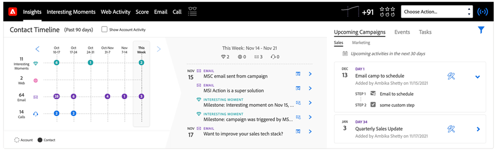

# Panoramica della funzione Approfondimenti vendite {#msi-actions-feature-overview}

Accelerare le attività di ricerca grazie a strumenti di intelligenza e coinvolgimento basati sul marketing insieme in un unico flusso di lavoro utilizzando le azioni di Insight sulle vendite.

## Layout lead e layout contatto {#lead-layout-and-contact-layout}

Le seguenti azioni sono disponibili dal menu a discesa &quot;Scegli azioni&quot; nella navigazione superiore:

* Invia e-mail di vendita
   * Le e-mail di vendita dispongono di funzioni di visualizzazione, tracciamento dei clic e delle risposte (quando il canale di consegna è impostato)
   * Include personalizzazione e-mail, firma personalizzata e allegati
   * Condivisione di modelli e rapporti
   * Condivisione di team, e-mail di gruppo e funzionalità CC/CCN
   * L&#39;attività e-mail di vendita verrà registrata nel record personale di Marketo
   * Filtri e trigger corrispondenti nelle campagne avanzate Marketo (dettagli qui sotto)

* Aggiungi alla campagna di vendita
   * Aggiungi i lead alle playlist di vendita, una sequenza di e-mail e attività
   * Include l&#39;accesso e la condivisione del team, la generazione delle attività, il fine settimana salta, ignora le e-mail OOO come risposte e la fine automatica
   * L’attività della campagna verrà registrata nel record della persona di Marketo
   * Filtri e trigger corrispondenti nelle campagne avanzate Marketo (dettagli qui sotto)

* Finestra di dialogo vendite
   * Effettuare chiamate di vendita utilizzando il dialer all&#39;interno del CRM
   * Include la presenza locale, preregistrata
   * Risultati della chiamata di registro, registrazione delle chiamate nel pannello e cronologia delle attività
   * L’attività di chiamata verrà registrata nel record della persona di Marketo
   * Filtri e attivatori nelle campagne avanzate Marketo

* Aggiungi attività
   * Creare attività e-mail, chiamate, InMail e personalizzate per i lead
   * Creazione automatica delle attività con le campagne di vendita
   * Sincronizza le attività con Salesforce
   * Eseguire il log delle attività nella sezione Cronologia attività Salesforce

Per accedere al feed live fai clic sull’icona ((0)) nella barra di navigazione superiore. Include la possibilità di visualizzare gli aggiornamenti live sulle attività di vendita insieme alla funzionalità di docking dello schermo.

I seguenti dati sono disponibili nelle schede all’interno del pannello MSI:

* Dashboard approfondimenti
   * La griglia di Velocity di coinvolgimento includerà le attività provenienti da e-mail di vendita, azioni di campagna di vendita e dialogo di vendita
   * Prossime campagne di vendita - Quando un lead fa parte di una campagna in corso, queste informazioni saranno disponibili nella scheda delle prossime campagne di vendita
   * Attività imminenti: quando è presente un’attività imminente relativa a un lead, queste informazioni saranno disponibili nella scheda Attività in arrivo

* Scheda E-mail
   * Tutte le e-mail di vendita inviate verranno registrate qui. Le attività verranno anche registrate nel record personale di Marketo
   * Le colonne includono Oggetto, Apri, Clic, Risposto (disponibile solo per le e-mail di vendita con canale di consegna impostato), Mittente, Data
   * Include la scheda a discesa con dettagli aggiuntivi come Mittente, Modello, Campagna di vendita e Anteprima e-mail

* Scheda Chiamata
   * Tutte le chiamate effettuate utilizzando la funzione di dialer di vendita saranno registrate qui. Le attività verranno anche registrate nel record personale di Marketo
   * Le colonne includono Nome, Risultato, Note, Chiamato a, Durata e collegamento alla registrazione
   * Include la scheda di scorrimento con dettagli aggiuntivi come Chiamata effettuata da, Risposta alla chiamata da, Numero di telefono e Stato

## Layout account e opportunità {#account-and-opportunity-layout}

Le seguenti azioni sono disponibili nella navigazione superiore:

* Invia e-mail di vendita - Possibilità di inviare e-mail di gruppo personalizzate o modellate con visualizzazione, clic e risposta tracking a tutti i contatti associati a un account/opportunità
   * Le e-mail di vendita dispongono di funzioni di visualizzazione, tracciamento dei clic e delle risposte (quando il canale di consegna è impostato)
   * Include personalizzazione e-mail, firma personalizzata e allegati
   * Condivisione di modelli e rapporti
   * Condivisione di team, e-mail di gruppo e funzionalità CC/CCN
   * L&#39;attività e-mail di vendita verrà registrata nel record personale di Marketo
   * Filtri e trigger corrispondenti nelle campagne avanzate Marketo (dettagli qui sotto)

* Aggiungi alla campagna di vendita - Aggiungi tutti i contatti associati a un account/opportunità alle playlist di vendita, che è una sequenza di e-mail e attività
   * Aggiungi i lead alle playlist di vendita, una sequenza di e-mail e attività
   * Include l&#39;accesso e la condivisione del team, la generazione delle attività, il fine settimana salta, ignora le e-mail OOO come risposte e la fine automatica
   * L’attività della campagna verrà registrata nel record della persona di Marketo
   * Filtri e trigger corrispondenti nelle campagne avanzate Marketo (dettagli qui sotto)

Per accedere al feed live, fai clic sull’icona ((0)) nella barra di navigazione superiore. Include la possibilità di visualizzare gli aggiornamenti live sulle attività di vendita insieme alla funzionalità di docking dello schermo.

Nelle schede sono disponibili i seguenti dati:

* Dashboard approfondimenti
   * La griglia di Velocity di coinvolgimento includerà le attività provenienti da e-mail di vendita, azioni della campagna di vendita e dal dialogo vendite
   * Prossime campagne di vendita - Quando un contatto dell’account o dell’opportunità fa parte di una campagna in corso, queste informazioni saranno disponibili nella scheda delle prossime campagne di vendita.
   * Attività in arrivo: quando è presente un&#39;attività imminente relativa a un contatto dall&#39;account/opportunità, queste informazioni saranno disponibili nella scheda Attività in arrivo.

* Scheda E-mail
   * Tutte le e-mail di vendita inviate ai contatti dell&#39;account/opportunità verranno registrate qui. Le attività verranno anche registrate nel record personale di Marketo
   * Le colonne includono Oggetto, Apri, Clic, Risposto (disponibile solo per le e-mail di vendita con canale di consegna impostato), Mittente e Data
   * Include la scheda a discesa con dettagli aggiuntivi come Mittente, Modello, Campagna di vendita e Anteprima e-mail

* Scheda Chiamata
   * Tutte le chiamate effettuate ai contatti dall&#39;account/opportunità utilizzando la funzione di dialer di vendita saranno registrate qui. Le attività verranno anche registrate nel record personale di Marketo
   * Le colonne includono Nome, Risultato, Note, Chiamato a, Durata e collegamento alla registrazione
   * Include la scheda di scorrimento con dettagli aggiuntivi come Chiamata effettuata da, Risposta alla chiamata da, Numero di telefono e Stato

## Visualizzazione elenco lead e contatti (azioni collettive) {#lead-and-contact-list-view}

* Invia e-mail di vendita - Possibilità di inviare e-mail personalizzate o modellate con visualizzazione, clic e risposta tracking a un elenco di contatti/lead
* Invia campagna di vendita - Aggiungi ai libri di gioco di vendita che è una sequenza di e-mail e attività a un elenco di contatti/lead

## Scheda globale Marketo {#marketo-global-tab}

**Scheda Migliori Scommesse**

Le seguenti azioni in blocco sono disponibili dal menu a discesa nella scheda Best Bets (Migliori scommesse):

* Invia e-mail di vendita - Possibilità di inviare e-mail personalizzate o modellate con visualizzazione, tracciamento dei clic e delle risposte
* Invia campagna di vendita - Aggiungi i lead alle playlist di vendita, una sequenza di e-mail e attività

   

Le seguenti azioni in linea sono disponibili per singoli lead/contatti nella scheda Best Bets :

* Invia e-mail di vendita - Possibilità di inviare e-mail personalizzate o modellate con visualizzazione, tracciamento dei clic e delle risposte
* Invia campagna di vendita - Aggiungi i lead alle playlist di vendita, una sequenza di e-mail e attività
* Dialer vendite - Effettuare chiamate di vendita utilizzando il dialer all&#39;interno del CRM
* Aggiungi attività : crea attività e-mail, chiamate, clienti o Linkedin per potenziali lead

   

**Scheda E-mail**

* Tutte le e-mail di vendita inviate verranno registrate qui. Le attività verranno anche registrate nel record personale di Marketo
* Le colonne includono Oggetto, Apri, Clic, Risposto (disponibile solo per le e-mail di vendita con canale di consegna impostato), Mittente e Data
* Include la scheda a discesa con dettagli aggiuntivi come Mittente, Modello, Campagna di vendita e Anteprima e-mail

**Scheda Chiamata**

* Tutte le chiamate effettuate utilizzando la funzione di dialer di vendita saranno registrate qui. Le attività verranno anche registrate nel record personale di Marketo
* Le colonne includono Nome, Risultato, Note, Chiamato a, Durata e collegamento alla registrazione
* Include la scheda di scorrimento con dettagli aggiuntivi come Chiamata effettuata da, Risposta alla chiamata da, Numero di telefono e Stato

**Scheda Attività**

* Le attività e-mail, Call, InMail e personalizzate create e completate saranno disponibili per la gestione delle attività in questa scheda. Include la possibilità di aggiungere attività
* Creazione automatica delle attività con le campagne di vendita
* Sincronizza le attività con Salesforce
* Eseguire il log delle attività nella sezione Cronologia attività Salesforce

   

**Feed live**

* Possibilità di visualizzare gli aggiornamenti live sulle attività di vendita insieme alla funzionalità di docking dello schermo
* I pulsanti e-mail, chiamata e cadenza incorporati rendono fruibile ogni informazione del cliente

## Funzioni disponibili in Marketo {#features-available-in-marketo}

Attività di vendita acquisite in Marketo:

* Invia e-mail di vendita - L&#39;utente ha inviato un&#39;e-mail di vendita a un lead
* Apri e-mail di vendita - Il lead ha aperto un messaggio e-mail di vendita inviato
* Fai clic su Email di vendita - Lead su un collegamento in un messaggio e-mail di vendita
* E-mail di vendita risposta - Il lead ha risposto a un messaggio e-mail di vendita
* Ricevere una chiamata di vendita - Il lead ha ricevuto una chiamata da un venditore tramite il Dialer vendite.
* Aggiungi alla campagna di vendita - Il lead è stato aggiunto a una campagna di vendita creata
* Rimosso dalla campagna di vendita - Il lead è stato rimosso da una campagna di vendita creata

I filtri e i trigger includono:

* Invia e-mail di vendita
* E-mail di vendita aperta
* E-mail di vendita selezionata
* Risposta all&#39;e-mail di vendita
* Chiamata alle vendite ricevute
* Aggiunta alla campagna di vendita
* Rimosso dalla campagna di vendita

   
