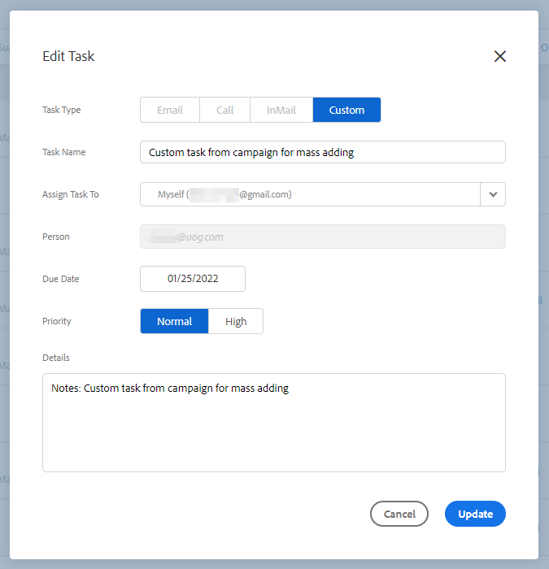

# Sincronizzazione attività promemoria con Salesforce {#reminder-task-sync-with-salesforce}

>[!NOTE]
>
>Per informazioni su come abilitare l’estrazione della sincronizzazione delle attività [Sincronizza le azioni Approfondimenti vendite Attività/Promemoria alle attività Salesforce](/help/marketo/product-docs/marketo-sales-insight/actions/crm/salesforce-integration/salesforce-sync-settings.md#sync-sales-insight-actions-tasks-reminders-to-salesforce-tasks).

Una volta abilitate le impostazioni di sincronizzazione delle attività, gli utenti vedranno le loro attività di promemoria bidirezionalmente sincronizzate con Salesforce. Ciò significa che gli utenti possono gestire le attività da Salesforce o da Sales Insight Actions e avere la certezza che i sistemi rimarranno allineati.

## Sincronizzazione campo attività promemoria {#reminder-task-field-sync}

Di seguito è riportato un elenco dei campi attività promemoria in Azioni Approfondimenti vendite e dei relativi campi Salesforce supportati tramite la sincronizzazione bidirezionale delle attività.

<table>
 <tr>
  <th>Campo attività Azioni Insight vendite</th>
  <th>Campo attività Salesforce</th>
  <th>Task Salesforce</th>
 </tr>
 <tr>
  <td>Nome attività</td>
  <td>Campo oggetto</td>
  <td>Breve campo di riepilogo inteso per mostrare il titolo dell’attività.</td>
 </tr>
 <tr>
  <td>Stato</td>
  <td>Stato attività</td>
  <td>
Mostra lo stato dell'attività. Le attività Insight vendite hanno due stati che si associano a due valori nell’elenco di selezione dello stato dell’attività Salesforce.

  
Apri in Azioni Approfondimenti vendite = Non avviato in Salesforce.

  
Completa in Azioni Approfondimenti vendite = Completato in Salesforce.

  
Gli altri valori di stato in Salesforce non verranno sincronizzati con le azioni Approfondimenti vendite.
</td>
 </tr>
 <tr>
  <td>Priorità</td>
  <td>Priorità</td>
  <td>
La priorità delle azioni di analisi delle vendite può essere Normale o Alta, che viene associata ai valori di priorità Normale e Alta in Salesforce.

  
Il valore a bassa priorità in Salesforce non verrà sincronizzato con le azioni Approfondimenti vendite.
</td>
 </tr>
 <tr>
  <td>Data di scadenza</td>
  <td>Data di scadenza</td>
  <td>Data di scadenza dell'attività.</td>
 </tr>
 <tr>
  <td>Dettagli</td>
  <td>Commenti</td>
  <td>Mostra informazioni più dettagliate su cosa si intendeva completare con l’attività promemoria.</td>
 </tr>
</table>

## Sincronizzazione delle azioni Approfondimenti vendite con Salesforce per la prima volta {#syncing-sales-insight-actions-tasks-with-salesforce-for-the-first-time}

Quando attivi per la prima volta la sincronizzazione tra le azioni Approfondimenti vendite e le attività Salesforce, importiamo le attività Salesforce. Lo faremo **not** sovrascrivi tutte le attività correnti in Azioni Approfondimenti vendite a Salesforce. Per ridurre l&#39;ingombro e i duplicati, le uniche attività che vengono sincronizzate da Sales Insight Actions in Salesforce sono le attività create *dopo* è possibile sincronizzare le azioni Insight vendite con SFDC.

Ecco cosa succede quando sincronizzi le azioni Approfondimenti vendite e le attività SFDC:

* Non appena fai clic su salva nella sincronizzazione delle attività, queste iniziano a sincronizzarsi. Inizialmente ci vorrà un po&#39; di tempo.

* Eventuali promemoria aggiornati o creati nelle ultime 24 ore verranno trasferiti dalla DSC alle azioni di Insight sulle vendite. La sincronizzazione è basata sulla data di scadenza e tutte le attività verranno sincronizzate sul back-end, ma in Command Center verranno visualizzate solo le attività scadute oggi e domani.

* Se la sincronizzazione è stata attivata in precedenza ed elimini eventuali attività in SFDC, tutto ciò che è stato eliminato negli ultimi 15 giorni verrà eliminato dal Centro comandi.

* Sincronizzeremo costantemente le attività tra le azioni Approfondimenti vendite e SFDC, purché la sincronizzazione sia abilitata.

Dopo la sincronizzazione iniziale, tutte le attività create, modificate, completate o eliminate in Azioni Insight vendite verranno sincronizzate nell’elenco delle attività in Salesforce. E qualsiasi cosa creata, modificata, completata o eliminata in Salesforce aggiornerà l’elenco delle attività in Azioni Approfondimenti vendite.

Per attivare questa sincronizzazione, controlla la casella di sincronizzazione nel tuo [Pagina Impostazioni](https://toutapp.com/login) nell&#39;applicazione web.

>[!NOTE]
>
>Il campo dell’oggetto di un’attività può essere aggiornato in Azioni Approfondimenti vendite e tale aggiornamento verrà sincronizzato nel campo Oggetto di Salesforce per l’attività sincronizzata corrispondente, se si utilizza l’ `{{activity_subject}}` campo dinamico nel [Personalizzazione dei dettagli dell&#39;attività](/help/marketo/product-docs/marketo-sales-insight/actions/crm/salesforce-integration/configure-salesforce-activity-detail-customization.md) impostazioni. Al contrario, eventuali aggiornamenti apportati al campo oggetto in Salesforce _not_ eseguire la sincronizzazione con il campo oggetto promemoria azioni di analisi vendite.
