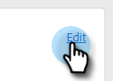

# Aggiungere testo con collegamento ipertestuale {#add-hyperlinked-text}

Segui i passaggi seguenti per scoprire come aggiungere collegamenti ipertestuali ai tuoi modelli e-mail.

1. Nella pagina [!UICONTROL Templates], selezionare il modello desiderato (o crearne uno nuovo).

   

1. Fai clic su **[!UICONTROL Edit]**.

   

1. Digitare il testo che si desidera inserire nel collegamento ipertestuale, ad esempio &quot;Fare clic qui&quot;. [!DNL Highlight] e fare clic sul pulsante di collegamento nell&#39;editor.

   

1. Immettere l&#39;URL al quale si desidera collegarlo (ovvero `https://experienceleague.adobe.com/docs/marketo/using/home.html?lang=it`). Scegliere se aprire l&#39;URL nella stessa finestra o in una nuova finestra e fare clic su **[!UICONTROL Save]**.

   

1. Fare di nuovo clic su **[!UICONTROL Save]**.

   

>[!NOTE]
>
>Se il modello modificato è attualmente utilizzato come passaggio e-mail in una campagna, avrai la possibilità di aggiornare la formulazione per campagne specifiche (o tutte).
