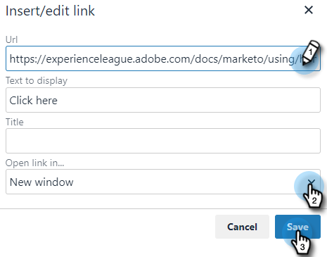

# Aggiungi testo con collegamento ipertestuale {#add-hyperlinked-text}

Per scoprire come aggiungere collegamenti ipertestuali ai modelli e-mail, effettua le seguenti operazioni.

1. Nella pagina Modelli , seleziona il modello desiderato (o creane uno nuovo).

   

1. Fai clic su **Modifica**.

   

1. Digitare il testo da collegare come collegamento ipertestuale (ad esempio, &quot;Fare clic qui&quot;). Evidenzialo e fai clic sul pulsante di collegamento nell’editor.

   

1. Inserisci l’URL a cui desideri che sia collegato (ad es. `https://experienceleague.adobe.com/docs/marketo/using/home.html`). Scegli se desideri aprire l’URL nella stessa finestra o in una nuova finestra e fai clic su **Salva**.

   

1. Fai clic su **Salva** di nuovo.

   

>[!NOTE]
>
>Se il modello modificato viene attualmente utilizzato come passaggio e-mail in qualsiasi campagna, ti verrà offerta la possibilità di aggiornare la formulazione per campagne specifiche (o tutte).
