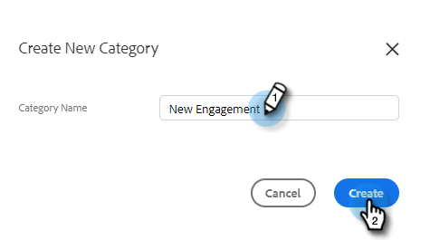

# Gestire le categorie di modelli {#manage-template-categories}

## Creare una categoria {#create-a-category}

1. Fai clic sul pulsante **Modelli** scheda .

   

1. Fai clic sul pulsante **+** accanto a **Categorie**.

   

1. Inserisci un nome per la nuova categoria, quindi fai clic su **Crea**.

   

## Rinominare una categoria di modelli {#rename-a-template-category}

1. Fai clic sul pulsante **Modelli** scheda .

   

1. Passa il puntatore del mouse sul modello da rinominare e fai clic sul punto (tre punti). Seleziona **Rinomina**.

   

1. Digitare il nuovo nome. Per salvare, premere Invio (o fare clic altrove sullo schermo).

   

## Eliminare una categoria di modelli {#delete-a-template-category}

1. Fai clic sul pulsante **Modelli** scheda .

   

1. Passa il puntatore del mouse sul modello da rinominare e fai clic sul punto (tre punti). Seleziona **Elimina**.

   

1. Fai clic su **Elimina** per confermare.

   

>[!NOTE]
>
>Le categorie non possono essere eliminate se contengono ancora dei modelli. Spostare o eliminare tutti i modelli prima di eliminare una categoria.
