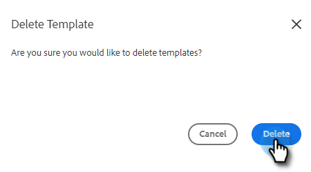

# Gestisci modelli {#manage-templates}

## Creare un modello {#create-a-new-template}

1. Accedi a **Modelli** scheda.

   

1. Clic **Crea modello**.

   

1. Scegli un **Nome** e **Categoria** per il modello e-mail, quindi fai clic su **Crea**.

   

1. Nell’editor modelli, crea un oggetto per l’e-mail e digita il messaggio desiderato. Utilizza gli strumenti di modifica (font, dimensione del testo, ecc.) per personalizzare l&#39;aspetto. Clic **Salva** per finalizzare le modifiche.

   

>[!TIP]
>
>Digita sempre il testo direttamente nel modello o copialo da un editor di testo normale (ad esempio Blocco note o TextEdit). Copiare e incollare da un editor Rich Text (ad esempio, MS Word) può causare irregolarità di formattazione.

## Visualizza dettagli modello {#view-template-details}

L&#39;area Dettagli modello contiene più schede.

<table>
 <tr>
  <td><strong>Modello</strong></td>
  <td>Rivedi e apporta modifiche, imposta i criteri per rendere il modello un modello consigliato, aggiungi note</td>
 </tr>
 <tr>
  <td><strong>Analytics</strong></td>
  <td>Rivedi l’analisi del coinvolgimento per il modello. Eseguire una ricerca filtrata.</td>
 </tr>
 <tr>
  <td><strong>E-mail</strong></td>
  <td>Visualizza tutte le e-mail inviate utilizzando questo modello. Eseguire una ricerca filtrata.</td>
 </tr>
 <tr>
  <td><strong>Campagne</strong></td>
  <td>Scopri in quali campagne viene utilizzato il modello.</td>
 </tr>
</table>

## Condividere un modello {#share-a-template}

Se utilizzi uno dei nostri account team, tutti i modelli sono ancora privati per impostazione predefinita.

1. Accedi a **Modelli** scheda.

   

1. Trova e scegli il modello desiderato.

   

1. Fai clic su **Condividi** pulsante.

   

   >[!NOTE]
   >
   >I modelli condivisi con te verranno visualizzati nella sezione **Modelli team** sulla sinistra della pagina Modelli. I team sono disponibili solo per gli utenti Premium.

1. Fai clic sul menu a discesa Condividi con e seleziona i team con cui desideri condividere.

   

1. È possibile mantenere il modello nella categoria corrente o spostarlo in una diversa. In questo esempio lo manteniamo nell&#39;attuale. Clic **Condividi** al termine.

   

## Preferito per un modello {#favorite-a-template}

È possibile aggiungere modelli di qualsiasi categoria all&#39;elenco Preferiti. In questo modo viene automaticamente generata una nuova categoria nella parte superiore dell’elenco, per poter accedere rapidamente ai modelli più utilizzati.

1. Accedi a **Modelli** scheda.

   

1. Individua il modello desiderato e passa il cursore sopra di esso. Fare clic sulla stella visualizzata a sinistra del nome del modello.

   

   Dopo che è favorita, la stella rimarrà.

   

## Personalizza visualizzazione modello {#customize-template-view}

Dalla sezione **Visualizza** , puoi scegliere di visualizzare: tutti i modelli, i tuoi modelli, i tuoi modelli preferiti, i modelli condivisi, i modelli non condivisi o i modelli non utilizzati (modelli che non sono stati utilizzati negli ultimi 90 giorni).

>[!NOTE]
>
>È inoltre possibile aggiungere/rimuovere colonne nella vista modello facendo clic sull&#39;icona delle impostazioni a destra del menu a discesa.

## Archiviare un modello {#archive-a-template}

Archivia i modelli per organizzare e focalizzare i contenuti di vendita senza perdere i dati dei modelli.

1. Seleziona la casella accanto al modello da archiviare.

   

1. Clic **Archivia**.

   

1. Clic **Archivia** per confermare.

   

>[!NOTE]
>
>Una volta archiviato, il modello non può essere modificato né utilizzato. Per riutilizzarlo, sposta il modello fuori dall’archivio e in un’altra categoria.

Puoi anche selezionare il filtro Non utilizzato per visualizzare e archiviare modelli che non sono stati utilizzati da oltre 90 giorni.

## Eliminare un modello {#delete-a-template}

Per eliminare un modello, segui la procedura riportata di seguito.

>[!CAUTION]
>
>Se elimini un modello, verranno eliminati anche tutti i dati di tracciamento e analisi ad esso associati.

1. Seleziona la casella accanto al modello da eliminare.

   

1. Clic **Elimina**.

   

1. Clic **Elimina** per confermare.

   
