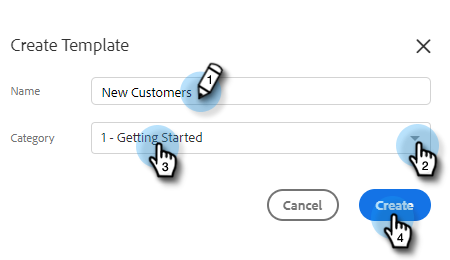
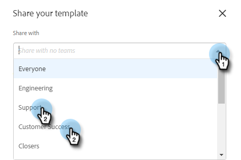

# Gestire i modelli {#manage-templates}

## Creare un modello {#create-a-new-template}

1. Passa a **Modelli** scheda .

   

1. Fai clic su **Crea modello**.

   

1. Scegli un **Nome** e **Categoria** per il modello e-mail, quindi fai clic su **Crea**.

   

1. Nell’editor modelli, crea una riga dell’oggetto per l’e-mail e digita il messaggio desiderato. Utilizzare gli strumenti di modifica (font, dimensioni del testo, ecc.) personalizzare l&#39;aspetto. Fai clic su **Salva** per finalizzare le modifiche.

   

>[!TIP]
>
>Digitare sempre il testo direttamente nel modello o copiarlo da un editor di testo normale (ad esempio, Blocco note o Modifica testo). Copiare e incollare da un editor Rich Text (ad esempio, MS Word) può causare irregolarità nella formattazione.

## Visualizza dettagli modello {#view-template-details}

L’area Dettagli modello contiene più schede.

<table>
 <tr>
  <td><strong>Modello</strong></td>
  <td>Rivedi e apporta modifiche, imposta criteri per rendere il modello un modello consigliato, aggiungi note</td>
 </tr>
 <tr>
  <td><strong>Analytics</strong></td>
  <td>Rivedi l’analisi del coinvolgimento per il modello. Eseguire una ricerca filtrata.</td>
 </tr>
 <tr>
  <td><strong>E-mail</strong></td>
  <td>Visualizza tutte le e-mail inviate utilizzando questo modello. Eseguire una ricerca filtrata.</td>
 </tr>
 <tr>
  <td><strong>Campagne</strong></td>
  <td>Vedi in quali campagne viene utilizzato il modello.</td>
 </tr>
</table>

## Condividere un modello {#share-a-template}

Se utilizzi uno dei nostri account team, per impostazione predefinita tutti i modelli sono ancora privati.

1. Passa a **Modelli** scheda .

   

1. Trova e scegli il modello desiderato.

   

1. Fai clic sul pulsante **Condividi** pulsante .

   

   >[!NOTE]
   >
   >I modelli che sono stati condivisi con te verranno visualizzati in **Modelli team** intestazione a sinistra della pagina Modelli . I team sono disponibili solo per gli utenti Premium.

1. Fai clic sull’elenco a discesa Condividi con e seleziona i team con cui desideri condividere.

   

1. È possibile mantenere il modello nella categoria corrente o spostarlo in un altro. In questo esempio lo manteniamo nella versione corrente. Fai clic su **Condividi** al termine.

   

## Modello preferito {#favorite-a-template}

È possibile aggiungere modelli da qualsiasi categoria all&#39;elenco Preferiti. In questo modo viene generata automaticamente una nuova categoria nella parte superiore dell’elenco, per accedere rapidamente ai modelli più utilizzati.

1. Passa a **Modelli** scheda .

   

1. Trova il modello desiderato e passa il cursore sopra di esso. Fare clic sulla stella visualizzata a sinistra del nome del modello.

   

   Dopo che è favorito, la stella rimarrà.

   

## Personalizzare la visualizzazione dei modelli {#customize-template-view}

Da **Visualizza** a discesa, puoi scegliere di visualizzare: tutti i modelli, i modelli, i modelli preferiti, i modelli condivisi, i modelli non condivisi o i modelli non utilizzati (modelli che non sono stati utilizzati negli ultimi 90 giorni).

>[!NOTE]
>
>Inoltre, puoi aggiungere/rimuovere colonne nella visualizzazione modello facendo clic sull’icona delle impostazioni a destra del menu a discesa della vista.

## Archiviare un modello {#archive-a-template}

Archivia modelli per mantenere i contenuti di vendita organizzati e mirati senza perdere dati di modelli.

1. Seleziona la casella accanto al modello da archiviare.

   

1. Fai clic su **Archivia**.

   

1. Fai clic su **Archivia** per confermare.

   

>[!NOTE]
>
>Una volta archiviato, il modello non può essere modificato o utilizzato. Per utilizzarlo nuovamente, sposta il modello fuori da Archivio e in qualsiasi altra categoria.

Puoi anche selezionare il filtro Non utilizzato per visualizzare e archiviare i modelli che non sono stati utilizzati da oltre 90 giorni.

## Eliminare un modello {#delete-a-template}

Per eliminare un modello, effettua le seguenti operazioni.

>[!CAUTION]
>
>L&#39;eliminazione di un modello comporta anche l&#39;eliminazione di TUTTI i dati di tracciamento e analisi associati ad esso.

1. Seleziona la casella accanto al modello da eliminare.

   

1. Fai clic su **Elimina**.

   

1. Fai clic su **Elimina** per confermare.

   
