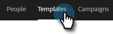

# Visualizzare l’elenco modelli come altro utente {#view-template-list-as-another-user}

In qualità di amministratore, puoi visualizzare i modelli come qualsiasi utente.

>[!NOTE]
>
>**Autorizzazioni amministratore richieste**

1. Fai clic su **[!UICONTROL Templates]**.

   

1. Fare clic sul menu a discesa **[!UICONTROL View As]** e selezionare l&#39;utente desiderato.

   

1. I modelli sono ora visualizzati come utente selezionato.

   

   >[!NOTE]
   >
   >Puoi anche utilizzare i filtri o la funzione di ricerca insieme a _[!UICONTROL View As]_&#x200B;per visualizzare ciò che ti interessa di più.
