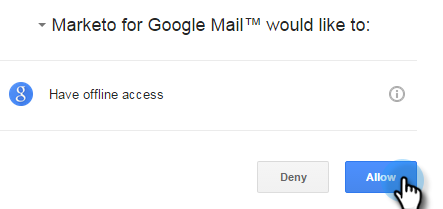

# Installare Marketo Insights per Google Chrome {#install-marketo-insights-for-google-chrome}

Segui questi passaggi per iniziare a utilizzare il potente componente aggiuntivo Chrome.

>[!NOTE]
>
>Non devi essere un amministratore Marketo per installare l&#39;estensione .

1. Installa il [Estensione Marketo Insights for Google Chrome Add in](https://chrome.google.com/webstore/detail/marketo-for-google-mail/jjkfbhajlmoeegbjgjipliamplidmbjb) da Chrome Web Store.

   

1. Fai clic con il pulsante destro del mouse sul logo Marketo in Chrome e seleziona **Opzioni**.

   

1. Inserisci il tuo **Codice Reg**, **Indirizzo e-mail**, **Nome** e **Cognome**. Fai clic su **Verifica e salva**.

   

   >[!CAUTION]
   >
   >Assicurati di utilizzare il tuo **account e-mail principale** durante la registrazione, in quanto non supportiamo l&#39;uso di alias per questo plug-in.

   >[!NOTE]
   >
   >Il codice Reg sarà presente nell’e-mail inviata dopo un amministratore Marketo [rilascia una licenza del componente aggiuntivo per e-mail di Marketo](/help/marketo/product-docs/marketo-sales-insight/msi-outlook-plugin/issue-a-marketo-email-add-in-license.md) [.](https://docs.marketo.com/pages/viewpage.action?pageid=7510848) **Scade dopo 14 giorni**.

1. Fai clic su **Consenti** per consentire l&#39;accesso offline.

   

>[!MORELIKETHIS]
>
>[Utilizzo di Marketo Insights per Google Chrome](/help/marketo/product-docs/marketo-sales-insight/msi-chrome-plugin/using-marketo-insights-for-google-chrome.md)
