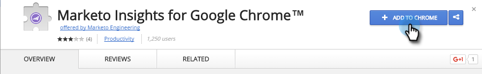

# Installa Marketo Insights per [!DNL Google Chrome] {#install-marketo-insights-for-google-chrome}

Per iniziare a utilizzare il potente componente aggiuntivo Chrome, segui la procedura riportata di seguito. Per installare l&#39;estensione non è necessario essere amministratore Marketo.

>[!NOTE]
>
>Le funzionalità delle azioni di Sales Insight, tra cui Invia e-mail per le vendite, Aggiungi a campagna vendite e Attività, non sono disponibili nei plug-in e-mail di Sales Insight per Gmail e Outlook. Al momento, gli utenti possono inviare un’e-mail tracciabile solo con o senza un modello e-mail di Marketo dal proprio client e-mail quando utilizzano i plug-in e-mail di Sales Insight.

1. Installa l&#39;estensione [Marketo Insights for Google Chrome Add in](https://chrome.google.com/webstore/detail/marketo-for-google-mail/jjkfbhajlmoeegbjgjipliamplidmbjb){target="_blank"} da Chrome Web Store.

   

1. Fare clic con il pulsante destro del mouse sul logo Marketo in [!DNL Chrome] e selezionare **[!UICONTROL Options]**.

   

1. Immetti **[!UICONTROL Reg code]**, **[!UICONTROL Email Address]**, **[!UICONTROL First Name]** e **[!UICONTROL Last Name]**. Fai clic su **[!UICONTROL Verify and Save]**.

   

   >[!CAUTION]
   >
   >Assicurati di utilizzare il tuo **account e-mail principale** durante la registrazione, in quanto non è supportato l&#39;utilizzo di alias per questo plug-in.

   >[!NOTE]
   >
   >Il codice Reg sarà presente nell&#39;e-mail inviata dopo che un amministratore di Marketo [ti avrà rilasciato una licenza per il componente aggiuntivo e-mail di Marketo](/help/marketo/product-docs/marketo-sales-insight/msi-outlook-plugin/issue-a-marketo-email-add-in-license.md){target="_blank"}. **Scade dopo 14 giorni**.

1. Fare clic su **[!UICONTROL Allow]** per consentire l&#39;accesso offline.

   

>[!MORELIKETHIS]
>
>[Utilizzo di Marketo Insights per Google Chrome](/help/marketo/product-docs/marketo-sales-insight/msi-chrome-plugin/using-marketo-insights-for-google-chrome.md){target="_blank"}
