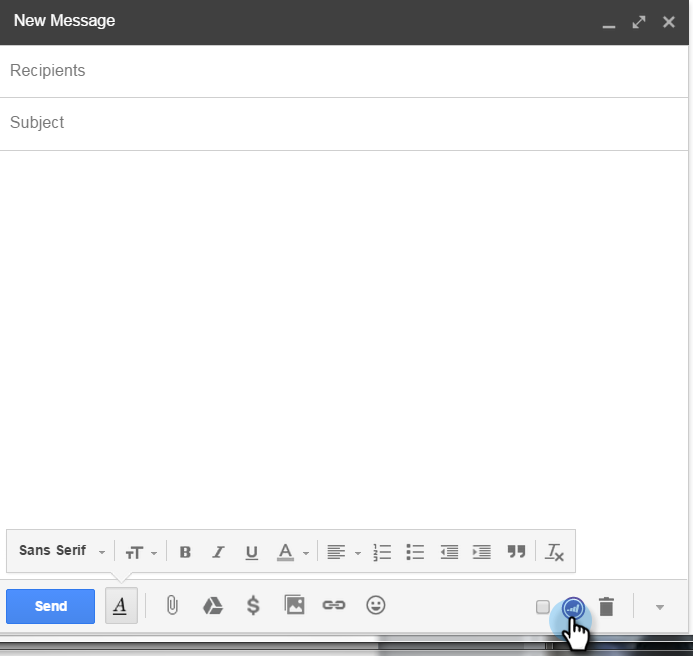
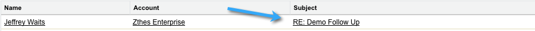

# Utilizzo di Marketo Insights per Google Chrome {#using-marketo-insights-for-google-chrome}

Invia e tieni traccia di qualsiasi e-mail Google con Marketo Insights for Google Chrome.

>[!PREREQUISITES]
>
>[Installare Marketo Insights per Google Chrome](/help/marketo/product-docs/marketo-sales-insight/msi-chrome-plugin/install-marketo-insights-for-google-chrome.md)

>[!NOTE]
>
>Le funzionalità delle azioni di approfondimento delle vendite, tra cui Invia e-mail alle vendite, Aggiungi a campagna di vendita e Attività, non sono disponibili nei plug-in e-mail di approfondimento delle vendite per Gmail e Outlook. Al momento, gli utenti possono inviare un’e-mail tracciabile solo con o senza un modello e-mail di Marketo dal proprio client e-mail quando utilizzano i plug-in e-mail di Sales Insight.

## Inviare un’e-mail con Marketo Insights {#send-an-email-with-marketo-insights}

1. Nella finestra Componi fare clic sull&#39;icona Marketo.

   

1. Il pulsante Invia è diventato viola per Marketo. Questa e-mail ora verrà inviata con Marketo, tutti i collegamenti verranno tracciati e un pixel di tracciamento verrà inserito nell’e-mail. Verrà registrata come attività e-mail di vendita inviata.

   

   >[!NOTE]
   >
   >Un pixel di tracciamento consente di sapere chi ha aperto l’e-mail.

   >[!TIP]
   >
   >Facoltativamente, fai clic sulla doppia freccia per espandere la visualizzazione a schermo intero.

1. Se desideri precompilare l’e-mail con un modello di Marketo pubblicato, fai clic su **Altre opzioni** e seleziona **Carica modello Marketo**.

   

1. Seleziona un **Modello disponibile** e fai clic su **Ok**.

   

1. Inserisci il contenuto e un indirizzo e-mail, quindi fai clic su **Invia**.

   

   >[!NOTE]
   >
   >I messaggi vengono tracciati solo quando **Invia** Il pulsante è viola.

1. L’e-mail verrà presto visualizzata in Marketo Sales Insight e verranno tracciate tutte le aperture e i clic.

   

## Registra risposte e-mail con Marketo {#log-email-replies-with-marketo}

È possibile registrare le risposte e le attività precedenti nella cronologia delle attività di un lead.

1. Nel riquadro di anteprima di Google Mail fare clic su **Accedi a Marketo**.

   

1. Tutto qui! L’e-mail verrà presto visualizzata in Marketo Sales Insight.

   

   >[!MORELIKETHIS]
   >
   >* [Installare Marketo Insights per Google Chrome](/help/marketo/product-docs/marketo-sales-insight/msi-chrome-plugin/install-marketo-insights-for-google-chrome.md)
   >* [Visualizzare le informazioni sulla persona e sull&#39;account e le attività in Google Mail](/help/marketo/product-docs/marketo-sales-insight/msi-chrome-plugin/view-person-and-account-information-and-activities-in-google-mail.md)
