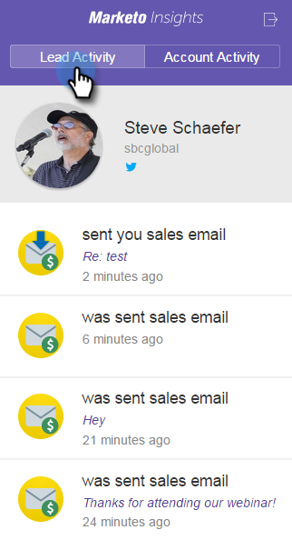
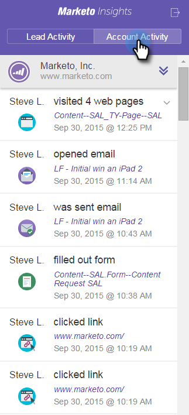

# Visualizza informazioni su utenti e account in Google Mail {#view-person-and-account-information-and-activities-in-google-mail}

## Visualizza attività in Google Mail {#view-activities-in-google-mail}

Utilizzate il riquadro Approfondimenti contestuali di marketing per visualizzare le informazioni sull&#39;account e le attività recenti.

Il riquadro viene visualizzato sia nella finestra di composizione a schermo intero che nel normale riquadro di lettura di Google Mail. Nella visualizzazione Componi, il riquadro mostra informazioni e attività per la prima persona inserita nella riga A. Nella vista di lettura, il riquadro mostra informazioni e attività per la persona che ha inviato il messaggio e-mail che si sta leggendo.

Nella scheda Attività persona sono visualizzate informazioni rilevanti sulla persona, ad esempio nome, titolo, immagine e così via. Potete inoltre visualizzare le attività più recenti che si sono verificate dopo l’invio di un messaggio e-mail, come visitare una pagina Web, compilare un modulo, fare clic su un collegamento, partecipare a un evento e aprire un messaggio e-mail.

Nella scheda Attività account sono visualizzate informazioni rilevanti sull&#39;account, ad esempio il nome della società, l&#39;URL del sito Web e la posizione. Nella scheda vengono inoltre visualizzate le attività dell&#39;account più recenti. L&#39;account è identificato dal dominio persona. Le attività vengono visualizzate nell&#39;elenco se un utente di Sales Insight presente nell&#39;iscrizione ha mai risposto.

Se il team non ha mai inviato un&#39;e-mail di vendita alla persona, non viene visualizzata alcuna attività.

Fare clic sull&#39;icona per comprimere il riquadro.

Fare clic sull&#39;icona Marketo per espandere il riquadro.

## Visualizza attività in Google Chrome {#view-activities-in-google-chrome}

È inoltre possibile utilizzare il riquadro Attività globale in Google Chrome per visualizzare un elenco completo delle attività più recenti che si sono verificate per tutte le persone con cui si è verificato di recente. Si tratta di un feed aggiornato in tempo reale che visualizza continuamente il numero di attività non lette sull&#39;icona.

Fare clic sull&#39;icona Marketo per aprire il riquadro.

>[!MORELIKETHIS]
>
>[Utilizzo di Marketo Insights per Google Chrome](/help/marketo/product-docs/marketo-sales-insight/msi-chrome-plugin/using-marketo-insights-for-google-chrome.md)
