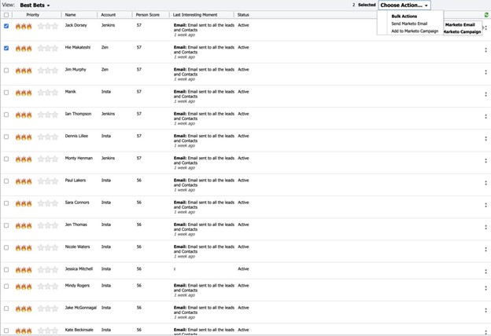

# Migliori offerte {#best-bets}

La scheda Best Bets (Scommesse migliori) include un elenco di tutti gli hot lead in base alla loro priorità, calcolato utilizzando l’urgenza e il punteggio relativo.

Facendo clic sul menu del punto sotto la colonna Azioni, puoi utilizzare opzioni di coinvolgimento come:
* Invia e-mail Marketo
* Aggiungi a Marketo Campaign

Puoi anche selezionare più lead dalla scheda Best Bets (Migliori risultati) e scegliere _Invia e-mail Marketo_ o _Aggiungi a Marketo Campaign_.

