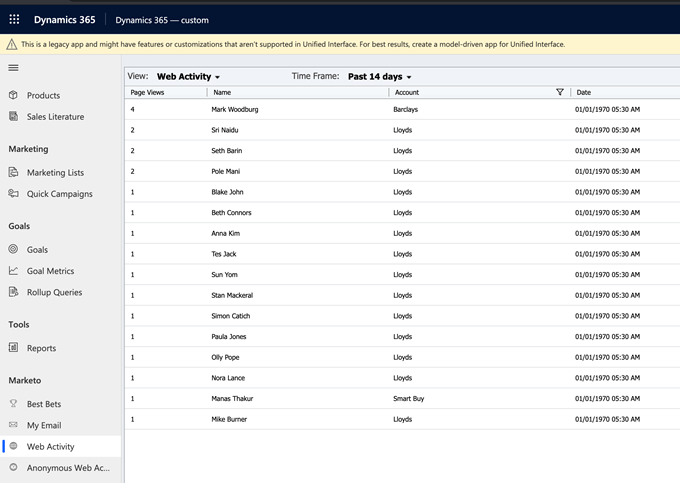

# Attività web {#web-activities}

La scheda Attività web mostra le attività web dei lead/contatti.
Esamina le attività web più recenti del lead, citando il conteggio delle visite della pagina e i rispettivi account. Puoi filtrare i risultati in modo da limitare il numero di pagine specificato.

## Attività Web anonime {#anonymous-web-activities}

La scheda Attività Web anonime mostra tutte le **attività Web anonime** dei visitatori delle pagine Web. Esamina le attività web più recenti citando il conteggio delle visite alla pagina.
