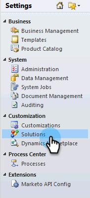
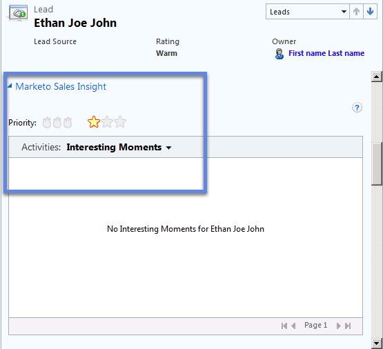

# Installare e configurare Marketo Sales Insight in Microsoft Dynamics 2011 {#install-and-configure-marketo-sales-insight-in-microsoft-dynamics}

Marketo Sales Insight è uno strumento fantastico per il vostro team di vendita. Di seguito sono riportate istruzioni dettagliate su come installarlo e configurarlo in Microsoft Dynamics 2011 On-Premises.

>[!PREREQUISITES]
>
>Completa l&#39;integrazione Marketo-Microsoft.
>
>[Scaricare la soluzione corretta](/help/marketo/product-docs/marketo-sales-insight/msi-for-microsoft-dynamics/installing/download-the-marketo-sales-insight-solution-for-microsoft-dynamics.md) per la versione di Microsoft Dynamics CRM in uso.

## Importa soluzione {#import-solution}

1. Accedere a Microsoft Dynamics CRM. Clic **Impostazioni** nel menu in basso a sinistra.

   

1. Seleziona **Soluzioni** nell&#39;albero.

   

1. Clic **Importa** ( ).

   

   >[!NOTE]
   >
   >Dovresti avere già [installato e configurato](/help/marketo/product-docs/marketo-sales-insight/msi-for-microsoft-dynamics/installing/install-and-configure-marketo-sales-insight-in-microsoft-dynamics-2011.md) la soluzione Marketo prima di procedere.

1. Clic **Sfoglia**. Selezionare la soluzione Marketo Sales Insight [scaricato](/help/marketo/product-docs/marketo-sales-insight/msi-for-microsoft-dynamics/installing/download-the-marketo-sales-insight-solution-for-microsoft-dynamics.md). Clic **Successivo**.

   

1. Verifica i dettagli della soluzione e fai clic su **Successivo**.

   

1. Assicurati che l’opzione Messaggio SDK sia selezionata. Clic **Successivo**.

   

1. Ora attendi il completamento dell’importazione.

   

1. Fai clic su **Chiudi**.

   

1. Marketo Sales Insight verrà ora visualizzato nell&#39;elenco delle soluzioni. Yay!

   

1. Seleziona Marketo Sales Insight e fai clic su **Pubblica tutte le personalizzazioni** ( ).

   

## Connettere Marketo e Sales Insight  {#connect-marketo-and-sales-insight}

>[!NOTE]
>
>**Autorizzazioni amministratore richieste**

1. Accedi a Marketo e fai clic su **Amministratore**.

   

1. Sotto **Insight sulle vendite** clic sezione **Modifica configurazione API**.

   

1. Copia il **Host Marketo**, **URL API**, e **ID utente API** da utilizzare in un passaggio successivo. Immetti un **Chiave segreta API** a tua scelta e fai clic su **Salva**.

   >[!CAUTION]
   >
   >Non utilizzare una e commerciale (&amp;) nella chiave segreta API.

   

   >[!NOTE]
   >
   >I seguenti campi devono essere sincronizzati con Marketo per _lead e contatto_ per il corretto funzionamento di Sales Insight:
   >
   >* Priorità
   >* Urgenza
   >* Punteggio relativo
   >
   >Se manca uno di questi campi, in Marketo verrà visualizzato un messaggio di errore con il nome dei campi mancanti. Per risolvere questo problema, esegui [questa procedura](/help/marketo/product-docs/marketo-sales-insight/msi-for-microsoft-dynamics/setting-up-and-using/required-fields-for-syncing-marketo-with-dynamics.md).

1. Torna a Dynamics, seleziona **Impostazioni**.

   

1. Seleziona **Configurazione API Marketo** nell&#39;albero.

   

1. Clic **Configurazione predefinita**.

   

1. Immetti le informazioni ottenute da Marketo in precedenza.

   

1. Clic **Salva**.

   

## Imposta accesso utente {#set-user-access}

Imposta i ruoli utente per consentire a utenti specifici di accedere a Sales Insight.

1. Seleziona **Impostazioni**.

   

1. Seleziona **Amministrazione** nell&#39;albero.

   

1. Clic **Utenti**.

   

1. Seleziona gli utenti a cui vuoi concedere l’accesso e fai clic su **Gestisci ruoli**.

   

1. Seleziona la **Insight sulla vendita di Marketo** ruolo e clic **OK**.

   

   Ed è tutto! Tutti gli utenti con accesso potranno ora visualizzare la sezione approfondimenti vendite nella visualizzazione dettagli lead/contatto.

   

   Congratulazioni. Ora hai liberato la potenza di Marketo Sales Insight.

>[!MORELIKETHIS]
>
>[Impostazione di stelle e fiamme per record lead/contatti](/help/marketo/product-docs/marketo-sales-insight/msi-for-microsoft-dynamics/setting-up-and-using/setting-up-stars-and-flames-for-lead-contact-records.md)
