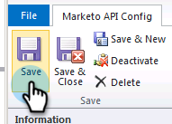
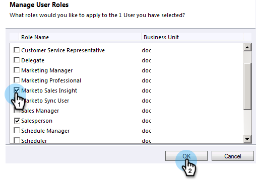

# Installazione e configurazione di Marketing Sales Insight in Microsoft Dynamics 2011 {#install-and-configure-marketo-sales-insight-in-microsoft-dynamics}

Marketing Sales Insight è uno strumento fantastico per il vostro team di vendita. Di seguito sono riportate le istruzioni dettagliate su come installarlo e configurarlo nei locali di Microsoft Dynamics 2011.

>[!PREREQUISITES]
>
>Completate l&#39;integrazione tra Marketo e Microsoft.
>
>[Scarica la ](/help/marketo/product-docs/marketo-sales-insight/msi-for-microsoft-dynamics/installing/download-the-marketo-sales-insight-solution-for-microsoft-dynamics.md) soluzione corretta per la versione di Microsoft Dynamics CRM in uso.

## Soluzione di importazione {#import-solution}

1. Accedi a Microsoft Dynamics CRM. Fare clic su **Impostazioni** nel menu in basso a sinistra.

   

1. Selezionare **Soluzioni** nella struttura.

   

1. Fare clic su **Importa** ( ).

   

   >[!NOTE]
   >
   >Prima di procedere, è già necessario che [sia installata e configurata](/help/marketo/product-docs/marketo-sales-insight/msi-for-microsoft-dynamics/installing/install-and-configure-marketo-sales-insight-in-microsoft-dynamics-2011.md) la soluzione Marketo.

1. Fare clic su **Sfoglia**. Selezionate la soluzione Marketing Sales Insight [scaricata](/help/marketo/product-docs/marketo-sales-insight/msi-for-microsoft-dynamics/installing/download-the-marketo-sales-insight-solution-for-microsoft-dynamics.md). Fare clic su **Next**.

   

1. Verificate i dettagli della soluzione e fate clic su **Next**.

   

1. Accertati che l’opzione Messaggio SDK sia selezionata. Fare clic su **Next**.

   

1. Attendere il termine dell&#39;importazione.

   

1. Fare clic su **Chiudi**.

   

1. Marketing Sales Insight verrà visualizzato nell&#39;elenco delle soluzioni. Sì!

   

1. Selezionare Marketing Sales Insight e fare clic su **Pubblica tutte le personalizzazioni** ( ).

   

## Connect Marketing e Sales Insight {#connect-marketo-and-sales-insight}

>[!NOTE]
>
>**Autorizzazioni amministratore richieste**

1. Accedete a Marketo e fate clic su **Admin**.

   

1. Nella sezione **Sales Insight** fare clic su **Edit API Configuration** (Modifica configurazione API).

   

1. Copiate l&#39;**Marketo Host**, **URL API** e l&#39;**ID utente API** da utilizzare in un secondo momento. Immettete una **Chiave segreta API** di vostra scelta e fate clic su **Salva**.

   >[!CAUTION]
   >
   >Non utilizzate una e commerciale (&amp;) nella chiave segreta API.

   

   >[!NOTE]
   >
   >Per il funzionamento di _Lead e Contact_, è necessario sincronizzare i campi seguenti con Marketo:
   >
   >* Priorità
   >* Urgenza
   >* Punteggio relativo

   >
   >Se manca uno di questi campi, in Marketo verrà visualizzato un messaggio di errore con il nome dei campi mancanti. Per risolvere il problema, eseguire [questa procedura](/help/marketo/product-docs/marketo-sales-insight/msi-for-microsoft-dynamics/setting-up-and-using/required-fields-for-syncing-marketo-with-dynamics.md).

1. Torna a Dynamics, seleziona **Settings**.

   

1. Selezionare **Configurazione API Marketo** nella struttura.

   

1. Fare clic su **Configurazione predefinita**.

   

1. Inserite le informazioni da Marketo a precedente.

   

1. Fare clic su **Salva**.

   

## Imposta accesso utente {#set-user-access}

Configurate i ruoli utente per consentire a utenti specifici di accedere a Sales Insight.

1. Selezionare **Settings**.

   

1. Selezionare **Amministrazione** nella struttura.

   

1. Fare clic su **Utenti**.

   

1. Selezionare gli utenti a cui si desidera concedere l&#39;accesso e fare clic su **Gestisci ruoli**.

   

1. Selezionare il ruolo **Marketing Sales Insight** e fare clic su **OK**.

   

   Ed è tutto! Tutti gli utenti dispongono dell&#39;accesso per visualizzare la sezione Informazioni sulle vendite nella visualizzazione Dettagli lead/contatto.

   

   Congratulazioni. Ora hai scatenato la potenza di Marketing Sales Insight.

>[!MORELIKETHIS]
>
>[Impostazione di stelle e fiamme per i record lead/contatto](/help/marketo/product-docs/marketo-sales-insight/msi-for-microsoft-dynamics/setting-up-and-using/setting-up-stars-and-flames-for-lead-contact-records.md)
