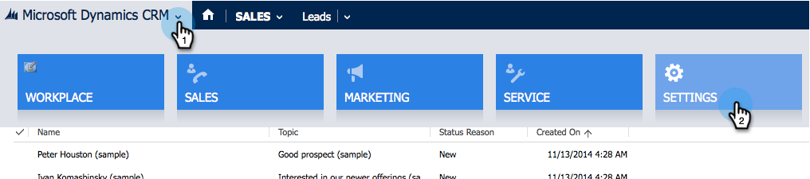

# Installazione e configurazione di Marketing Sales Insight in Microsoft Dynamics 2015 {#install-and-configure-marketo-sales-insight-in-microsoft-dynamics}

Marketo Sales Insight è uno strumento fantastico per dare al vostro team di vendita una &quot;finestra&quot; nella ricchezza di dati di cui dispone il team Marketing. Come installare e configurare in Microsoft Dynamics 201

>[!PREREQUISITES]
>
>Completate l&#39;integrazione tra Marketo e Microsoft.
>
>[Scarica la ](/help/marketo/product-docs/marketo-sales-insight/msi-for-microsoft-dynamics/installing/download-the-marketo-sales-insight-solution-for-microsoft-dynamics.md) soluzione corretta per la versione di Microsoft Dynamics CRM in uso.

## Soluzione di importazione {#import-solution}

OK, ora è ora di importare la soluzione Marketing to Sales Insight in Microsoft Dynamics. Di seguito viene illustrato come:

1. In Microsoft Dynamics CRM fare clic su **Impostazioni**.

   

1. In IMPOSTAZIONI, fare clic su **Personalizzazioni**.

   

1. Fare clic su **Soluzioni**.

   

   >[!NOTE]
   >
   >Prima di procedere, avresti già installato e configurato la soluzione Marketo.

1. Fare clic su **Importa**.

   

1. Nella nuova finestra, fare clic su **Sfoglia**.

   

1. Trova e seleziona la soluzione che hai scaricato sopra.

   

1. Fare clic su **Next**.

   

1. La soluzione verrà caricata. Potete visualizzare il contenuto del pacchetto, se lo desiderate. Fare clic su **Next**.

   

1. Assicurarsi di lasciare la casella selezionata e fare clic su **Importa**.

   

1. Sentitevi liberi di scaricare il file di registro, quindi fate clic su **Chiudi**.

   

1. Fantastico! Dovresti vedere la soluzione ora. Se non è presente, aggiorna lo schermo.

   

## Connect Marketing e Sales Insight {#connect-marketo-and-sales-insight}

Colleghiamo la tua istanza di Marketo a Sales Insight in Dynamics. Di seguito viene illustrato come:

>[!NOTE]
>
>Diritti di amministratore richiesti.

1. Accedete a Marketo e andate alla sezione **Admin**.

   

1. Nella sezione Sales Insight, fare clic su **Edit API Configuration**.

   

1. Copiate l&#39;**Marketo Host**, **URL API** e l&#39;**ID utente API** da utilizzare in un secondo momento. Immettete una chiave segreta API a vostra scelta e fate clic su **Salva**.

   >[!CAUTION]
   >
   >Non utilizzate una e commerciale (&amp;) nella chiave segreta API.

   

   >[!NOTE]
   >
   >Per il funzionamento di *Lead e Contact*, è necessario sincronizzare i campi seguenti con Marketo:
   >
   >* Priorità
   >* Urgenza
   >* Punteggio relativo

   >
   >Se manca uno di questi campi, in Marketo verrà visualizzato un messaggio di errore con il nome dei campi mancanti. Per risolvere il problema, eseguire [questa procedura](/help/marketo/product-docs/marketo-sales-insight/msi-for-microsoft-dynamics/setting-up-and-using/required-fields-for-syncing-marketo-with-dynamics.md).

1. In Microsoft Dynamics, passare a **Impostazioni**.

   

1. In **Impostazioni**, fare clic su **Configurazione API Marketo**.

   

1. Fare clic su **Nuovo**.

   

1. Inserite le informazioni da Marketo in precedenza e fate clic su **Salva**.

   

## Imposta accesso utente {#set-user-access}

Infine, è necessario consentire a utenti specifici l&#39;accesso per utilizzare Marketing Cloud Sales Insight.

1. Vai a **Settings**.

   

1. Vai a **Security**.

   

1. Fare clic su **Utenti**.

   

1. Selezionare gli utenti a cui si desidera concedere l&#39;accesso a Sales Insight e fare clic su **Gestisci ruoli**.

   

1. Selezionare il ruolo Marketing Sales Insight e fare clic su **OK**.

   

   E dovreste essere tutti pronti! Infine, per testare, accedi a Dynamics come utente che ha accesso a Marketing Sales Insight e cerca un lead o un contatto.

   

Ora hai sbloccato la potenza di Marketing Sales Insight per il tuo team di vendita.

>[!MORELIKETHIS]
>
>[Impostazione di stelle e fiamme per i record lead/contatto](/help/marketo/product-docs/marketo-sales-insight/msi-for-microsoft-dynamics/setting-up-and-using/setting-up-stars-and-flames-for-lead-contact-records.md)
