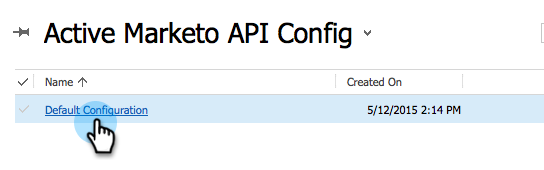

# Installa e configura [!DNL Marketo Sales Insight] in [!DNL Microsoft Dynamics 365] {#install-and-configure-marketo-sales-insight-in-microsoft-dynamics}

[!DNL Marketo Sales Insight] è uno strumento fantastico per offrire al tuo team di vendita una &quot;finestra&quot; sulla ricchezza di dati di cui dispone il team Marketing. Ecco come installare e configurare.

>[!PREREQUISITES]
>
>Completa l&#39;integrazione Marketo-Microsoft.
>
>[Scarica la soluzione corretta](/help/marketo/product-docs/marketo-sales-insight/msi-for-microsoft-dynamics/installing/download-the-marketo-sales-insight-solution-for-microsoft-dynamics.md) per la tua versione di [!DNL Microsoft Dynamics CRM].

## Importa soluzione {#import-solution}

1. Accedi a [[!DNL Microsoft Office 365]](https://login.microsoftonline.com/).

   

1. Fare clic sul menu  e selezionare **CRM**.

   

1. Fare clic sul menu . Nel menu a discesa, selezionare **[!DNL Settings]**, quindi selezionare **[!DNL Solutions]**.

   

   >[!NOTE]
   >
   >Prima di procedere, dovresti avere già installato [e configurato la soluzione Marketo](/help/marketo/product-docs/crm-sync/microsoft-dynamics-sync/sync-setup/microsoft-dynamics-365-with-ropc-connection/step-1-of-4-install.md).

1. Fai clic su **[!UICONTROL Import]**.

   

1. Nella nuova finestra, fare clic su **[!UICONTROL Browse]**. Scegliere la [soluzione Marketo Sales Insight scaricata al passaggio 1](#msi). Fai clic su **[!UICONTROL Next]**.

   

1. La soluzione verrà caricata. Puoi visualizzare il contenuto del pacchetto, se lo desideri. Fai clic su **[!UICONTROL Next]**.

   

1. Assicurarsi di lasciare la casella **[!UICONTROL checked]** e fare clic su **[!UICONTROL Import]**.

   

1. Scarica il file di registro. Fai clic su **[!UICONTROL Close]**.

   

1. Fantastico! Dovresti vedere la soluzione ora. Se non è presente, aggiorna lo schermo.

   

1. Fai clic su **[!UICONTROL Publish All Customizations]**.

   

## Connetti Marketo e [!DNL Sales Insight] {#connect-marketo-and-sales-insight}

Colleghiamo l&#39;istanza di Marketo a [!DNL Sales Insight] in [!DNL Dynamics]. Ecco come:

>[!NOTE]
>
>**Autorizzazioni amministratore richieste**

1. Accedere a Marketo e passare alla sezione **[!UICONTROL Admin]**.

   

1. Nella sezione **[!UICONTROL Sales Insight]**, fai clic su **Modifica configurazione API**.

   

1. Copiare **[!UICONTROL Marketo Host]**, **[!UICONTROL API URL]** e **[!UICONTROL API User Id]** per utilizzarli in un passaggio successivo. Immettere un **[!UICONTROL API Secret Key]** desiderato e fare clic su **[!UICONTROL Save]**.

   >[!CAUTION]
   >
   >Non utilizzare una e commerciale (&amp;) nella chiave segreta API.

   

   >[!NOTE]
   >
   >I campi seguenti devono essere sincronizzati con Marketo affinché _sia lead che contatto_ per [!DNL Sales Insight] funzionino:
   >
   > * Priorità
   > * Urgenza
   > * Punteggio relativo
   >
   >Se manca uno di questi campi, in Marketo verrà visualizzato un messaggio di errore con il nome dei campi mancanti. Per risolvere il problema, eseguire [questa procedura](/help/marketo/product-docs/marketo-sales-insight/msi-for-microsoft-dynamics/setting-up-and-using/required-fields-for-syncing-marketo-with-dynamics.md).

1. Tornando a [!DNL Microsoft Dynamics], fai clic sull&#39;icona  accanto a [!UICONTROL Settings], quindi seleziona **[!UICONTROL Marketo API Config]** nel menu a discesa.

   

1. Fai clic su **[!UICONTROL Default Configuration]**.

   

1. Immetti le informazioni copiate in precedenza da Marketo.

   

1. Fai clic sull&#39;icona  nell&#39;angolo in basso a destra per salvare le modifiche.

## Imposta accesso utente {#set-user-access}

È necessario concedere agli utenti le autorizzazioni per utilizzare [!DNL Sales Insight].

1. Fare clic sul menu . Nel menu a discesa selezionare **[!UICONTROL Settings]**, quindi selezionare **[!UICONTROL Security]**.

   

1. Fai clic su **[!UICONTROL Users]**.

   

1. Selezionare gli utenti a cui si desidera concedere l&#39;accesso a [!DNL Sales Insight] e fare clic su **[!UICONTROL Manage Roles]**.

   

1. Selezionare la mansione **[!UICONTROL Marketo Sales Insight]** e fare clic su **[!UICONTROL OK]**.

   

   E dovreste aver finito! Infine, per eseguire il test, accedere a [!DNL Dynamics] come utente che ha accesso a [!DNL Marketo Sales Insight] e controllare un lead o un contatto.

   

Hai sbloccato la potenza di [!DNL Marketo Sales Insight] per il tuo team vendite.

>[!MORELIKETHIS]
>
>[Impostazione di stelle e fiamme per record lead/contatti](/help/marketo/product-docs/marketo-sales-insight/msi-for-microsoft-dynamics/setting-up-and-using/setting-up-stars-and-flames-for-lead-contact-records.md)
