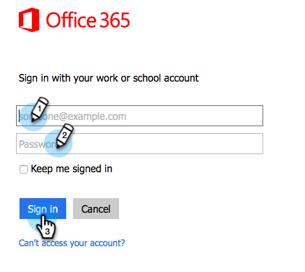
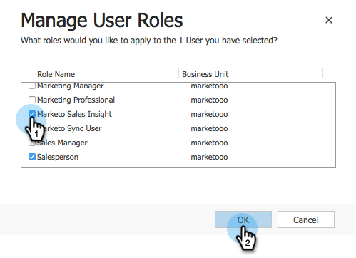

# Installazione e configurazione di Marketing Sales Insight in Microsoft Dynamics 365 {#install-and-configure-marketo-sales-insight-in-microsoft-dynamics}

Marketo Sales Insight è uno strumento fantastico per dare al vostro team di vendita una &quot;finestra&quot; nella ricchezza di dati di cui dispone il team Marketing. Come installare e configurare.

>[!PREREQUISITES]
>
>Completate l&#39;integrazione tra Marketo e Microsoft.
>
>[Scarica la ](/help/marketo/product-docs/marketo-sales-insight/msi-for-microsoft-dynamics/installing/download-the-marketo-sales-insight-solution-for-microsoft-dynamics.md) soluzione corretta per la versione di Microsoft Dynamics CRM in uso.

## Soluzione di importazione {#import-solution}

1. Accedete a [Microsoft Office 365](https://login.microsoftonline.com/).

   

1. Fare clic sul menu  e selezionare **CRM**.

   

1. Fare clic sul menu . Nell&#39;elenco a discesa, selezionare **Impostazioni**, quindi selezionare **Soluzioni**.

   

   >[!NOTE]
   >
   >Prima di procedere, è necessario che [sia già installato e configurato la soluzione Marketo](/help/marketo/product-docs/crm-sync/microsoft-dynamics-sync/sync-setup/microsoft-dynamics-365/step-1-of-3-install.md).

1. Fare clic su **Importa**.

   

1. Nella nuova finestra, fare clic su **Sfoglia**. Scegliere la [Marketing Sales Insight soluzione scaricata nel passaggio 1](#msi). Fare clic su **Next**.

   

1. La soluzione verrà caricata. Potete visualizzare il contenuto del pacchetto, se lo desiderate. Fare clic su **Next**.

   

1. Assicurarsi di lasciare la casella **selezionata** e fare clic su **Importa**.

   

1. Sentitevi liberi di scaricare il file di registro. Fare clic su **Chiudi**.

   

1. Fantastico! Dovresti vedere la soluzione ora. Se non è presente, aggiorna lo schermo.

   

1. Fate clic su **Pubblica tutte le personalizzazioni**.

   

## Connect Marketing e Sales Insight {#connect-marketo-and-sales-insight}

Colleghiamo la tua istanza di Marketo a Sales Insight in Dynamics. Di seguito è riportata la procedura seguente:

>[!NOTE]
>
>**Autorizzazioni amministratore richieste**

1. Accedete a Marketo e andate alla sezione **Admin**.

   

1. Nella sezione **Informazioni sulle vendite**, fare clic su **Modifica configurazione API**.

   

1. Copiate l&#39;**Marketo Host**, **URL API** e l&#39;**ID utente API** per utilizzarlo in un secondo momento. Immettete una **Chiave segreta API** di vostra scelta e fate clic su **Salva**.

   >[!CAUTION]
   >
   >Non utilizzate una e commerciale (&amp;) nella chiave segreta API.

   

   >[!NOTE]
   >
   >Per il funzionamento di _Lead e Contact_, è necessario sincronizzare i campi seguenti con Marketo:
   >
   > * Priorità
   > * Urgenza
   > * Punteggio relativo

   >
   >Se manca uno di questi campi, in Marketo verrà visualizzato un messaggio di errore con il nome dei campi mancanti. Per risolvere il problema, eseguire [questa procedura](/help/marketo/product-docs/marketo-sales-insight/msi-for-microsoft-dynamics/setting-up-and-using/required-fields-for-syncing-marketo-with-dynamics.md).

1. In Microsoft Dynamics, fai clic sull&#39;icona  accanto a Impostazioni, quindi seleziona **Configurazione API Marketo** nel menu a discesa.

   

1. Fare clic su **Configurazione predefinita**.

   

1. Inserite le informazioni copiate da Marketo in precedenza.

   

1. Fate clic sull&#39;icona  nell&#39;angolo inferiore destro per salvare le modifiche.

## Imposta accesso utente {#set-user-access}

Devi concedere agli utenti le autorizzazioni per utilizzare Sales Insight.

1. Fare clic sul menu . Nel menu a discesa selezionare **Impostazioni**, quindi selezionare **Protezione**.

   

1. Fare clic su **Utenti**.

   

1. Selezionare gli utenti a cui si desidera concedere l&#39;accesso a Sales Insight e fare clic su **Gestisci ruoli**.

   

1. Selezionare il ruolo **Marketing Sales Insight** e fare clic su **OK**.

   

   E dovreste essere tutti pronti! Infine, per testare, accedi a Dynamics come utente che ha accesso a Marketing Sales Insight e cerca un lead o un contatto.

   

Ora hai sbloccato la potenza di Marketing Sales Insight per il tuo team di vendita.

>[!MORELIKETHIS]
>
>[Impostazione di stelle e fiamme per i record lead/contatto](/help/marketo/product-docs/marketo-sales-insight/msi-for-microsoft-dynamics/setting-up-and-using/setting-up-stars-and-flames-for-lead-contact-records.md)
