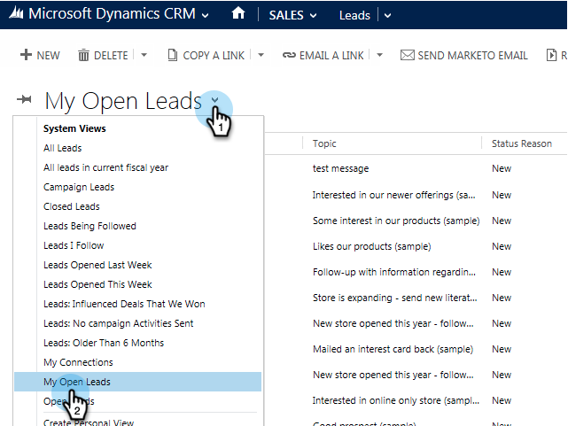
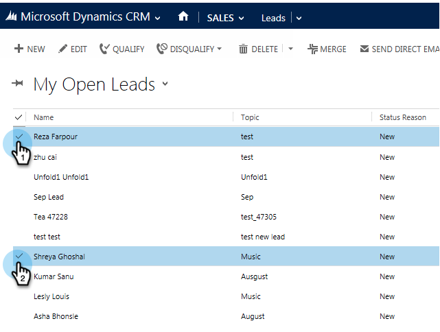
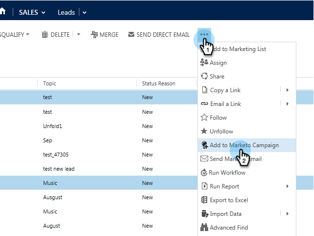
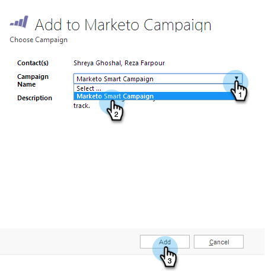

# Aggiungere un lead/contatto a una campagna Marketo da [!DNL Microsoft Dynamics] {#add-a-lead-contact-to-a-marketo-campaign-from-microsoft-dynamics}

Puoi aggiungere lead/contatti alle campagne intelligenti di Marketo in modo rapido e semplice direttamente da [!DNL Microsoft Dynamics]. Ecco come.

1. In [!DNL Dynamics], passare all&#39;area **[!UICONTROL Sales]**.

   

1. Selezionare una visualizzazione.

   

1. Seleziona uno o più contatti o lead.

   

1. Fare clic su **...** e selezionare **[!UICONTROL Add to Marketo Campaign]**.

   

1. Selezionare la campagna Marketo a cui si desidera aggiungere i lead o i contatti e fare clic su **[!UICONTROL Add]**.

   

   >[!NOTE]
   >
   >Affinché la campagna venga visualizzata nel menu a discesa, utilizza il trigger [&#128279;](/help/marketo/product-docs/core-marketo-concepts/smart-campaigns/using-smart-campaigns/setting-up-a-trigger-smart-campaign-for-sales-using-campaign-is-requested.md) della **campagna richiesta**, con [!DNL Sales Insight] come origine, quando configuri la campagna.

E questa è tutta gente! Ora puoi sfruttare la potenza delle campagne intelligenti di Marketo direttamente da [!DNL Dynamics].
