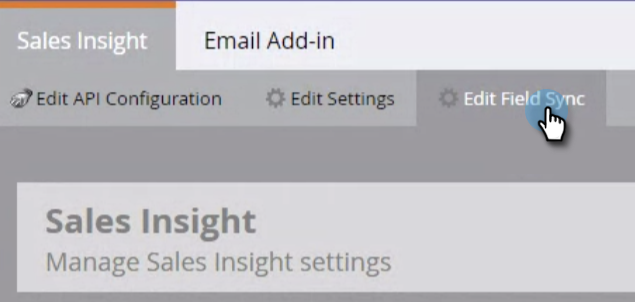
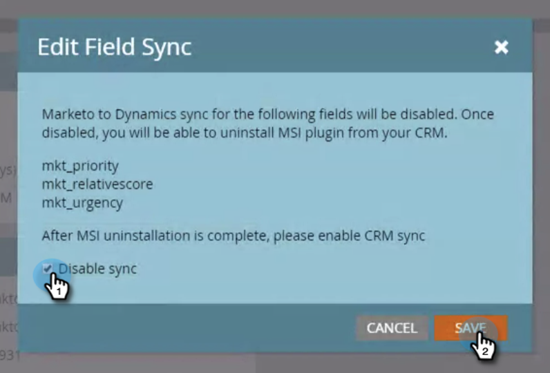

# Disinstallare MSI dall’istanza di MS Dynamics {#uninstall-msi-from-your-ms-dynamics-instance}

Per disinstallare MSI dall’istanza di MS Dynamics, è necessario eseguire i passaggi in Marketo e MS Dynamics.

>[!PREREQUISITES]
>
>[Disattiva Global MS Dynamics Sync](/help/marketo/product-docs/marketo-sales-insight/msi-for-microsoft-dynamics/uninstalling/disable-global-ms-dynamics-sync.md)

1. In Marketo, fai clic su **Amministratore**.

   

1. Fai clic su **Approfondimenti vendite**.

   

1. Fai clic su **Modifica sincronizzazione campo**.

   

1. Seleziona la **Disattiva sincronizzazione** seleziona e fai clic su **Salva**.

   >[!NOTE]
   >
   >Assicurati di [disattiva la sincronizzazione globale di MS Dynamics](/help/marketo/product-docs/marketo-sales-insight/msi-for-microsoft-dynamics/uninstalling/disable-global-ms-dynamics-sync.md) prima di disabilitare la sincronizzazione dei campi.

   

## I seguenti passaggi si svolgono nell’istanza di MS Dynamics: {#the-following-steps-take-place-in-your-ms-dynamics-instance}

1. Fai clic su **Impostazioni avanzate**.

1. Fai clic su **Soluzioni**.

1. Seleziona **Informazioni sulle vendite Marketo** e fai clic sull’icona Elimina .

1. Quando viene visualizzata la finestra modale della soluzione di disinstallazione, fai clic su **OK**.

   In genere, la disinstallazione completa della soluzione MS Dynamics richiede circa 20 minuti. Tuttavia, se si dispone di un’istanza di MS Dynamics di grandi dimensioni, potrebbe richiedere un po’ più di tempo.

   >[!NOTE]
   >
   >Ricorda di attivare la sincronizzazione di Global MS Dynamics una volta disinstallato MSI.
