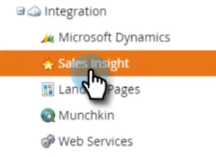

# Disinstallare MSI dall&#39;istanza di MS Dynamics {#uninstall-msi-from-your-ms-dynamics-instance}

Per disinstallare MSI dall&#39;istanza di MS Dynamics, è necessario eseguire i passaggi sia in Marketo che in MS Dynamics.

>[!NOTE]
>
>**Prerequisiti**
>
>[Disabilita sincronizzazione MS Dynamics globale](http://docs.marketo.com/x/TAA6Ag)

1. In Marketo, fai clic su **Admin**.

   

1. Fare clic su **Vendite**.

   

1. Fate clic su **Modifica sincronizzazione** campi.

   

1. Selezionate la casella di controllo **Disattiva sincronizzazione** e fate clic su **Salva**.

   >[!NOTE]
   >
   >**Promemoria**
   >
   >
   >Prima di disattivare la sincronizzazione dei campi, [disattivate Global MS Dynamics Sync](http://docs.marketo.com/x/TAA6Ag) .

   

## Nella tua istanza di MS Dynamics si verificano i seguenti passaggi: {#the-following-steps-take-place-in-your-ms-dynamics-instance}

1. Fate clic su Impostazioni **** avanzate.
1. Fate clic su **Soluzioni**.
1. Selezionate **Visione vendite** marketing e fate clic sull&#39;icona Elimina.
1. Quando viene visualizzata la finestra modale della soluzione di disinstallazione, fate clic su **OK**.

   Solitamente ci vogliono circa 20 minuti per la soluzione MS Dynamics per disinstallare completamente. Tuttavia, se si dispone di un&#39;istanza MS Dynamics grande, potrebbe richiedere un po&#39; più di tempo.

   >[!NOTE]
   >
   >**Promemoria**
   >
   >
   >Ricordate di attivare la sincronizzazione Global MS Dynamics una volta disinstallato MSI.

