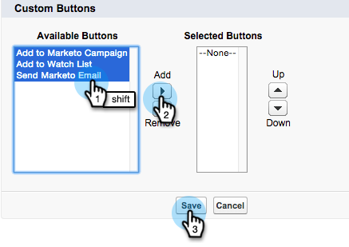

# Aggiungi i pulsanti di azione in blocco a Salesforce Classic{#add-bulk-action-buttons-to-salesforce-classic}

Puoi aggiungere pulsanti Marketo ai layout Salesforce. Ecco un esempio:

1. Fai clic su **Configurazione**. Cerca &quot;layout ricerca&quot; e fai clic sul pulsante **Layout di ricerca** sotto **Lead**.

   

1. Fai clic su **Modifica** in **Vista a elenco lead** fila.

   

1. Aggiungi **Aggiungi a Marketo Campaign**, **Invia e-mail Marketo** e **Aggiungi a elenco di controllo** i pulsanti **Pulsanti selezionati** e **Salva**.

   

   >[!TIP]
   >
   >Tenere premuto il tasto Maiusc per selezionare tutti e tre i pulsanti contemporaneamente.

1. Ripetere questi passaggi per Contatti (tutti e tre i pulsanti) e Account (un solo pulsante): Aggiungi a elenco di controllo).

   >[!NOTE]
   >
   >Non è possibile aggiungere pulsanti Marketo a Opportunità.
