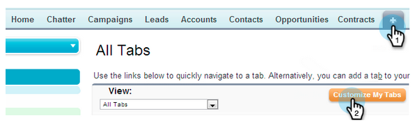

# Aggiungi scheda Marketo a [!DNL Salesforce] {#add-marketo-tab-to-salesforce}

1. In [!DNL Salesforce], fare clic su **+** e quindi su **[!UICONTROL Customize My Tabs]**.

   

1. Seleziona Marketo nell’elenco a sinistra. Quindi fare clic su **[!UICONTROL Add]** per aggiungerlo alle **[!UICONTROL Selected]schede**.

   >[!TIP]
   >
   >Utilizza le frecce **[!UICONTROL Up]** e **[!UICONTROL Down]** per riordinare le schede.

   

   E qui è la tua scheda Marketo!

   
