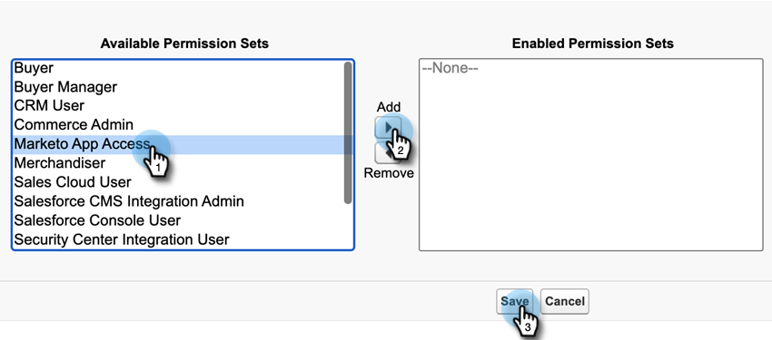

# Aggiungi set di autorizzazioni Insight vendite {#add-sales-insight-permission-set}

Utilizza i passaggi seguenti per aggiungere l’accesso alle funzioni Approfondimenti vendite di Salesforce. Applicabile a Salesforce Classic e Illuminazione

>[!PREREQUISITES]
>
>[Aggiorna il tuo pacchetto Vendite Insight Salesforce](/help/marketo/product-docs/marketo-sales-insight/msi-for-salesforce/upgrading/upgrading-your-msi-package.md){target=&quot;_blank&quot;} alla versione 1.8000 o successiva per utilizzare questa funzione.

>[!IMPORTANT]
>
>Se in precedenza hai concesso l’accesso a Sales Insight a tutti i profili e/o hai implementato Sales Insight per tutti i tuoi utenti, devi [rimuovi accesso a livello di profilo](/help/marketo/product-docs/marketo-sales-insight/msi-for-salesforce/configuration/remove-sales-insight-access.md){target=&quot;_blank&quot;} per utilizzare questo set di autorizzazioni.

## Panoramica {#overview}

L’autorizzazione &quot;Marketo App&quot; fa parte del pacchetto Salesforce Insight Vendite. Include l’accesso agli oggetti, alle classi apex e alle pagine delle forze visive indicati di seguito. Questi sono necessari per accedere a tutte le funzioni di Sales Insight.

**Impostazioni oggetto**

<table> 
 <tbody> 
 <tr> 
   <td>BestBetsCache</td> 
   <td>Leggi, Crea, Modifica, Elimina, Visualizza Tutto, Modifica Tutto</td> 
  </tr> 
  <tr> 
   <td>Dettagli della visualizzazione delle migliori scommesse</td> 
   <td>Leggi, Crea, Modifica, Elimina, Visualizza Tutto, Modifica Tutto</td> 
  </tr> 
  <tr> 
   <td>Visualizzazioni migliori</td> 
   <td>Leggi, Crea, Modifica, Elimina, Visualizza Tutto, Modifica Tutto</td> 
  </tr> 
  <tr> 
   <td>EmailActivityCache</td> 
   <td>Leggi, Crea, Modifica, Elimina, Visualizza Tutto, Modifica Tutto</td> 
  </tr> 
  <tr> 
   <td>GetMethodArgus</td> 
   <td>Leggi, Crea, Modifica, Elimina, Visualizza Tutto, Modifica Tutto</td> 
  </tr> 
  <tr> 
   <td>GroupedWebActivityCache</td> 
   <td>Leggi, Crea, Modifica, Elimina, Visualizza Tutto, Modifica Tutto</td> 
  </tr> 
  <tr> 
   <td>InteressanteMomentsCache</td> 
   <td>Leggi, Crea, Modifica, Elimina, Visualizza Tutto, Modifica Tutto</td> 
  </tr> 
  <tr> 
   <td>Configurazione di Marketo Sales Insight</td> 
   <td>Leggi, Crea, Modifica, Elimina, Visualizza Tutto, Modifica Tutto</td> 
  </tr> 
  <tr> 
   <td>ScoringCache</td> 
   <td>Leggi, Crea, Modifica, Elimina, Visualizza Tutto, Modifica Tutto</td> 
  </tr> 
  <tr> 
   <td>Valori</td> 
   <td>Leggi, Crea, Modifica, Elimina, Visualizza Tutto, Modifica Tutto</td> 
  </tr> 
  <tr> 
   <td>WebActivityCache</td> 
   <td>Leggi, Crea, Modifica, Elimina, Visualizza Tutto, Modifica Tutto</td> 
  </tr> 
 </tbody> 
</table>

* Accesso classe Apex: 159 Classi Apex che essendo con &quot;mkto_si&quot;
* Accesso a una pagina di visualizzazione: 64 Pagine di visualizzazione con &quot;mkto_si&quot;
* Definizioni di impostazione personalizzate: Impostazioni mkto_si.Marketo e preferenze utente mkto_si.User

## Aggiunta di un set di autorizzazioni dell’app Marketo agli utenti {#adding-marketo-app-permission-set-to-users}

1. Accedi al tuo account Salesforce.

1. Fai clic su **Configurazione**.

   

1. In Amministratore, fai clic su per eseguire la rimozione **Gestione utenti**, quindi **Utenti**.

   

1. In Tutti gli utenti, selezionare l&#39;utente a cui si desidera fornire l&#39;accesso, quindi fare clic su **Assegnazioni set di autorizzazioni**.

   

1. Fai clic su **Modifica assegnazioni**.

   

1. Seleziona **Accesso alle app Marketo** dai set di autorizzazioni disponibili, quindi **Aggiungi**. Fai clic su **Salva**.

   

1. Ora, quando scorri verso il basso la pagina dei dettagli utente, vedrai &quot;Accesso alle app Marketo&quot; in Assegnazioni dei set di autorizzazioni.

   

>[!NOTE]
>
>Gli utenti che non hanno accesso a Insight delle vendite visualizzeranno questo messaggio: &quot;Non disponi di privilegi sufficienti per accedere a questa scheda.&quot;

Tutto qui! Accesso a Sales Insight completato. Ripeti gli stessi passaggi per qualsiasi altro profilo a cui desideri aggiungere l’accesso.
