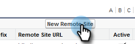
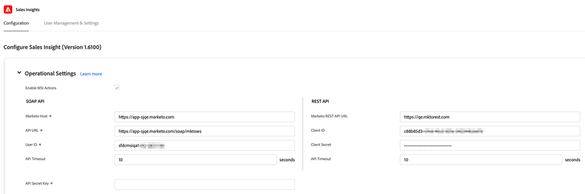

# Configurazione per clienti esistenti {#configuration-for-existing-customers}

Imposta la seguente configurazione per iniziare a utilizzare la nuova dashboard di Insights.

>[!PREREQUISITES]
>
>Assicurarsi di aver aggiornato il pacchetto [!DNL Salesforce] alla versione più recente

## Configura [!DNL Sales Insight] in Marketo {#configure-sales-insight-in-marketo}

1. Apri una nuova scheda nel browser per ottenere le credenziali di [!DNL Marketo Sales Insights] dal tuo account Marketo.

1. Passa alla schermata **[!UICONTROL Admin]**.

   

1. Fai clic su **[!UICONTROL Sales Insight]**.

   

1. Fare clic su **[!UICONTROL View]** per popolare le credenziali API REST.

   

1. Viene visualizzata una finestra a comparsa di conferma. Fai clic su **[!UICONTROL OK]**.

## Configura [!DNL Sales Insight] in [!DNL Salesforce] {#configure-sales-insight-in-salesforce}

1. In Salesforce, fare clic su **[!UICONTROL Setup]**.

   

1. Cercare e selezionare **[!UICONTROL Remote Site Settings]**.

   

1. Fai clic su **[!UICONTROL New Remote Site]**.

   

1. Immetti [!UICONTROL Remote Site Name] (può essere ad esempio &quot;MarketoRestAPI&quot;) e [!UICONTROL Remote Site URL] (l&#39;URL API dal pannello Configurazione API REST in Marketo).

   

1. Fai clic su **[!UICONTROL Save]**.

   

   Ora hai creato l’impostazione per il sito remoto per l’API Rest.

## Accedi a Marketo Sales Insight {#access-marketo-sales-insight}

1. Copiare le credenziali dal pannello API REST nella pagina di amministrazione di [!DNL Marketo’s Sales Insight]. Incollali nella sezione API REST della pagina di configurazione [!DNL Sales Insight] di Salesforce.

1. Immettere [!UICONTROL API Secret Key].

   
