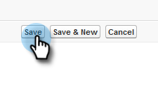

# Configurazione per i clienti esistenti {#configuration-for-existing-customers}

Imposta la seguente configurazione per iniziare a utilizzare il nuovo dashboard Approfondimenti .

>[!PREREQUISITES]
>
>Assicurati di aver aggiornato il pacchetto Salesforce alla versione più recente

## Configurare la funzione Approfondimenti vendite in Marketo {#configure-sales-insight-in-marketo}

1. Apri una nuova scheda nel browser per ottenere le credenziali Marketo Sales Insights dal tuo account Marketo.

1. Vai a **Amministratore** area.

   

1. Fai clic su **Approfondimenti vendite**.

   

1. Fai clic su **Visualizza** per popolare le credenziali API Rest.

   

1. Verrà visualizzato un pop-up di conferma. Fai clic su **OK**.

## Configurazione di Sales Insight in Salesforce {#configure-sales-insight-in-salesforce}

1. In Salesforce, fai clic su **Configurazione**.

   

1. Cerca e seleziona **Impostazioni del sito remoto**.

   

1. Fai clic su **Nuovo sito remoto**.

   

1. Inserisci il Nome del sito remoto (può essere simile a &quot;MarketoRestAPI&quot;) e l’URL del sito remoto (l’URL API dal pannello Configurazione API Rest in Marketo).

   

1. Fai clic su **Salva**.

   

   È stata ora creata l’impostazione del sito remoto per l’API Rest.

## Accedere a Marketo Sales Insight {#access-marketo-sales-insight}

1. Copia le credenziali dal pannello Rest API nella pagina Sales Insight Admin di Marketo. Incollali nella sezione Rest API della pagina Sales Insight Configuration di Salesforce.

1. Immetti la chiave segreto API.

   
