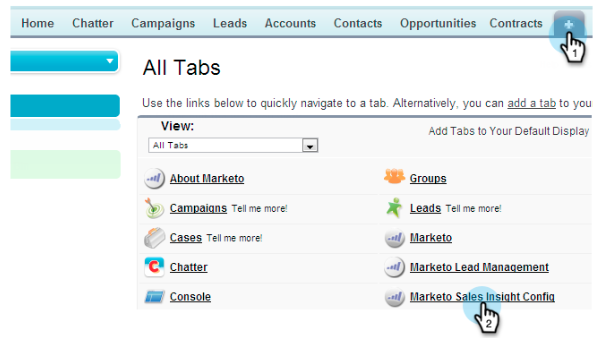

# Approfondimenti vendite Marketo in Salesforce Enterprise/Unlimited {#configure-marketo-sales-insight-in-salesforce-enterprise-unlimited}

Di seguito sono riportati i passaggi da effettuare per configurare Marketo Sales Insight in Salesforce Enterprise/Unlimited Edition. Cominciamo.

>[!PREREQUISITES]
>
>* [Configura la sincronizzazione dei campi Marketo nella tua Salesforce Enterprise/Unlimited Edition](https://docs.marketo.com/pages/viewpage.action?pageid=2360372)
>* [Installa il pacchetto di informazioni sulle vendite di Marketo nell&#39;AppExchange Salesforce](/help/marketo/product-docs/marketo-sales-insight/msi-for-salesforce/installation/install-marketo-sales-insight-package-in-salesforce-appexchange.md)

>[!NOTE]
>
>**Autorizzazioni amministratore richieste**

## Configurare Sales Insight in Marketo {#configure-sales-insight-in-marketo}

1. Apri una nuova finestra del browser per ottenere le credenziali di Approfondimenti vendite Marketo dal tuo account Marketo.

1. Vai all&#39;area Amministratore e seleziona **Informazioni sulle vendite**.

   

1. Fai clic su **Modifica configurazione API**.

   

1. Immetti una chiave segreto API a tua scelta e fai clic su **Salva**. NON utilizzare una e commerciale (&amp;) nella chiave segreto API.

   

   >[!NOTE]
   >
   >La chiave di segreto API è una password per la tua organizzazione e deve essere protetta.

1. Fai clic su **Visualizza** nel pannello Configurazione API rimanenti per popolare le credenziali.

   

1. Verrà visualizzato un pop-up di conferma. Fare clic su **OK**.

   

## Configurazione di informazioni sulle vendite in Salesforce {#configure-sales-insight-in-salesforce}

1. In Salesforce, fai clic su **Configurazione**.

   

1. Cerca &quot;sito remoto&quot; e seleziona **Impostazioni sito remoto**.

   

1. Fare clic su **Nuovo sito remoto**.

   

1. Inserisci il Nome del sito remoto (può essere simile a &quot;MarketoSoapAPI&quot;). Inserisci URL del sito remoto, che è l’URL dell’host Marketo dal pannello Configurazione API Soap in Marketo. Fare clic su **Salva**. Ora hai creato le impostazioni del sito remoto per l’API Soap.

   

1. Fare nuovamente clic su **Nuovo sito remoto**.

   

1. Inserisci il Nome del sito remoto (può essere simile a &quot;MarketoRestAPI&quot;). Inserisci URL del sito remoto, che è l’URL API dal pannello Configurazione API Rest in Marketo. Fare clic su **Salva**. Sono state create le impostazioni del sito remoto per l’API di ripristino.

## Approfondimenti vendite Marketo {#set-up-marketo-sales-insight}

1. Accedi alla tua istanza di Marketo e fai clic su **Amministratore**.

   

1. Fare clic su **Informazioni sulle vendite**.

   

1. Fai clic su **Modifica configurazione API**.

   

1. Immetti una **Chiave segreto API** e fai clic su **Salva**.

   >[!CAUTION]
   >
   >Non utilizzare una e commerciale (&amp;) nella chiave segreto API.

   

   >[!TIP]
   >
   >Tieni aperta questa finestra. Queste informazioni saranno necessarie in seguito in Salesforce.

1. Torna a Salesforce, fai clic su **Configurazione**.

   

1. Cerca &quot;sito remoto&quot; e fai clic su **Impostazioni sito remoto** in **Controlli di sicurezza**.

   

1. Fare clic su **Nuovo sito remoto**.

   

1. Inserisci **Nome sito remoto** e **URL sito remoto**, quindi fai clic su **Salva**.

   

   >[!NOTE]
   >
   >Scegli il tuo **Nome sito remoto** (MarketoAPI viene utilizzato qui). Il **URL del sito remoto** si trova nel campo Host di Marketo della finestra di dialogo Modifica configurazione API dal passaggio 4.

## Personalizzare i layout di pagina {#customize-page-layouts}

1. Fare clic su **Configurazione**.

   

1. Cerca &quot;layout pagina&quot; e seleziona il **Layout pagina** in **Lead**.

   

1. Fai clic su **Pagine di visualizzazione** a sinistra. Trascina **Sezione** nel layout sotto la sezione Collegamenti personalizzati.

   

1. Inserisci &quot;Approfondimenti vendite Marketo&quot; come **Nome sezione**. Seleziona **1-Column** e fai clic su **OK**.

   

1. Trascina **Lead** nella nuova sezione.

   

   >[!TIP]
   >
   >Il nome di questa casella verrà modificato in base al tipo di oggetto. Ad esempio, se si modifica il layout di pagina per Contatti, verrà visualizzato Contatto.

1. Fai doppio clic sul blocco **Lead** appena aggiunto.

   

1. Modifica l&#39;altezza in pixel **450** e fai clic su **OK**.

   

   >[!TIP]
   >
   >È consigliabile un&#39;altezza di 410 pixel per gli oggetti Account e Opportunità.

1. Fai clic su **Campi** a sinistra. Quindi cerca e trascina l&#39;etichetta **Coinvolgimento** nel layout **Approfondimenti vendite Marketo** .

   

1. Ripetere il passaggio precedente anche per questi campi.

<table> 
 <tbody> 
  <tr> 
   <td colspan="1">Coinvolgimento</td> 
  </tr> 
  <tr> 
   <td colspan="1" rowspan="1">
Valore punteggio relativo
</td> 
  </tr> 
  <tr> 
   <td colspan="1" rowspan="1">
Valore di urgenza
</td> 
  </tr> 
  <tr> 
   <td colspan="1" rowspan="1">
Data ultimo momento interessante
</td> 
  </tr> 
  <tr> 
   <td colspan="1" rowspan="1">
Desc dell'ultimo momento interessante
</td> 
  </tr> 
  <tr> 
   <td colspan="1" rowspan="1">
Ultima origine momento interessante
</td> 
  </tr> 
  <tr> 
   <td colspan="1" rowspan="1">
Ultimo tipo di momento interessante
</td> 
  </tr> 
 </tbody> 
</table>

1. Al termine, fai clic su **Salva** .

   

1. Ripeti questo processo per aggiungere sezioni di pagina Visualforce e campi Approfondimenti vendite per **Contact**, **Account** e **Opportunity**.

1. Ripetere i passaggi da 5 a 7 per aggiungere le sezioni della pagina Visualforce per Contatto, Account e Opportunità. Quindi, ripeti i passaggi 8-10 per aggiungere campi Approfondimenti vendite per **Contact**. Assicurati di salvare dopo eventuali modifiche.

## Mappa campi persona personalizzati {#map-custom-person-fields}

I campi persona Marketo devono essere mappati sui campi di contatto Salesforce per garantire il corretto funzionamento della conversione. Ecco come.

1. Fare clic su **Configurazione**.

   

1. Cerca &quot;campi&quot; nella barra di ricerca e fai clic su **Campi** in **Lead**.

   

1. Fate clic su **Mappa campi lead**.

   

1. Fai clic sull&#39;elenco a discesa a destra per **Coinvolgimento**.

   

1. Selezionare **Contact.Engagement** nell&#39;elenco.

   

1. Ripeti e mappa anche questi campi.

<table> 
 <tbody> 
  <tr> 
   <th colspan="1" rowspan="1">Campo personalizzato Marketo Person</th> 
   <th colspan="1" rowspan="1">Campo personalizzato contatto Salesforce</th> 
  </tr> 
  <tr> 
   <td colspan="1" rowspan="1">
Coinvolgimento
</td> 
   <td colspan="1" rowspan="1">
Contact.Engagement
</td> 
  </tr> 
  <tr> 
   <td colspan="1" rowspan="1">
Valore punteggio relativo
</td> 
   <td colspan="1" rowspan="1">
Valore punteggio relativo di Contact.Relative
</td> 
  </tr> 
  <tr> 
   <td colspan="1" rowspan="1">
Valore di urgenza
</td> 
   <td colspan="1" rowspan="1">
Valore Contact.Urency
</td> 
  </tr> 
  <tr> 
   <td colspan="1" rowspan="1">
Data ultimo momento interessante
</td> 
   <td colspan="1" rowspan="1">
Contact.Last Interessante Momento Data
</td> 
  </tr> 
  <tr> 
   <td colspan="1" rowspan="1">
Desc dell'ultimo momento interessante
</td> 
   <td colspan="1" rowspan="1">
Contact.Last Interessante Momento Desc
</td> 
  </tr> 
  <tr> 
   <td colspan="1" rowspan="1">
Ultima origine momento interessante
</td> 
   <td colspan="1" rowspan="1">
Contact.Last Interessante Momento Origine
</td> 
  </tr> 
  <tr> 
   <td colspan="1" rowspan="1">
Ultimo tipo di momento interessante
</td> 
   <td colspan="1" rowspan="1">
Contact.Last Interessante Moment Type
</td> 
  </tr> 
 </tbody> 
</table>

1. Al termine fai clic su **Salva** .

## Configurazione Approfondimenti vendite Marketo {#marketo-sales-insight-config}

1. Fare clic su **+**, quindi selezionare **Configurazione analisi vendite Marketo**.

   

1. Controlla **Abilita API Marketo**. Quindi compila le [informazioni di configurazione API in Marketo Admin](#set-up-marketo-sales-insight). Al termine, fai clic su **Salva modifiche**.

   

   >[!NOTE]
   >
   >Se il test di diagnostica non è riuscito, potrebbe essere necessario [aggiungere altri campi al layout di pagina](https://nation.marketo.com/docs/DOC-1115).

Ed è tutto! Dovresti essere in grado di visualizzare i campi Approfondimenti vendite Marketo per Lead, Contatti, Account e Opportunità.

>[!NOTE]
>
>Per gli account, Insight vendite includerà tutte le e-mail, ma solo i momenti interessanti più recenti, l’attività web e i cambiamenti di punteggio.

## Approfondimenti vendite Marketo {#access-marketo-sales-insight}

1. In Salesforce, fai clic su **+** alla fine della barra delle schede e fai clic su **Configurazione approfondimenti vendite Marketo**.

1. Seleziona la casella di controllo **Abilita API Marketo** .

1. Copia le credenziali dal pannello API Soap nella pagina Admin di Marketing’s Sales Insight e incollale nella sezione API Soap della pagina Configurazione di Salesforce Sales Insight .

1. Copia le credenziali dal pannello Rest API nella pagina Sales Insight Admin di Marketo e incollale nella sezione Rest API della pagina Salesforce Sales Insight Configuration.

   

>[!MORELIKETHIS]
>
>* [Priorità, Urgenza, Punteggio relativo e Migliori offerte](/help/marketo/product-docs/marketo-sales-insight/msi-for-salesforce/features/stars-and-flames/priority-urgency-relative-score-and-best-bets.md)
>* [Aggiungi la scheda Approfondimenti vendite Marketo e i pulsanti a Salesforce](/help/marketo/product-docs/marketo-sales-insight/msi-for-salesforce/features/bulk-actions/add-marketo-sales-insight-tab-and-buttons-to-salesforce.md)
>* [Impostazione di Sales Insight per il team](/help/marketo/product-docs/marketo-sales-insight/msi-for-salesforce/configuration/setting-up-sales-insight-for-your-team.md)

