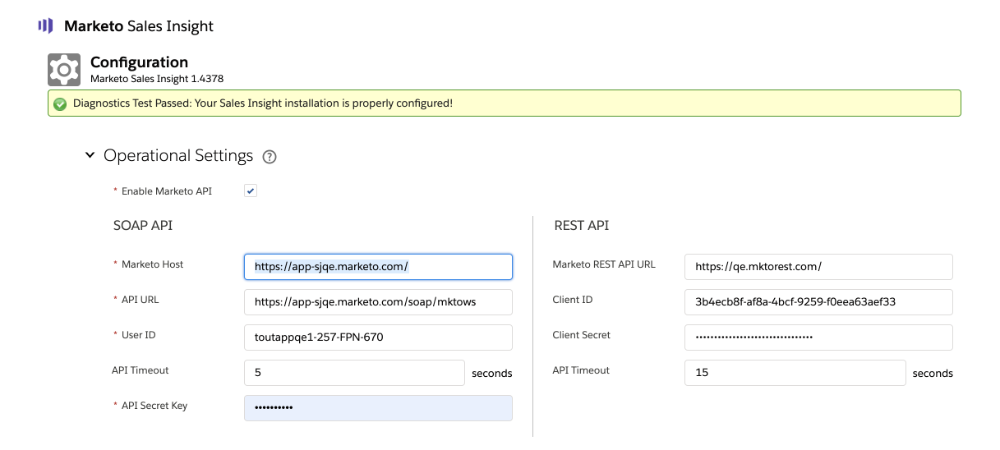

# Configurare Marketing Sales Insight in Salesforce Enterprise/Unlimited {#configure-marketo-sales-insight-in-salesforce-enterprise-unlimited}

Di seguito sono descritti i passaggi da effettuare per configurare Marketing Cloud Sales Insight in Salesforce Enterprise/Unlimited Edition. Cominciamo.

>[!PREREQUISITES]
>
>* [Configurare la sincronizzazione dei campi Marketo nella versione Salesforce Enterprise/Unlimited Edition](https://docs.marketo.com/pages/viewpage.action?pageid=2360372)
>* [Installazione del pacchetto marketing Sales Insight in Salesforce  AppExchange](/help/marketo/product-docs/marketo-sales-insight/msi-for-salesforce/installation/install-marketo-sales-insight-package-in-salesforce-appexchange.md)

>[!NOTE]
>
>**Autorizzazioni amministratore richieste**

## Configurare Sales Insight in Marketo {#configure-sales-insight-in-marketo}

1. Aprite una nuova finestra del browser per ottenere le credenziali di Marketing to Sales Insight dal vostro account Marketo.

1. Andate nell&#39;area Admin e selezionate **Sales Insight**.

   

1. Fare clic su **Modifica configurazione API**.

   

1. Immetti una chiave segreta API di tua scelta e fai clic su **Salva**. NON utilizzate una e commerciale (&amp;) nella chiave segreta API.

   

   >[!NOTE]
   >
   >La chiave segreta API è come una password per l&#39;organizzazione e deve essere protetta.

1. Fate clic su **View** nel pannello Configurazione API rimanente per compilare le credenziali.

   

1. Verrà visualizzato un messaggio di conferma. Fare clic su **OK**.

   

## Configurare la funzione Sales Insight in Salesforce {#configure-sales-insight-in-salesforce}

1. In Salesforce, fare clic su **Setup**.

   

1. Cercare &quot;sito remoto&quot; e selezionare **Impostazioni sito remoto**.

   

1. Fare clic su **Nuovo sito remoto**.

   

1. Inserite il Nome del sito remoto (può essere simile a &quot;MarketoSoapAPI&quot;). Inserite l&#39;URL del sito remoto, che è l&#39;URL dell&#39;host Marketo dal pannello Configurazione API Soap in Marketo. Fare clic su **Salva**. Ora avete creato le impostazioni del sito remoto per l&#39;API Soap.

   

1. Fare di nuovo clic su **Nuovo sito remoto**.

   

1. Immettete il nome del sito remoto (può essere simile a &quot;MarketoRestAPI&quot;). Inserite URL sito remoto, che è l&#39;URL API dal pannello Configurazione API di ripristino in Marketo. Fare clic su **Salva**. Sono state create impostazioni del sito remoto per l&#39;API Rest.

## Impostazione di Marketing Sales Insight {#set-up-marketo-sales-insight}

1. Accedete all&#39;istanza di Marketo e fate clic su **Admin**.

   

1. Fare clic su **Sales Insight**.

   

1. Fare clic su **Modifica configurazione API**.

   

1. Immettete una **Chiave segreta API** e fate clic su **Salva**.

   >[!CAUTION]
   >
   >Non utilizzate una e commerciale (&amp;) nella chiave segreta API.

   

   >[!TIP]
   >
   >Tieni questa finestra aperta. Queste informazioni saranno necessarie più tardi in Salesforce.

1. Torna a Salesforce, fai clic su **Setup**.

   

1. Cercare &quot;sito remoto&quot; e fare clic su **Impostazioni sito remoto** in **Controlli di sicurezza**.

   

1. Fare clic su **Nuovo sito remoto**.

   

1. Immettere **Nome del sito remoto** e **URL del sito remoto**, quindi fare clic su **Salva**.

   

   >[!NOTE]
   >
   >Scegliete il **Nome del sito remoto** (qui viene utilizzata l&#39;API Marketo). L&#39; **URL del sito remoto** si trova nel campo Host di Marketo della finestra di dialogo Modifica configurazione API dal passaggio 4.

## Personalizzare i layout di pagina {#customize-page-layouts}

1. Fare clic su **Setup**.

   

1. Cercare &quot;layout di pagina&quot; e selezionare il **Layout di pagina** in **Lead**.

   

1. Fare clic su **Pagine Visualforce** a sinistra. Trascinare **Section** nel layout sotto la sezione Collegamenti personalizzati.

   

1. Inserire &quot;Marketing Sales Insight&quot; come **Nome sezione**. Selezionare **1-Column** e fare clic su **OK**.

   

1. Trascinare **Lead** nella nuova sezione.

   

   >[!TIP]
   >
   >Il nome di questa casella viene modificato in base al tipo di oggetto. Ad esempio, se modificate il layout della pagina per Contatti, verrà visualizzato Contatto.

1. Fare doppio clic sul blocco **Lead** appena aggiunto.

   

1. Modificate l&#39;altezza in **450** pixel e fate clic su **OK**.

   

   >[!TIP]
   >
   >È consigliabile un&#39;altezza di 410 pixel per gli oggetti Account e Opportunità.

1. Fare clic su **Campi** a sinistra. Quindi, cercare e trascinare l&#39;etichetta **Engagement** nel layout **Marketing Sales Insight**.

   

1. Ripetere il passaggio precedente anche per questi campi.

<table> 
 <tbody> 
  <tr> 
   <td colspan="1">Coinvolgimento</td> 
  </tr> 
  <tr> 
   <td colspan="1" rowspan="1">
Valore punteggio relativo
</td> 
  </tr> 
  <tr> 
   <td colspan="1" rowspan="1">
Valore di urgenza
</td> 
  </tr> 
  <tr> 
   <td colspan="1" rowspan="1">
Data ultimo momento interessante
</td> 
  </tr> 
  <tr> 
   <td colspan="1" rowspan="1">
Ultimo interessante momento
</td> 
  </tr> 
  <tr> 
   <td colspan="1" rowspan="1">
Ultima origine momento interessante
</td> 
  </tr> 
  <tr> 
   <td colspan="1" rowspan="1">
Ultimo tipo di momento interessante
</td> 
  </tr> 
 </tbody> 
</table>

1. Fare clic su **Save** al termine.

   

1. Ripetete questa procedura per aggiungere le sezioni delle pagine Visualforce e i campi Sales Insight per **Contact**, **Account** e **Opportunity**.

1. Ripetere i passaggi da 5 a 7 per aggiungere le sezioni delle pagine di Visualforce per Contatto, Account e Opportunità. Quindi, ripeti i passaggi da 8 a 10 per aggiungere i campi Informazioni sulle vendite per **Contact**. Accertatevi di salvare dopo eventuali modifiche.

## Mappa campi persona personalizzati {#map-custom-person-fields}

I campi persona marketing devono essere mappati sui campi di contatto Salesforce per garantire il corretto funzionamento della conversione. Ecco come.

1. Fare clic su **Setup**.

   

1. Cercare &quot;fields&quot; nella barra di ricerca e fare clic su **Fields** in **Lead**.

   

1. Fare clic su **Mappa campi lead**.

   

1. Fare clic sul menu a discesa a destra per **Engagement**.

   

1. Selezionare **Contact.Engagement** nell&#39;elenco.

   

1. Ripetete e mappate anche questi campi.

<table> 
 <tbody> 
  <tr> 
   <th colspan="1" rowspan="1">Campo personalizzato Marketo Person</th> 
   <th colspan="1" rowspan="1">Campo personalizzato contatto Salesforce</th> 
  </tr> 
  <tr> 
   <td colspan="1" rowspan="1">
Coinvolgimento
</td> 
   <td colspan="1" rowspan="1">
Contact.Engagement
</td> 
  </tr> 
  <tr> 
   <td colspan="1" rowspan="1">
Valore punteggio relativo
</td> 
   <td colspan="1" rowspan="1">
Contact.Relative Score Value
</td> 
  </tr> 
  <tr> 
   <td colspan="1" rowspan="1">
Valore di urgenza
</td> 
   <td colspan="1" rowspan="1">
Contact.Urency Value
</td> 
  </tr> 
  <tr> 
   <td colspan="1" rowspan="1">
Data ultimo momento interessante
</td> 
   <td colspan="1" rowspan="1">
Contatto.Data ultimo momento interessante
</td> 
  </tr> 
  <tr> 
   <td colspan="1" rowspan="1">
Ultimo interessante momento
</td> 
   <td colspan="1" rowspan="1">
Contact.Last Interessante Momento Desc
</td> 
  </tr> 
  <tr> 
   <td colspan="1" rowspan="1">
Ultima origine momento interessante
</td> 
   <td colspan="1" rowspan="1">
Contact.Last Interesting Moment Source
</td> 
  </tr> 
  <tr> 
   <td colspan="1" rowspan="1">
Ultimo tipo di momento interessante
</td> 
   <td colspan="1" rowspan="1">
Contatto.Ultimo tipo di momento interessante
</td> 
  </tr> 
 </tbody> 
</table>

1. Al termine, fate clic su **Salva**.

## Configurazione analisi vendite Marketo {#marketo-sales-insight-config}

1. Fare clic su **+**, quindi selezionare **Configurazione analisi vendite marketing**.

   

1. Selezionare **Abilita API Marketo**. Quindi, compila le [informazioni di configurazione API in Marketing Admin](#set-up-marketo-sales-insight). Fare clic su **Salva modifiche** al termine.

   

   >[!NOTE]
   >
   >Se il test di diagnostica non riesce, potrebbe essere necessario [aggiungere altri campi al layout di pagina](https://nation.marketo.com/docs/DOC-1115).

Ed è tutto! È necessario essere in grado di visualizzare i campi Visione marketing per lead, contatti, account e opportunità.

>[!NOTE]
>
>Per gli account, Sales Insight includerà tutte le e-mail, ma solo i momenti interessanti più recenti, l&#39;attività Web e le modifiche alla valutazione.

## Accesso al punto vendita marketing {#access-marketo-sales-insight}

1. In Salesforce, fare clic su **+** alla fine della barra delle schede e fare clic su **Configurazione analisi vendite marketing**.

1. Selezionate la casella di controllo **Abilita API Marketo**.

1. Copiate le credenziali dal pannello API Soap nella pagina Admin di Marketing’s Sales Insight e incollatele nella sezione API Soap della pagina Configurazione di Salesforce Sales Insight.

1. Copiate le credenziali dal pannello Rest API nella pagina Admin di Marketing’s Sales Insight e incollatele nella sezione Rest API della pagina Configurazione Salesforce Sales Insight.

   

>[!MORELIKETHIS]
>
>* [Priorità, Urgenza, Punteggio relativo e migliori risultati](/help/marketo/product-docs/marketo-sales-insight/msi-for-salesforce/features/stars-and-flames/priority-urgency-relative-score-and-best-bets.md)
>* [Aggiungi la scheda Marketing Sales Insight e i pulsanti a Salesforce](/help/marketo/product-docs/marketo-sales-insight/msi-for-salesforce/features/bulk-actions/add-marketo-sales-insight-tab-and-buttons-to-salesforce.md)

