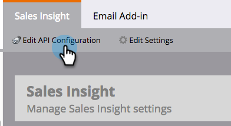

# Configurare Marketo Sales Insight in Salesforce Enterprise/Unlimited {#configure-marketo-sales-insight-in-salesforce-enterprise-unlimited}

Configurare Marketo Sales Insight nelle edizioni Salesforce Enterprise/Unlimited completando i passaggi seguenti.

>[!PREREQUISITES]
>
>[Installa il pacchetto Marketo Sales Insight nell&#39;AppExchange Salesforce](/help/marketo/product-docs/marketo-sales-insight/msi-for-salesforce/installation/install-marketo-sales-insight-package-in-salesforce-appexchange.md)

>[!NOTE]
>
>**Sono richieste le autorizzazioni di amministratore.**

## Configura approfondimenti vendite nel Marketo Engage {#configure-sales-insight-in-marketo}

1. Per ottenere le credenziali di Marketo Sales Insight nel Marketo Engage, vai all&#39;area **[!UICONTROL Amministratore]** e seleziona **[!UICONTROL Sales Insight]**.

   

1. Fare clic su **[!UICONTROL Modifica configurazione API]**.

   

1. Immetti una chiave segreta API a tua scelta e fai clic su **[!UICONTROL Salva]**. NON utilizzare una e commerciale (`&`) nella chiave segreta API.

   

   >[!NOTE]
   >
   >La chiave segreta API è una password per la tua organizzazione e deve essere sicura.

1. Per popolare le credenziali, fai clic su **[!UICONTROL Visualizza]** nel pannello _[!UICONTROL Configurazione API REST]_.

   

1. Quando viene visualizzata una finestra di dialogo di conferma, fare clic su **[!UICONTROL OK]**.

   

   >[!TIP]
   >
   >Tieni aperta questa finestra. Queste informazioni sono necessarie successivamente per la configurazione di Salesforce.

## Configurare Sales Insight in Salesforce {#configure-sales-insight-in-salesforce}

1. In Salesforce, fare clic su **[!UICONTROL Configurazione]**.

   

1. Cercare &quot;sito remoto&quot; e selezionare **[!UICONTROL Impostazioni sito remoto]**.

   

1. Fare clic su **[!UICONTROL Nuovo sito remoto]**.

   

1. Immettere il nome del sito remoto (può essere simile a `MarketoSoapAPI`). Immetti l&#39;URL del sito remoto, che è l&#39;URL dell&#39;host Marketo dal pannello _[!UICONTROL Configurazione API Soap]_ nel Marketo Engage. Fai clic su **[!UICONTROL Salva]**. Sono state create le impostazioni del sito remoto per l’API Soap.

   

1. Fai di nuovo clic su **[!UICONTROL Nuovo sito remoto]**.

   

1. Immettere il nome del sito remoto (può essere simile a `MarketoAPI`). Immetti l&#39;URL del sito remoto, che è l&#39;URL API del pannello _[!UICONTROL Configurazione API REST]_ nel Marketo Engage. Fai clic su **[!UICONTROL Salva]**. Sono state create le impostazioni del sito remoto per l’API REST.

   >[!NOTE]
   >
   >_Scegli_ il **[!UICONTROL nome sito remoto]** (`MarketoAPI` è utilizzato qui). L&#39;**[!UICONTROL URL sito remoto]** si trova nel campo Host Marketo della finestra di dialogo Modifica configurazione API dal passaggio 3 nella sezione &quot;Configura approfondimenti vendite in Marketo&quot;.

## Concedi agli utenti di Sales Insight l’accesso al profilo per gli oggetti Salesforce standard {#grant-sales-insight-users-profile-access}

A causa dei miglioramenti apportati alla sicurezza di Salesforce, i pacchetti di AppExchange non possono più concedere l’autorizzazione agli oggetti standard e l’accesso deve essere concesso agli oggetti Salesforce pertinenti dal profilo dell’utente Salesforce. Per concedere le autorizzazioni necessarie, segui la procedura riportata di seguito.

1. Fare clic su **[!UICONTROL Configurazione]**.

1. Cerca &quot;Profili&quot; nella Ricerca rapida.

1. Fai clic su **[!UICONTROL Modifica]** accanto al profilo utilizzato dagli utenti di Salesforce.

1. Nella sezione _[!UICONTROL Autorizzazione oggetto standard]_, abilita l&#39;accesso **[!UICONTROL Lettura]** per i seguenti oggetti: [!UICONTROL Lead], [!UICONTROL Contatto], [!UICONTROL Account] e [!UICONTROL Opportunità].

1. Fai clic su **[!UICONTROL Salva]**.

## Personalizzare i layout di pagina {#customize-page-layouts}

1. Fare clic su **[!UICONTROL Configurazione]**.

   

1. Cerca &quot;Layout di pagina&quot; e seleziona **[!UICONTROL Layout di pagina]** in **[!UICONTROL Lead]**.

   

1. Fai clic su **[!UICONTROL Pagine Visualforce]** a sinistra. Trascina **[!UICONTROL Sezione]** nel layout sotto la sezione _[!UICONTROL Collegamenti personalizzati]_.

   

1. Immetti &quot;Marketo Sales Insight&quot; come **[!UICONTROL Nome sezione]**, seleziona **[!UICONTROL 1-Colonna]** e fai clic su **[!UICONTROL OK]**.

   

1. Trascina **[!UICONTROL Lead]** nella nuova sezione.

   

   >[!TIP]
   >
   >Il nome di questa casella cambia in base al tipo di oggetto. Se ad esempio si modifica il layout di pagina per i contatti, verrà visualizzato Contatto.

1. Fai doppio clic sul blocco **[!UICONTROL Lead]** appena aggiunto.

   

1. Modifica l&#39;altezza a **450** pixel e fai clic su **[!UICONTROL OK]**.

   

   >[!NOTE]
   >
   >Seleziona **[!UICONTROL Mostra barre di scorrimento]** se hai bisogno di accedere alle attività di scorrimento.

   >[!TIP]
   >
   >L&#39;altezza consigliata per gli oggetti Account e Opportunità è di 410 pixel.

1. Fai clic su **[!UICONTROL Campi]** a sinistra. Cerca e trascina l&#39;etichetta **[!UICONTROL Urgenza]** nel layout **[!UICONTROL Marketo Sales Insight]**.

   

1. Ripeti il passaggio precedente anche per questi campi.

   * Ultimo momento di interesse
   * Data ultimo momento di interesse
   * Descrizione ultimo momento di interesse
   * Ultimo momento di interesse Source
   * Tipo ultimo momento di interesse
   * Ultima attività per vendite
   * Ultimo coinvolgimento per vendite
   * ID contatto MSI
   * Punteggio relativo
   * Valore punteggio relativo
   * Urgenza
   * Valore Urgenza
   * Visualizza in Marketo

1. Al termine, fai clic su **[!UICONTROL Salva]**.

   

1. Ripeti i passaggi 5-7 per aggiungere sezioni di pagina e campi approfondimenti vendite di Visualforce per **[!UICONTROL Contatto]**, **[!UICONTROL Account]** e **[!UICONTROL Opportunità]**.

1. Ripeti i passaggi 8-10 per aggiungere questi campi di approfondimento sulle vendite per **[!UICONTROL Contatto]**. Assicurati di salvare tutte le modifiche.

   * Ultimo momento di interesse
   * Data ultimo momento di interesse
   * [!UICONTROL Descrizione ultimo momento di interesse]
   * [!UICONTROL Ultimo momento di interesse Source]
   * [!UICONTROL Ultimo tipo di momento di interesse]
   * [!UICONTROL Ultima attività Marketo per vendite]
   * [!UICONTROL Ultimo coinvolgimento Marketo per vendite]
   * [!UICONTROL Punteggio lead MKTO]
   * [!UICONTROL Punteggio relativo]
   * [!UICONTROL Valore punteggio relativo]
   * [!UICONTROL Informazioni sulle vendite] - Apre la pagina dell&#39;elenco completo dei contatti
   * [!UICONTROL Urgenza]
   * [!UICONTROL Valore Urgenza]

## Mappa campi persona personalizzati {#map-custom-person-fields}

I campi della persona Marketo devono essere mappati sui campi del contatto Salesforce per garantire il corretto funzionamento della conversione. Segui questi passaggi per mapparli.

1. Fare clic su **[!UICONTROL Configurazione]**.

   

1. Cerca &quot;fields&quot; nella barra di ricerca e fai clic su **[!UICONTROL Fields]** in **[!UICONTROL Lead]**.

   

1. Fai clic su **[!UICONTROL Mappa campi lead]**.

   

1. Fare clic sul menu a discesa a destra di **[!UICONTROL Coinvolgimento]**.

   

1. Selezionare **[!UICONTROL Contact.Engagement]** nell&#39;elenco.

   

1. Ripeti e mappa anche questi campi.

   | Campo personalizzato persona Marketo | Campo personalizzato contatto Salesforce |
   |--- |--- |
   | `Engagement` | `Contact.Engagement` |
   | `Relative Score Value` | `Contact.Relative Score Value` |
   | `Urgency Value` | `Contact.Urgency Value` |
   | `Last Interesting Moment Date` | `Contact.Last Interesting Moment Date` |
   | `Last Interesting Moment Desc` | `Contact.Last Interesting Moment Desc` |
   | `Last Interesting Moment Source` | `Contact.Last Interesting Moment Source` |
   | `Last Interesting Moment Type` | `Contact.Last Interesting Moment Type` |

1. Al termine, fai clic su **[!UICONTROL Salva]**.

## Scheda di configurazione di Marketo Sales Insight {#marketo-sales-insight-configuration-tab}

1. In Salesforce, fai clic su **+** alla fine della barra delle schede, quindi fai clic su **[!UICONTROL Configurazione approfondimento vendite Marketo]**.

1. Copiare le credenziali dal pannello API Soap nella [pagina di amministrazione di Marketo Sales Insight](/help/marketo/product-docs/marketo-sales-insight/msi-for-salesforce/configuration/configure-marketo-sales-insight-in-salesforce-professional-edition.md#set-up-marketo-sales-insight){target="_blank"} e incollarle nella sezione API Soap della pagina Configurazione di Salesforce Sales Insight.

1. Copiare le credenziali dal pannello API Rest nella [pagina di amministrazione di Marketo Sales Insight](/help/marketo/product-docs/marketo-sales-insight/msi-for-salesforce/configuration/configure-marketo-sales-insight-in-salesforce-professional-edition.md#set-up-marketo-sales-insight){target="_blank"} e incollarle nella sezione API Rest della pagina di configurazione di Salesforce Sales Insight.

   

Dovresti essere in grado di visualizzare i campi Insight vendite Marketo per lead, contatti, account e opportunità.

>[!NOTE]
>
>Se il test di diagnostica non è riuscito, [aggiungere altri campi al layout di pagina](https://nation.marketo.com:443/t5/knowledgebase/how-to-repair-marketo-sales-insight-setup-configuration-problems/ta-p/248218){target="_blank"} potrebbe risolvere il problema.

>[!NOTE]
>
>Per gli account, Sales Insight include tutte le e-mail, ma solo i momenti di interesse più recenti, l’attività web e le modifiche dei punteggi.

>[!MORELIKETHIS]
>
>* [Priorità, Urgenza, Punteggio relativo e Elementi di maggiore rilevanza](/help/marketo/product-docs/marketo-sales-insight/msi-for-salesforce/features/stars-and-flames/priority-urgency-relative-score-and-best-bets.md)
>* [Aggiungi scheda Marketo a Salesforce](/help/marketo/product-docs/marketo-sales-insight/msi-for-salesforce/configuration/add-marketo-tab-to-salesforce.md)
>* [Aggiungi accesso a Sales Insight ai profili](/help/marketo/product-docs/marketo-sales-insight/msi-for-salesforce/configuration/add-sales-insight-access-to-profiles.md){target="_blank"}
