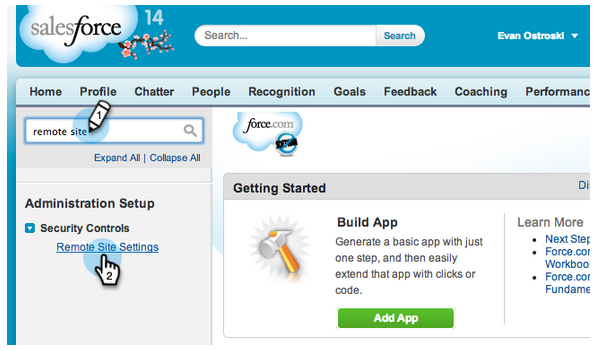

# Configurare Marketo Sales Insight in Salesforce Professional Edition {#configure-marketo-sales-insight-in-salesforce-professional-edition}

Di seguito sono riportati i passaggi da effettuare per configurare Marketo Sales Insight in Salesforce Professional Edition. Cominciamo.

>[!PREREQUISITES]
>
>* Installa Marketo nella tua Salesforce Professional Edition.
>
>* [Installa il pacchetto Marketo Sales Insight in Salesforce AppExchange](/help/marketo/product-docs/marketo-sales-insight/msi-for-salesforce/installation/install-marketo-sales-insight-package-in-salesforce-appexchange.md)

>[!NOTE]
>
>**Autorizzazioni amministratore richieste**

## Configurare la funzione Approfondimenti vendite in Marketo {#configure-sales-insight-in-marketo}

1. Apri una nuova finestra del browser per ottenere le credenziali Marketo Sales Insight dal tuo account Marketo.
1. Vai all’area Amministratore e seleziona **Approfondimenti vendite**.

   

1. Fai clic su **Modifica configurazione API**.

   

1. Immetti una chiave segreto API a tua scelta e fai clic su **Salva**. NON utilizzare una e commerciale (&amp;) nella chiave segreto API.

   

   >[!NOTE]
   >
   >La chiave di segreto API è una password per la tua organizzazione e deve essere protetta.

1. Fai clic su **Visualizza** nel pannello Configurazione API REST per popolare le credenziali.

   

1. Verrà visualizzato un pop-up di conferma. Fai clic su **OK**.

   

## Configurazione di Sales Insight in Salesforce {#configure-sales-insight-in-salesforce}

1. In Salesforce, fai clic su **Configurazione**.

   

1. Cerca &quot;sito remoto&quot; e seleziona **Impostazioni del sito remoto**.

   

1. Fai clic su **Nuovo sito remoto**.

   

1. Inserisci il Nome del sito remoto (può essere simile a &quot;MarketoSoapAPI&quot;). Inserisci URL del sito remoto, che è l’URL host Marketo dal pannello Configurazione API Soap in Marketo. Fai clic su **Salva**. Ora hai creato le impostazioni del sito remoto per l’API Soap.

   

1. Fai clic su **Nuovo sito remoto** di nuovo.

   

1. Inserisci il Nome del sito remoto (può essere simile a &quot;MarketoRestAPI&quot;). Inserisci URL del sito remoto, che è l’URL API dal pannello Configurazione API di ripristino in Marketo. Fai clic su **Salva**. Sono state create le impostazioni del sito remoto per l’API di ripristino.

## Configurare Marketo Sales Insight {#set-up-marketo-sales-insight}

1. Accedi alla tua istanza Marketo e fai clic su **Amministratore**.

   

1. Fai clic su **Approfondimenti vendite**.

   

1. Fai clic su **Modifica configurazione API**.

   

1. Inserisci un **Chiave segreta API** e fai clic su **Salva**.

   >[!CAUTION]
   >
   >Non utilizzare una e commerciale (&amp;) nella chiave segreto API.

   

   >[!TIP]
   >
   >Tieni aperta questa finestra. Queste informazioni saranno necessarie in seguito in Salesforce.

1. Torna a Salesforce, fai clic su **Configurazione**.

   

1. Cerca &quot;sito remoto&quot; e fai clic su **Impostazione del sito remoto** sotto **Controlli di sicurezza**.

   

1. Fai clic su **Nuovo sito remoto**.

   

1. Invio **Nome del sito remoto** e **URL sito remoto**, quindi fai clic su **Salva**.

   

   >[!NOTE]
   >
   >Scegli il tuo **Nome del sito remoto** (MarketoAPI viene utilizzato qui). La **URL sito remoto** nel campo Host Marketo della finestra di dialogo Modifica configurazione API del passaggio 4.

## Personalizzare i layout di pagina {#customize-page-layouts}

1. Fai clic su **Configurazione**.

   

1. Cerca &quot;layout pagina&quot; e seleziona il **Layout pagina** sotto **Lead**.

   

1. Fai clic su **Pagine della visualizzazione** a sinistra. Trascina **Sezione** al layout nella sezione Collegamenti personalizzati .

   

1. Inserisci &quot;Marketo Sales Insight&quot; come **Nome sezione**. Seleziona **1 colonna** e fai clic su **OK**.

   

1. Trascinamento della selezione **Lead** nella nuova sezione.

   

   >[!TIP]
   >
   >Il nome di questa casella verrà modificato in base al tipo di oggetto. Ad esempio, se si modifica il layout di pagina per Contatti, verrà visualizzato Contatto.

1. Fai doppio clic sul pulsante **Lead** blocco appena aggiunto.

   

1. Modifica altezza in **450** pixel e fai clic su **OK**.

   

   >[!NOTE]
   >
   >Controlla **Mostra barre di scorrimento** se hai bisogno di accedere alle attività di scorrimento.

   >[!TIP]
   >
   >È consigliabile un&#39;altezza di 410 pixel per gli oggetti Account e Opportunità.

1. Fai clic su **Campi** a sinistra. Quindi cerca e trascina il **Coinvolgimento** nella **Informazioni sulle vendite Marketo** layout.

   

1. Ripetere il passaggio precedente anche per questi campi.

<table> 
 <tbody> 
  <tr> 
   <td colspan="1">Coinvolgimento</td> 
  </tr> 
  <tr> 
   <td colspan="1" rowspan="1">
Valore punteggio relativo
</td> 
  </tr> 
  <tr> 
   <td colspan="1" rowspan="1">
Valore di urgenza
</td> 
  </tr> 
  <tr> 
   <td colspan="1" rowspan="1">
Data ultimo momento interessante
</td> 
  </tr> 
  <tr> 
   <td colspan="1" rowspan="1">
Desc dell'ultimo momento interessante
</td> 
  </tr> 
  <tr> 
   <td colspan="1" rowspan="1">
Ultima origine momento interessante
</td> 
  </tr> 
  <tr> 
   <td colspan="1" rowspan="1">
Ultimo tipo di momento interessante
</td> 
  </tr> 
 </tbody> 
</table>

1. leccare **Salva** una volta finito.

   

1. Ripeti questo processo per aggiungere sezioni della pagina Visualforce e campi Approfondimenti vendite per **Contatto**, **Account** e **Opportunità**.
1. Ripetere i passaggi da 5 a 7 per aggiungere le sezioni della pagina Visualforce per Contatto, Account e Opportunità. Quindi, ripeti i passaggi 8-10 per aggiungere campi Approfondimenti vendite per **Contatto**. Assicurati di salvare dopo eventuali modifiche.

## Mappa campi persona personalizzati {#map-custom-person-fields}

I campi persona di Marketo devono essere mappati sui campi contatto di Salesforce per garantire il corretto funzionamento della conversione. Ecco come.

1. Fai clic su **Configurazione**.

   

1. Cerca &quot;campi&quot; nella barra di ricerca e fai clic su **Campi** sotto **Lead**.

   

1. Fai clic su **Mappa campi lead**.

   

1. Fai clic sul menu a discesa a destra di **Coinvolgimento**.

   

1. Seleziona **Contact.Engagement** nell&#39;elenco.

   

1. Ripeti e mappa anche questi campi.

<table> 
 <tbody> 
  <tr> 
   <th colspan="1" rowspan="1">Campo personalizzato persona Marketo</th> 
   <th colspan="1" rowspan="1">Campo personalizzato contatto Salesforce</th> 
  </tr> 
  <tr> 
   <td colspan="1" rowspan="1">
Coinvolgimento
</td> 
   <td colspan="1" rowspan="1">
Contact.Engagement
</td> 
  </tr> 
  <tr> 
   <td colspan="1" rowspan="1">
Valore punteggio relativo
</td> 
   <td colspan="1" rowspan="1">
Valore punteggio relativo di Contact.Relative
</td> 
  </tr> 
  <tr> 
   <td colspan="1" rowspan="1">
Valore di urgenza
</td> 
   <td colspan="1" rowspan="1">
Valore Contact.Urency
</td> 
  </tr> 
  <tr> 
   <td colspan="1" rowspan="1">
Data ultimo momento interessante
</td> 
   <td colspan="1" rowspan="1">
Contact.Last Interessante Momento Data
</td> 
  </tr> 
  <tr> 
   <td colspan="1" rowspan="1">
Desc dell'ultimo momento interessante
</td> 
   <td colspan="1" rowspan="1">
Contact.Last Interessante Momento Desc
</td> 
  </tr> 
  <tr> 
   <td colspan="1" rowspan="1">
Ultima origine momento interessante
</td> 
   <td colspan="1" rowspan="1">
Contact.Last Interessante Momento Origine
</td> 
  </tr> 
  <tr> 
   <td colspan="1" rowspan="1">
Ultimo tipo di momento interessante
</td> 
   <td colspan="1" rowspan="1">
Contact.Last Interessante Moment Type
</td> 
  </tr> 
 </tbody> 
</table>

1. Fai clic su **Salva** quando hai finito.

   

## Configurazione di Marketo Sales Insight {#marketo-sales-insight-config}

1. Fai clic su **+** quindi seleziona **Configurazione di Marketo Sales Insight**.

   

1. Controlla **Abilita API Marketo**. Quindi compila [Informazioni di configurazione API in Marketo Admin](#set-up-marketo-sales-insight). Fai clic su **Salva modifiche** quando hai finito.

   

   >[!NOTE]
   >
   >Se il test di diagnostica non è riuscito, potrebbe essere necessario [aggiungere altri campi al layout della pagina](https://nation.marketo.com/docs/DOC-1115).

Ed è tutto! È necessario essere in grado di visualizzare i campi Marketo Sales Insight per Lead, Contatti, Account e Opportunità.

>[!NOTE]
>
>Per gli account, Insight vendite includerà tutte le e-mail, ma solo i momenti interessanti più recenti, l’attività web e i cambiamenti di punteggio.

## Accedere a Marketo Sales Insight {#access-marketo-sales-insight}

1. In Salesforce, fai clic sul pulsante **+** alla fine della barra delle schede e fai clic su **Configurazione di Marketo Sales Insight**.

1. Seleziona la **Abilita API Marketo** casella di controllo.

1. Copia le credenziali dal pannello API Soap nella pagina Admin di Marketo Sales Insight e incollale nella sezione API Soap della pagina Configurazione di Salesforce Sales Insight .

1. Copia le credenziali dal pannello Rest API nella pagina Sales Insight Admin di Marketo e incollale nella sezione Rest API della pagina Salesforce Sales Insight Configuration.

   

>[!MORELIKETHIS]
>
>* [Priorità, Urgenza, Punteggio relativo e Migliori offerte](/help/marketo/product-docs/marketo-sales-insight/msi-for-salesforce/features/stars-and-flames/priority-urgency-relative-score-and-best-bets.md)
>* [Aggiungi scheda Marketo a Salesforce](/help/marketo/product-docs/marketo-sales-insight/msi-for-salesforce/configuration/add-marketo-tab-to-salesforce.md)
>* [Aggiungi accesso a informazioni sulle vendite nei profili](/help/marketo/product-docs/marketo-sales-insight/msi-for-salesforce/configuration/add-sales-insight-access-to-profiles.md){target=&quot;_blank&quot;}

