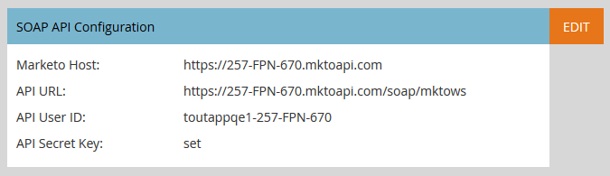

# Pagina Sales Insight per gli amministratori di Marketo {#sales-insight-page-for-marketo-admins}

Gli amministratori di Marketo dispongono di determinati privilegi in Sales Insight. Scopri di più.

## Configurazione API Soap {#soap-api-configuration}

Queste credenziali vengono utilizzate per collegare l’account Salesforce all’istanza Marketo e utilizzare quindi MSI in Salesforce.

## Configurazione API REST {#rest-api-configuration}

Queste credenziali vengono utilizzate per collegare l’account Salesforce all’istanza di Marketo e utilizzare la dashboard di approfondimenti MSI in Salesforce.

## Impostazioni punteggio persona {#person-score-settings}

* **Stelle**: le stelle rappresentano il punteggio totale di lead rispetto ad altri lead.
* **Fiamme**: le fiamme rappresentano l’urgenza - quanto il punteggio di un lead è cambiato di recente.

Per impostazione predefinita, Marketo Sales Insight utilizza il campo Punteggio lead per calcolare le stelle e le fiamme. Ma se vuoi scegliere un campo diverso, ecco come:

1. In **Amministratore** di Marketo, fai clic su **Insight sulle vendite**.

   

1. In Impostazioni punteggio lead, fai clic su **Modifica**.

   

1. Selezionare il campo da utilizzare per le stelle.

   

1. Selezionare il campo da utilizzare per le fiamme.

   

1. Clic **Salva**. Il ricalcolo degli approfondimenti sulle vendite richiederà del tempo. Puoi controllare il tuo CRM più tardi per vedere le stelle e le fiamme.

   

   >[!TIP]
   >
   >Se non disponi già dei campi di punteggio personalizzati, ecco come [crearle](/help/marketo/product-docs/administration/field-management/create-a-custom-field-in-marketo.md).

   >[!MORELIKETHIS]
   >
   >[Stelle e fiamme](/help/marketo/product-docs/marketo-sales-insight/msi-for-salesforce/features/stars-and-flames/customize-stars-and-flames.md)

## Impostazioni {#settings}

**Impostazioni annullamento iscrizione:**

Puoi scegliere una delle seguenti impostazioni per annullare l’iscrizione a Nessun modello, e-mail standard e e e-mail operative

* Rispetta impostazione annullamento iscrizione
* Rispetta le impostazioni per l’annullamento dell’iscrizione quando più di un destinatario
* Rispetta le impostazioni per l’annullamento dell’iscrizione quando più di 5 destinatari
* Ignora impostazioni annullamento iscrizione

**Abilita la possibilità di bloccare i modelli:**

Se questa opzione è abilitata, gli utenti MSI non potranno modificare i modelli durante l’invio di e-mail da Salesforce

**Attiva feed RSS:**

Quando questa opzione è abilitata, gli utenti MSI possono visualizzare il proprio feed lead in un feed RSS (oltre al feed lead in Salesforce). Il feed RSS può funzionare solo se la funzione &quot;Scadenza token&quot; è disabilitata.

**Scadenza token:**

La scadenza del token è controllata in Feature Manager. Per abilitarlo o disabilitarlo, contatta [Supporto Marketo](https://nation.marketo.com/t5/Support/ct-p/Support). Se abilitati, tutti i token Marketo scadono entro 10 minuti. Se disabilitati, i token Marketo non scadranno.

I token generati prima dell’abilitazione della scadenza del token non avranno un tempo di scadenza per la convalida, pertanto non scadranno anche se la funzione è attualmente abilitata.

I token generati dopo l’abilitazione della scadenza del token avranno un tempo di scadenza di 10 minuti, quindi scadranno tra 10 minuti anche dopo la disabilitazione della funzione.

Il comportamento del token sarà basato su quando è stato generato (quando la funzione Scadenza token è stata abilitata/disabilitata, anziché sullo stato corrente della funzione).
