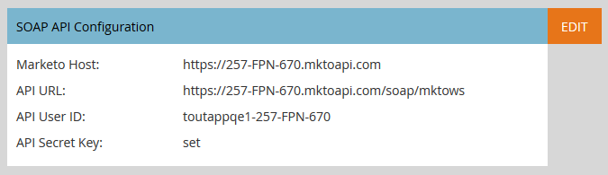
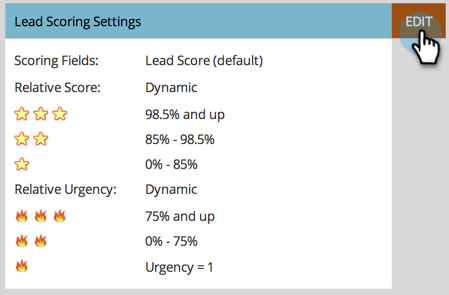

# [!DNL Sales Insight] pagina per amministratori di Marketo {#sales-insight-page-for-marketo-admins}

Gli amministratori di Marketo dispongono di alcuni privilegi in [!DNL Sales Insight]. Scopri di più.

## Configurazione API Soap {#soap-api-configuration}

Queste credenziali vengono utilizzate per connettere l&#39;account [!DNL Salesforce] all&#39;istanza Marketo per utilizzare MSI in [!DNL Salesforce].

## Configurazione API REST {#rest-api-configuration}

Queste credenziali vengono utilizzate per connettere l&#39;account [!DNL Salesforce] all&#39;istanza di Marketo per utilizzare il dashboard di approfondimenti MSI in [!DNL Salesforce].

## Impostazioni punteggio persona {#person-score-settings}

* **[!UICONTROL Stars]**: le stelle rappresentano il punteggio totale del lead rispetto ad altri lead.
* **[!UICONTROL Flames]**: le fiamme rappresentano l&#39;urgenza - quanto il punteggio di un lead è cambiato di recente.

Per impostazione predefinita, [!DNL Marketo Sales Insight] utilizza il campo Punteggio lead per calcolare le stelle e le fiamme. Ma se vuoi scegliere un campo diverso, ecco come:

1. Nell&#39;area **[!UICONTROL Admin]** di Marketo, fare clic su **[!UICONTROL Sales Insight]**.

   

1. In [!UICONTROL Lead Scoring Settings], fare clic su **[!UICONTROL Edit]**.

   

1. Selezionare il campo da utilizzare per le stelle.

   

1. Selezionare il campo da utilizzare per le fiamme.

   

1. Fai clic su **[!UICONTROL Save]**. Il ricalcolo di Sales insight richiederà del tempo. Puoi controllare il tuo CRM più tardi per vedere le stelle e le fiamme.

   

   >[!TIP]
   >
   >Se non disponi già dei campi di punteggio personalizzati, ecco come [crearli](/help/marketo/product-docs/administration/field-management/create-a-custom-field-in-marketo.md).

   >[!MORELIKETHIS]
   >
   >[Stelle e fiamme](/help/marketo/product-docs/marketo-sales-insight/msi-for-salesforce/features/stars-and-flames/customize-stars-and-flames.md)

## Impostazioni {#settings}

**Impostazioni annullamento sottoscrizione:**

Puoi scegliere una delle seguenti impostazioni per annullare l&#39;iscrizione a [!UICONTROL No Template], [!UICONTROL Standard Emails] e [!UICONTROL Operational emails]

* [!UICONTROL Respect Unsubscribe Setting]
* [!UICONTROL Respect Unsubscribe Settings when more than 1 recipient]
* [!UICONTROL Respect Unsubscribe Settings when more than 5 recipients]
* [!UICONTROL Ignore Unsubscribe Settings]

**Possibilità di bloccare i modelli:**

Se abilitata, gli utenti MSI non potranno modificare i modelli durante l&#39;invio di e-mail da [!DNL Salesforce]

**Abilita feed RSS:**

Se abilitata, gli utenti MSI possono visualizzare il proprio feed lead in un feed RSS (oltre al feed lead in [!DNL Salesforce]). Il feed RSS può funzionare solo se la funzionalità &quot;[!UICONTROL Token Expiration]&quot; è disabilitata.

**Scadenza token:**

La scadenza del token è controllata in Feature Manager. Per attivarlo o disattivarlo, contattare il [supporto Marketo](https://nation.marketo.com/t5/support/ct-p/Support). Se abilitati, tutti i token Marketo scadono entro 10 minuti. Se disabilitati, i token Marketo non scadranno.

I token generati prima dell’abilitazione della scadenza del token non avranno un tempo di scadenza per la convalida, pertanto non scadranno anche se la funzione è attualmente abilitata.

I token generati dopo l’abilitazione della scadenza del token avranno un tempo di scadenza di 10 minuti, quindi scadranno tra 10 minuti anche dopo la disabilitazione della funzione.

Il comportamento del token sarà basato su quando è stato generato (quando la funzione Scadenza token è stata abilitata/disabilitata, anziché sullo stato corrente della funzione).
