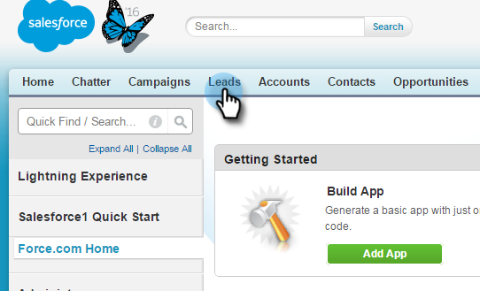

# Aggiunta di un lead/contatto a una campagna marketing da Salesforce {#add-a-lead-contact-to-a-marketo-campaign-from-salesforce}

Puoi facilmente aggiungere lead o contatti alle campagne smart di Marketo direttamente da Salesforce. Ecco come, usare i lead.

1. In Salesforce, fare clic sulla scheda **Lead**.

   

1. Selezionate dall&#39;elenco a discesa l&#39;elenco delle persone da visualizzare e fate clic su **Go**.

   

   >[!NOTE]
   >
   >L&#39;elenco a discesa include Tutti i lead aperti o non letti, i lead visualizzati di recente, i lead di oggi e possono includere altre categorie.

1. Selezionate un lead dall’elenco per aprire il record.

   

1. Nel record, scorrete verso il basso fino all&#39;area Visiva marketing, fate clic sul menu a discesa **Azioni**, selezionate **Aggiungi a campagna marketing**, quindi fate clic su **Vai**.

   

1. Fai clic sul menu a discesa **Nome campagna**, seleziona la campagna Marketo desiderata, quindi fai clic su **Aggiungi a campagna marketing**.

   

   >[!NOTE]
   >
   >Affinché la campagna venga visualizzata nell&#39;elenco a discesa, utilizzate il trigger [**Campaign is Required**](/help/marketo/product-docs/core-marketo-concepts/smart-campaigns/using-smart-campaigns/setting-up-a-trigger-smart-campaign-for-sales-using-campaign-is-requested.md), con **Sales Insight** come origine, quando configurate la campagna.

Ed è tutto! La persona viene aggiunta alla campagna Marketo.
