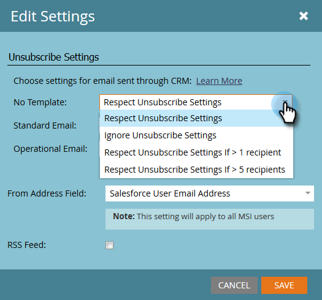

# Configura piè di pagina per annullamento iscrizione in [!DNL Marketo Sales Insight] {#configure-unsubscribe-footers-in-marketo-sales-insight}

Nelle e-mail di vendita, il piè di pagina per l’annullamento dell’iscrizione viene inserito automaticamente nella parte inferiore. Tuttavia, è possibile regolare le impostazioni in base alle proprie esigenze.

>[!NOTE]
>
>**Autorizzazioni amministratore richieste**

>[!NOTE]
>
>**Definizione**
>
>**Le e-mail di vendita** sono quelle inviate da [!DNL Sales Insight] (non sono incluse quelle inviate dal plug-in di Marketo Outlook).

1. Passare all&#39;area **[!UICONTROL Admin]**.

   

1. Fare clic su **[!UICONTROL Sales Insight]**, quindi su **[!UICONTROL Edit Settings]**.

   

   Sono disponibili diverse opzioni. Diamo innanzitutto un’occhiata ai tipi di e-mail per i quali puoi modificare le impostazioni.

   

   * **[!UICONTROL No Template]** - Composto manualmente dall&#39;utente di vendita.
   * **[!UICONTROL Standard Email]** - E-mail basate su un modello.
   * **[!UICONTROL Operational Email]** - E-mail che ignorano gli annullamenti dell&#39;abbonamento, la sospensione del marketing e i limiti di comunicazione (vengono inviate a prescindere da cosa).

   È possibile impostare un comportamento diverso per ogni tipo.

   >[!CAUTION]
   >
   >**[!UICONTROL Respect Unsubscribe Settings]**: i lead non abbonati NON riceveranno l&#39;e-mail anche se l&#39;e-mail pubblicata è &quot;operativa&quot;
   >
   >**[!UICONTROL Ignore Unsubscribe Settings]**: i lead non iscritti riceveranno l&#39;e-mail

1. Apportare le modifiche desiderate, quindi fare clic su **[!UICONTROL Save]**.

   >[!TIP]
   >
   >Le ultime due scelte consentono di includere/escludere in modo dinamico il piè di pagina per l’annullamento dell’iscrizione, a seconda del numero di destinatari (maggiore di 1 o maggiore di 5).

   

Ehi! Un po&#39; complicato, ma piuttosto flessibile, giusto?
