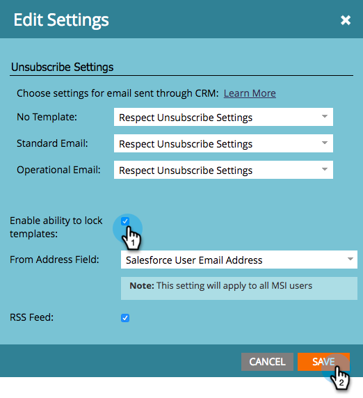

# Blocca modello vendite {#lock-sales-template}

Per impedire agli utenti di CRM di modificare i modelli di vendita, gli amministratori possono abilitare la possibilità di bloccare i modelli, che quindi consente agli utenti di bloccare i modelli singolarmente dall’editor e-mail.

>[!CAUTION]
>
>Questa funzione funziona solo per Salesforce e non è compatibile con Microsoft Dynamics o altri CRM. I modelli a cui si accede dai plug-in di Outlook o Gmail non verranno bloccati, in quanto l’editor non è controllato da Marketo.

## Abilita modello di blocco {#enable-lock-template}

>[!NOTE]
>
>**Autorizzazioni amministratore richieste**

1. Vai a **Amministratore**, quindi fai clic su **Insight sulle vendite**.

   

1. Sotto **Impostazioni**, fai clic su **Modifica**.

   

1. Verifica **Abilita la possibilità di bloccare i modelli**. Clic **Salva**.

   

>[!NOTE]
>
>Per impostazione predefinita, questa casella è selezionata e la possibilità di bloccare i modelli è abilitata. Deselezionandola, verrà disabilitata la funzione di blocco del modello nell’editor e-mail.

>[!NOTE]
>
>La modifica di questa impostazione come amministratore **non** influisce retroattivamente sui modelli esistenti, ovvero non li blocca automaticamente.

## Blocca modello nell’editor e-mail {#lock-template-in-the-email-editor}

1. Seleziona l’e-mail da bloccare, quindi fai clic su **Modifica bozza**.

   

1. Nell’editor e-mail, fai clic su **Impostazioni e-mail**.

   

1. Verifica **Pubblica su Marketo Sales Insight** se non è già selezionato. Ora puoi deselezionare **Consenti all&#39;utente CRM di modificare l&#39;e-mail** per bloccare il modello. Clic **Salva**.

   

   >[!NOTE]
   >
   >Per impostazione predefinita, questa casella è selezionata e gli utenti CRM possono modificare le e-mail.
