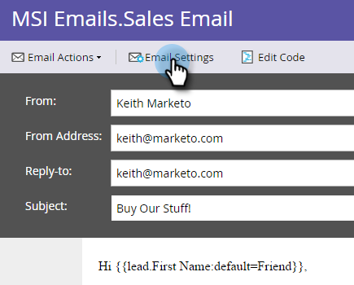

# Pubblicare un&#39;e-mail in Sales Insight {#publish-an-email-to-sales-insight}

Abilita l’impostazione Pubblica su Insight vendite per rendere disponibile un messaggio e-mail al tuo team di vendita sia in Insight vendite che nel componente aggiuntivo Outlook e Gmail. Puoi anche assegnargli una data di scadenza.

1. Trova il tuo messaggio e-mail, selezionalo e fai clic su **Modifica bozza**.

   

1. Una volta aperto l’editor, fai clic su **Impostazioni e-mail**.

   

1. Controlla **Pubblicare su Marketo Sales Insight**.

   

1. Per impostare una data di scadenza (facoltativa), controlla **Imposta scadenza** e scegliere una data.

   

   >[!NOTE]
   >
   >Alle 11:59 (CST) alla data di scadenza (se ne hai impostato uno), l’e-mail che hai reso disponibile scomparirà da Sales Insight e dai relativi componenti aggiuntivi. Naturalmente sarà ancora accessibile in Marketo.

1. Fai clic su **Salva**.

   

Bel lavoro! Ora sai come rendere disponibili le e-mail per il tuo team di vendita da inviare sul lato CRM e limitare il loro tempo disponibile, se necessario.

>[!NOTE]
>
>[Token personali](/help/marketo/product-docs/core-marketo-concepts/programs/tokens/understanding-my-tokens-in-a-program.md) non viene risolto quando si invia un&#39;e-mail da Sales Insight in Microsoft Dynamics o Salesforce; verranno compilati solo i token standard (Lead, Azienda, ecc.). Tuttavia, i valori predefiniti per i token funzioneranno.

>[!TIP]
>
>Non dimenticare di approvare questo messaggio e-mail per rendere effettive le modifiche. Scopri come [Approvare un’e-mail](/help/marketo/product-docs/email-marketing/general/creating-an-email/approve-an-email.md).
