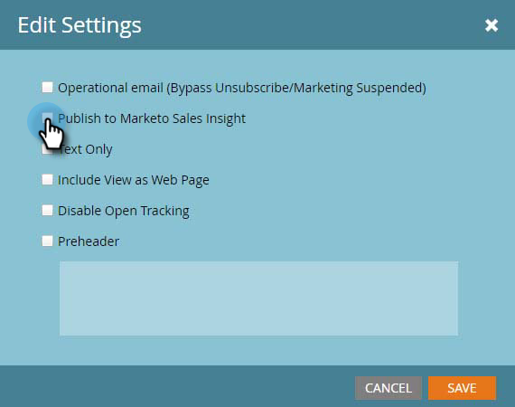
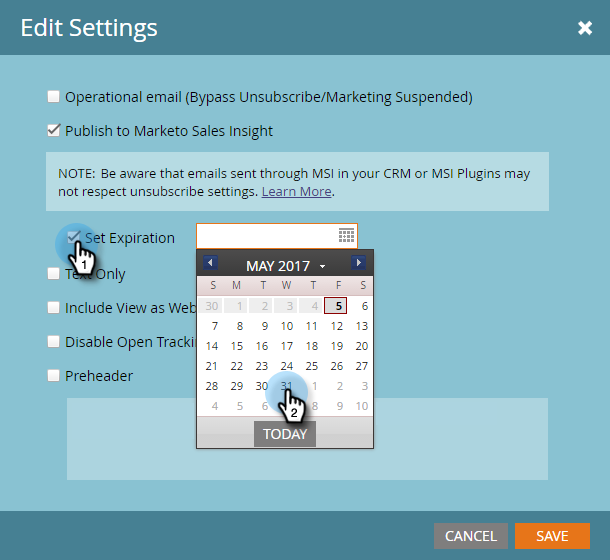

# Pubblica un&#39;e-mail in [!DNL Sales Insight] {#publish-an-email-to-sales-insight}

Abilitare l&#39;impostazione Pubblica su [!DNL Sales Insight] per rendere disponibile un&#39;e-mail al team vendite sia in [!DNL Sales Insight] che nel componente aggiuntivo [!DNL Outlook] e Gmail. Puoi anche assegnargli una data di scadenza.

1. Trova il tuo indirizzo e-mail, selezionalo e fai clic su **[!UICONTROL Edit Draft]**.

   

1. Una volta aperto l&#39;editor, fare clic su **[!UICONTROL Email Settings]**.

   

1. Seleziona **[!UICONTROL Publish to Marketo Sales Insight]**.

   

1. Per impostare una data di scadenza (facoltativa), selezionare **[!UICONTROL Set Expiration]** e scegliere una data.

   

   >[!NOTE]
   >
   >Alle 23:59 (CST) della data di scadenza (se ne imposta una), l&#39;e-mail che hai reso disponibile scompare da [!DNL Sales Insight] e dai relativi componenti aggiuntivi. Naturalmente sarà ancora accessibile in Marketo.

1. Fai clic su **[!DNL Save]**.

   

Bel lavoro! Ora sai come rendere le e-mail disponibili per il tuo team vendite da inviare sul lato CRM, e per limitare il tempo disponibile, se necessario.

>[!NOTE]
>
>[I miei token](/help/marketo/product-docs/core-marketo-concepts/programs/tokens/understanding-my-tokens-in-a-program.md) non verranno risolti durante l&#39;invio di un&#39;e-mail da [!DNL Sales Insight] in [!DNL Microsoft Dynamics] o [!DNL Salesforce]. Verranno popolati solo i token standard (lead, società, ecc.). Tuttavia, i valori predefiniti per i token funzioneranno.

>[!TIP]
>
>Per rendere effettive le modifiche, non dimenticare di approvare questa e-mail. Scopri come [Approvare un&#39;e-mail](/help/marketo/product-docs/email-marketing/general/creating-an-email/approve-an-email.md).
