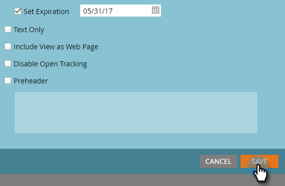

# Publish e-mail a Sales Insight {#publish-an-email-to-sales-insight}

Abilita l’impostazione Publish to Sales Insight per rendere disponibile un’e-mail al team di vendita sia in Sales Insight che nel componente aggiuntivo Outlook e Gmail. Puoi anche assegnargli una data di scadenza.

1. Trova il tuo indirizzo e-mail, selezionalo e fai clic su **Modifica bozza**.

   

1. Una volta aperto l&#39;editor, fai clic su **Impostazioni e-mail**.

   

1. Controlla **Publish in Marketo Sales Insight**.

   

1. Per impostare una data di scadenza (facoltativo), selezionare **Imposta scadenza** e scegliere una data.

   

   >[!NOTE]
   >
   >Alle 23:59 (ora italiana) del giorno di scadenza (se ne imposta una), l’e-mail messa a disposizione scompare da Sales Insight e dai suoi componenti aggiuntivi. Naturalmente sarà ancora accessibile in Marketo.

1. Fai clic su **Salva**.

   

Bel lavoro! Ora sai come rendere le e-mail disponibili per il tuo team vendite da inviare sul lato CRM, e per limitare il tempo disponibile, se necessario.

>[!NOTE]
>
>[I miei token](/help/marketo/product-docs/core-marketo-concepts/programs/tokens/understanding-my-tokens-in-a-program.md) non verranno risolti durante l&#39;invio di un&#39;e-mail da Sales Insight su Microsoft Dynamics o Salesforce; verranno popolati solo i token standard (lead, società, ecc.). Tuttavia, i valori predefiniti per i token funzioneranno.

>[!TIP]
>
>Per rendere effettive le modifiche, non dimenticare di approvare questa e-mail. Scopri come [Approvare un&#39;e-mail](/help/marketo/product-docs/email-marketing/general/creating-an-email/approve-an-email.md).
