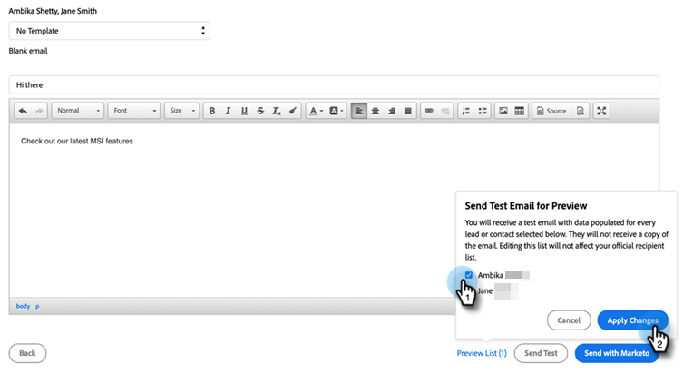

# Invia un messaggio e-mail di test {#send-a-test-email}

Prima di inviare un’e-mail, puoi testare il formato dell’e-mail e i token inviando un messaggio e-mail di prova a te stesso a qualsiasi indirizzo e-mail.

1. Passa al pannello Approfondimenti vendite in Salesforce di un lead o di un contatto.

1. Fai clic su **Invia e-mail Marketo**.

1. Fai clic su **Modificare i destinatari del test**.

1. È possibile scegliere uno o più lead dall’elenco per vedere come verranno sottoposti a rendering. Fai clic su **Applica modifiche** al termine.

   

   >[!NOTE]
   >
   >Come promemoria, seleziona questi lead **non** invia loro il test e-mail, ti mostra _come verranno visualizzate le e-mail_. Se scegli quattro lead, riceverai quattro e-mail di test diverse.

1. Fai clic su **Invia test**.

Riceverai un’e-mail con i valori dei token compilati per i lead scelti.

>[!NOTE]
>
>Non preoccuparti, rimarrai sulla pagina &quot;Invia e-mail Marketo&quot; anche dopo l’invio dell’e-mail di test, in modo da non perdere l’e-mail che hai creato.
