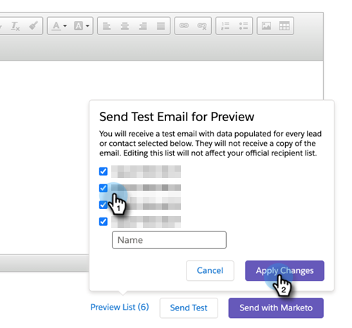

# Inviare un messaggio e-mail di prova {#send-a-test-email}

Prima di inviare un’e-mail, puoi testarne il formato e i token inviando un’e-mail di prova a te stesso a qualsiasi indirizzo e-mail.

1. Passare al pannello [!DNL Sales Insight] in [!DNL Salesforce] di un lead o contatto.

1. Fai clic su **[!UICONTROL Send Marketo Email]**.

1. Fai clic su **[!UICONTROL Edit Test Recipients]**.

1. Puoi scegliere uno o più lead dall’elenco per vedere come verranno visualizzati. Al termine, fai clic su **[!UICONTROL Apply Changes]**.

   

   >[!NOTE]
   >
   >La selezione di questi lead **non** invia loro il test e-mail. Viene visualizzato _l&#39;aspetto dell&#39;e-mail_. Se scegli quattro lead, riceverai quattro diverse e-mail di test.

1. Fai clic su **[!UICONTROL Send Test]**.

Riceverai un’e-mail con i valori dei token compilati per i lead scelti.

>[!NOTE]
>
>Non preoccuparti, rimarrai sulla pagina &quot;[!UICONTROL Send Marketo Email]&quot; anche dopo l&#39;invio dell&#39;e-mail di test, in modo da non perdere l&#39;e-mail creata.
