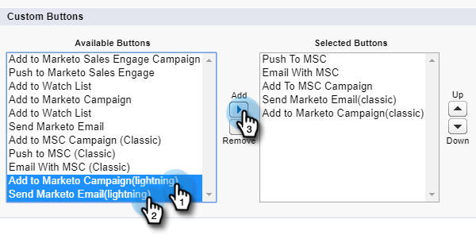

# Azioni di massa in Salesforce Lightning {#bulk-actions-in-salesforce-lightning}

Come impostare le azioni di massa in Salesforce Lightning.

1. In Salesforce, fai clic sull&#39;icona Configurazione e seleziona **Configurazione**.

   

1. Fare clic sulla scheda **Object Manager**.

   

1. Individuare e selezionare l&#39;etichetta **Lead**.

   

1. Fare clic su **Cerca layout per Salesforce Classic**.

   

   Trovate il layout Visualizzazione elenco. Fare clic sul menu a discesa a destra e selezionare **Modifica**.

   

1. In Pulsanti personalizzati, individua e seleziona **Aggiungi a campagna marketing (fulmine)** e **Invia e-mail marketing (fulmine)**. Fare clic sul pulsante **Aggiungi**.

   

1. Fare clic su **Salva**.

   

   Ora è possibile visualizzare i pulsanti delle azioni in blocco nella vista Elenco lead.

   >[!NOTE]
   >
   >Ripetere gli stessi passaggi per aggiungere azioni in blocco nella visualizzazione Elenco contatti.
