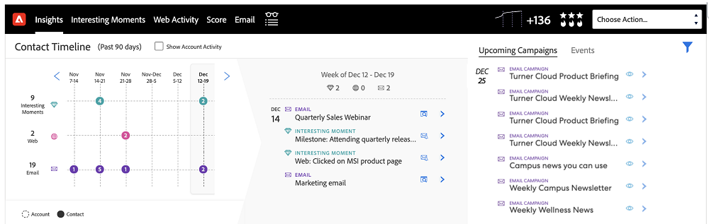

# Panoramica delle funzioni del dashboard approfondimenti {#insights-dashboard-feature-overview}

Ulteriori informazioni sulle funzioni disponibili nella dashboard Informazioni di vendita.

>[!PREREQUISITES]
>
>È necessario disporre del pacchetto SFDC MSI più recente e [configurazione](/help/marketo/product-docs/marketo-sales-insight/msi-for-salesforce/configuration/configuration-for-existing-customers.md).

## Layout contatto {#contact-layout}

**Griglia velocità di coinvolgimento**

* Questa griglia intelligente include i momenti di interesse, e-mail e attività Web negli ultimi 90 giorni
* L’utente può scegliere di &quot;mostrare l’attività account&quot;, in modo da disporre a livello di account tutti i momenti di interesse, e-mail e attività web nella visualizzazione del contatto
* L’utente può evidenziare una settimana specifica per visualizzare le attività entro tale settimana
* Visualizzazione predefinita: è selezionata la settimana corrente

**Drill-down e riepilogo del coinvolgimento**

* Espandere schede attività per i momenti di interesse, e-mail e attività web
* Scheda Attività Momenti di interesse - Include l’opzione di abbonamento
* Scheda Attività e-mail - Include l’opzione Anteprima
* Scheda Attività Web: include la possibilità di fare clic sul collegamento
* La barra di riepilogo settimanale mostra i momenti di interesse, l’e-mail e l’attività web per quella settimana. Ogni icona è cliccabile e può essere usata come filtro per mostrare un’attività specifica
* Visualizzazione predefinita: elenco delle attività della visualizzazione corrente

**Prossime campagne ed eventi e-mail**

Scheda Campagne e-mail:

* Include campagne che fanno parte di programmi e-mail o programmi predefiniti pianificati nei successivi 90 giorni
* Non specifico per il contatto/lead (ad esempio, l’elenco delle campagne è un elenco generico di tutte le campagne e-mail pianificate nell’istanza di Marketo). L’elenco delle campagne in tutti i pannelli lead, contatto, account e opportunità sarà lo stesso
* Se la ricorrenza della campagna è tale che viene eseguita più di tre volte nei successivi 90 giorni, verranno mostrate solo le tre esecuzioni successive in un dato momento (in modo simile al comportamento in Marketo)
* La scheda dei dettagli dell’attività in questa sezione avrà un’opzione di anteprima. Se il flusso include più passaggi dell’e-mail di invio, tutte le e-mail saranno disponibili per l’anteprima. Nel passaggio Invia flusso e-mail, se sono presenti più &quot;scelte e-mail&quot;, l’opzione predefinita sarà disponibile per l’anteprima
* I filtri includono &quot;Ricerca&quot; e &quot;Intervallo date&quot;

Scheda Evento:

* Include i programmi evento pianificati nei prossimi 90 giorni
* Utilizza l’opzione di filtro per visualizzare tutti gli eventi/eventi invitati (in base alle impostazioni dell’amministratore)
* Selezionando gli eventi invitati verranno visualizzati gli eventi a cui è stato invitato il contatto specifico, insieme allo stato del membro
* Selezionando tutti gli eventi verrà visualizzato l’elenco degli eventi pianificati nei successivi 90 giorni
* La scheda Dettagli attività in questa sezione presenta l’opzione di anteprima
* Il filtro include &quot;Ricerca&quot;, &quot;Mostra solo eventi invitati&quot; e &quot;Intervallo date&quot;

## Layout lead {#lead-layout}

**Griglia velocità di coinvolgimento**

* Questa griglia intelligente include i momenti di interesse, e-mail e attività Web negli ultimi 90 giorni
* L’utente può evidenziare una settimana specifica per visualizzare le attività entro tale settimana
* Visualizzazione predefinita: è selezionata la settimana corrente
* La funzione &quot;Mostra attività account&quot; non è disponibile per i lead perché non fa parte di alcun account in Salesforce finché non viene convertito in un contatto

**Drill-down e riepilogo del coinvolgimento**

* Schede di attività drill-down per i momenti di interesse, e-mail e attività web
* Scheda Attività Momenti di interesse - Include l’opzione di abbonamento
* Scheda Attività e-mail - Include l’opzione Anteprima
* Scheda Attività Web: include la possibilità di fare clic sul collegamento
* La barra di riepilogo settimanale mostra i momenti di interesse, l’e-mail e l’attività web per quella settimana. Ogni icona è cliccabile e può essere usata come filtro per mostrare un’attività specifica
* Visualizzazione predefinita: elenco delle attività della visualizzazione corrente

**Prossime campagne ed eventi via e-mail:**

Scheda Campagne e-mail:

* Include campagne che fanno parte di programmi e-mail o programmi predefiniti pianificati nei successivi 90 giorni
* Non specifico per il contatto/lead (ad esempio, l’elenco delle campagne è un elenco generico di tutte le campagne e-mail pianificate nell’istanza di Marketo). L’elenco delle campagne in tutti i pannelli lead, contatto, account e opportunità sarà lo stesso
* Se la ricorrenza della campagna è tale che viene eseguita più di tre volte nei successivi 90 giorni, verranno mostrate solo le tre esecuzioni successive in un dato momento (in modo simile al comportamento in Marketo)
* La scheda dei dettagli dell’attività in questa sezione avrà un’opzione di anteprima. Se il flusso include più passaggi dell’e-mail di invio, tutte le e-mail saranno disponibili per l’anteprima. Nel passaggio Invia flusso e-mail, se sono presenti più &quot;scelte e-mail&quot;, l’opzione predefinita sarà disponibile per l’anteprima
* I filtri includono &quot;Ricerca&quot; e &quot;Intervallo date&quot;

Scheda Evento:

* Include i programmi evento pianificati nei prossimi 90 giorni
* Utilizza l’opzione di filtro per visualizzare tutti gli eventi/eventi invitati (in base alle impostazioni dell’amministratore)
* Selezionando gli eventi invitati verranno visualizzati gli eventi a cui è stato invitato il contatto specifico, insieme allo stato del membro
* Selezionando tutti gli eventi verrà visualizzato l’elenco degli eventi pianificati nei successivi 90 giorni
* La scheda Dettagli attività in questa sezione presenta l’opzione di anteprima
* Il filtro include &quot;Ricerca&quot;, &quot;Mostra solo eventi invitati&quot; e &quot;Intervallo date&quot;

## Layout account {#account-layout}

**Griglia velocità di coinvolgimento**

* Questa griglia intelligente include i momenti di interesse, e-mail e attività Web degli ultimi 90 giorni per tutti i contatti nell’account
* L’utente può evidenziare una settimana specifica per visualizzare le attività entro tale settimana
* Visualizzazione predefinita: è selezionata la settimana corrente

**Drill-down e riepilogo del coinvolgimento**

* Schede di attività drill-down per i momenti di interesse, e-mail e attività web, compreso il nome del contatto
* Scheda Attività Momenti di interesse - Include l’opzione di abbonamento
* Scheda Attività e-mail - Include l’opzione Anteprima
* Scheda Attività Web: include la possibilità di fare clic sul collegamento
* La barra di riepilogo settimanale mostra i momenti di interesse, l’e-mail e l’attività web per quella settimana. Ogni icona è cliccabile e può essere usata come filtro per mostrare un’attività specifica
* Visualizzazione predefinita: elenco delle attività della visualizzazione corrente

**Prossime campagne ed eventi e-mail**

Scheda Campagne e-mail:

* Include campagne che fanno parte di programmi e-mail o programmi predefiniti pianificati nei successivi 90 giorni
* Non specifico per il contatto/lead (ad esempio, l’elenco delle campagne è un elenco generico di tutte le campagne e-mail pianificate nell’istanza di Marketo). L’elenco delle campagne in tutti i pannelli lead, contatto, account e opportunità sarà lo stesso
* Se la ricorrenza della campagna è tale che viene eseguita più di tre volte nei successivi 90 giorni, verranno mostrate solo le tre esecuzioni successive in un dato momento (in modo simile al comportamento in Marketo)
* La scheda dei dettagli dell’attività in questa sezione avrà un’opzione di anteprima. Se il flusso include più passaggi dell’e-mail di invio, tutte le e-mail saranno disponibili per l’anteprima. Nel passaggio Invia flusso e-mail, se sono presenti più &quot;scelte e-mail&quot;, l’opzione predefinita sarà disponibile per l’anteprima
* I filtri includono &quot;Ricerca&quot; e &quot;Intervallo date&quot;

Scheda Evento:

* Include i programmi evento pianificati nei prossimi 90 giorni
* Utilizza l’opzione di filtro per visualizzare tutti gli eventi/eventi invitati (in base alle impostazioni dell’amministratore)
* Selezionando gli eventi invitati verranno visualizzati gli eventi a cui è stato invitato il contatto specifico, insieme allo stato del membro
* Selezionando tutti gli eventi verrà visualizzato l’elenco degli eventi pianificati nei successivi 90 giorni
* La scheda Dettagli attività in questa sezione presenta l’opzione di anteprima
* Il filtro include &quot;Ricerca&quot;, &quot;Mostra solo eventi invitati&quot; e &quot;Intervallo date&quot;

## Layout opportunità {#opportunity-layout}

**Griglia velocità di coinvolgimento**

* Questa griglia intelligente include i momenti di interesse, e-mail e attività Web degli ultimi 90 giorni per tutti i contatti nell’opportunità
* L’utente può evidenziare una settimana specifica per visualizzare le attività entro tale settimana
* Visualizzazione predefinita: è selezionata la settimana corrente

**Drill-down e riepilogo del coinvolgimento**

* Schede di attività drill-down per i momenti di interesse, e-mail e attività web, compreso il nome del contatto
* Scheda Attività Momenti di interesse - Include l’opzione di abbonamento
* Scheda Attività e-mail - Include l’opzione Anteprima
* Scheda Attività Web: include la possibilità di fare clic sul collegamento
* La barra di riepilogo settimanale mostra i momenti di interesse, l’e-mail e l’attività web per quella settimana. Ogni icona è cliccabile e può essere usata come filtro per mostrare un’attività specifica
* Visualizzazione predefinita: elenco delle attività della visualizzazione corrente

**Prossime campagne ed eventi e-mail** Scheda Campagne e-mail:

* Include campagne che fanno parte di programmi e-mail o programmi predefiniti pianificati nei successivi 90 giorni
* Non specifico per il contatto/lead (ad esempio, l’elenco delle campagne è un elenco generico di tutte le campagne e-mail pianificate nell’istanza di Marketo). L’elenco delle campagne in tutti i pannelli lead, contatto, account e opportunità sarà lo stesso
* Se la ricorrenza della campagna è tale che viene eseguita più di tre volte nei successivi 90 giorni, verranno mostrate solo le tre esecuzioni successive in un dato momento (in modo simile al comportamento in Marketo)
* La scheda dei dettagli dell’attività in questa sezione avrà un’opzione di anteprima. Se il flusso include più passaggi dell’e-mail di invio, tutte le e-mail saranno disponibili per l’anteprima. Nel passaggio Invia flusso e-mail, se sono presenti più &quot;scelte e-mail&quot;, l’opzione predefinita sarà disponibile per l’anteprima
* I filtri includono &quot;Ricerca&quot; e &quot;Intervallo date&quot;

Scheda Evento:

* Include i programmi evento pianificati nei prossimi 90 giorni
* Utilizza l’opzione di filtro per visualizzare tutti gli eventi/eventi invitati (in base alle impostazioni dell’amministratore)
* Selezionando gli eventi invitati verranno visualizzati gli eventi a cui è stato invitato il contatto specifico, insieme allo stato del membro
* Selezionando tutti gli eventi verrà visualizzato l’elenco degli eventi pianificati nei successivi 90 giorni
* La scheda Dettagli attività in questa sezione presenta l’opzione di anteprima
* Il filtro include &quot;Ricerca&quot;, &quot;Mostra solo eventi invitati&quot; e &quot;Intervallo date&quot;

>[!NOTE]
>
>Se l’account o l’opportunità dispone di più di 800 contatti, la dashboard non visualizzerà alcun dato. Tuttavia, puoi andare dai singoli contatti per visualizzarne approfondimenti e coinvolgimento. Se il tuo account ha più di 800 contatti, &quot;Mostra attività a livello di account&quot; verrà disabilitato.
