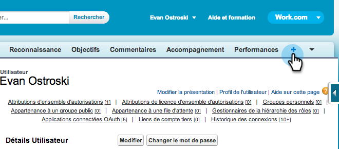
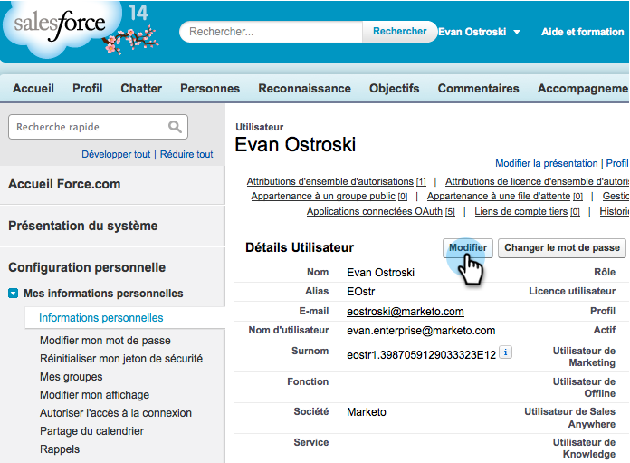

# Preparare informazioni sulle vendite per il supporto multilingue in Salesforce {#prepare-sales-insight-for-multi-lingual-support-in-salesforce}

>[!NOTE]
>
>**Autorizzazioni amministratore richieste**

Marketo Sales Insight è memorizzato per lingua. Quindi, se vuoi che funzioni per più lingue, devi immettere le credenziali separatamente per ogni lingua.

>[!NOTE]
>
>La funzione Approfondimenti vendite supporta attualmente:
>
>* Inglese
>* Francese
>* Tedesco
>
>Per impostazione predefinita, qualsiasi altra lingua corrisponde all’inglese.

## Aggiunta di una nuova lingua per Marketo Sales Insight {#adding-a-new-language-for-marketo-sales-insight}

1. Accedi a Salesforce. Nell&#39;elenco a discesa sotto il tuo nome nell&#39;angolo in alto a destra, fai clic su **Configurazione**.

   

1. Sotto **Informazioni personali**, fai clic su **Informazioni personali**.

   

1. Fai clic su **Modifica**.

   

1. Seleziona una lingua e fai clic su **Salva**.

   

1. L’interfaccia Salesforce si trova ora nella lingua selezionata. Puoi fare clic su **+** per visualizzare tutte le schede disponibili.

   

1. Fai clic su **Configurare Marketo Sales Insight** (nella lingua selezionata).

   

1. Vai su Marketo. Individua il tuo [Informazioni sulle vendite Marketo **Configurazione API** dettagli](/help/marketo/product-docs/marketo-sales-insight/msi-for-salesforce/configuration/configure-marketo-sales-insight-in-salesforce-enterprise-unlimited.md#configure-marketo-sales-insight).

   

1. Immetti i dettagli API da Marketo e fai clic su **Salva**.

   

## Cambia Salesforce Torna a Inglese {#change-salesforce-back-to-english}

Quando hai finito di personalizzare la tua organizzazione Salesforce, ecco come restituire la tua configurazione personale all&#39;inglese.

>[!NOTE]
>
>Le seguenti schermate sono in francese con istruzioni in inglese.  Verranno visualizzate le stesse schermate con testo nella lingua selezionata nel passaggio precedente.

1. Sotto il tuo nome, fai clic su **Configurazione**.

1. Fai clic su **Informazioni personali** sotto **Informazioni personali**.

   

1. Fai clic su **Modifica**.

   

1. Seleziona **Inglese** dal menu a discesa Lingua e fai clic su **Salva**.

   

   Ora la tua Salesforce è tornata in inglese!
